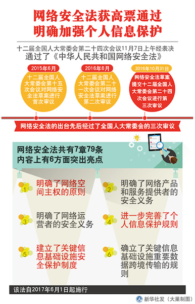

# 第一章 网络安全基础

---

## 提纲

* 专业术语定义（回顾）
* 威胁模型
* 安全策略和安全机制（回顾）
* 计算机⽹络安全模型
* 等级安全保护
* 计算机安全法规

# 专业术语定义

---

## 资产（Asset）

任何对组织业务具有 **价值** 的 **信息** 资产，包括计算机硬件、通信设施、IT 环境、数据库、软件、文档资料、信息服务和人员等。

---

## 网络安全（Cyberspace Security / Cyber Security / Network Security）

* Network 「狭义」的网络安全，主要指的是计算机网络中的信息安全问题
* Cyberspace / Cyber 「广义」的 **网络空间安全** ，「狭义」的网络安全问题演变成了「真实世界」的 **数字孪生** 安全问题，并借助于各种 `泛在互联` 技术影响到「真实世界」安全

---

## 安全属性 **CIA**

* 机密性（Confidentiality）
    * 从『信息不可见』到『状态不可知』
* 完整性（Integrity）
    * 未经授权不能进行更改
* 可用性（Availability）
    * 信息 `可被授权实体` 访问并 **按需使用**

---

## 威胁（Threat）

* 一种可能破坏安全基本要素的来源或原因
* 威胁来源
    * 内部威胁
    * 外部威胁
    * 自然威胁
    * 人为威胁

---

## 事件（Event）

如果威胁主体能够产生威胁，利用资产及其安全措施的脆弱性，那么实际产生危害的情况称为事件。

---

## 漏洞（Vulnerability）

* 漏洞又被称为脆弱性或弱点（Weakness）
* 信息资产及其安全措施在安全方面的不足和弱点
* 漏洞存在于`IT基础设施` (计算机软硬件、通信设施等)和`人` (管理制度、操作规范和流程)
* 漏洞一旦被利用，即会对资产造成`影响`
* 通常一个网络的漏洞/弱点可被分为：技术漏洞、配置漏洞和安全策略漏洞

---

## 风险（Risk）

* 风险是`威胁`事件发⽣的 **可能性** 与`影响`综合作用的结果
* 风险成为事实后，就会造成具体的`影响`

---

## 影响（Impact）

> 漏洞一旦被利用，会对资产造成影响。影响的种类不仅局限于对 CIA 的破坏，对于网络空间安全事件造成的影响可能波及：政治、经济、文化、人身安全、社会稳定等。

---

## 风险管理（Risk Management）

* 风险管理是指风险管理者采取各种措施和方法，消灭或减少风险事件发生的各种可能性，或者减少风险事件发生时造成的损失
* 常见的风险管理措施包括：风险降低、风险承受、风险规避、风险转移、分散风险、缓释风险和对冲风险
* 残余风险（Residual Risk）：任何一种风险管理手段都很难将风险完全根除，因此，我们将安全机制实施之后仍然遗留的风险称为 `残余风险`

---

## 攻击（Attack）

攻击是指由威胁源所实施的、导致安全事件发生的行为，它是 漏洞利用 和 实现威胁 的过程，一旦攻击得手即会造成影响。

# 风险管理的一张神图

---

# 风险管理的类比案例

---

小明⼝袋里有100元，因为打瞌睡，被小偷偷⾛了，导致小明晚上没饭吃 

* 风险
* 资产
* 影响
* 威胁
* 弱点
* 攻击

---

小明⼝袋里有100元，因为打瞌睡，被小偷偷⾛了，导致小明晚上没饭吃 

* 风险 - 钱被偷走
* 资产 - 100 元
* 影响 - 晚上没饭吃
* 威胁 - 小偷
* 弱点 - 打瞌睡
* 攻击 - 偷

---

## 重要启示

* 如果没有 漏洞（弱点），攻击⽆法得⼿
* 如果没有价值（资产），不会招来威胁

# 威胁模型

---

## 微软 STRIDE 模型

| 威胁                                | 安全性属性             |
| ----------------------------------- | ------------           |
| 假冒 (Spoof)                        | 认证（Authentication） |
| 篡改 (Tamper)                       | **完整性**             |
| 否认 (Repudiation)                  | 不可抵赖性             |
| 信息泄露 (Information Disclosure)   | **机密性**             |
| 拒绝服务 (Denial of Service)        | **可用性**             |
| 提升权限 (Elevation of Privilege)   | 授权（Authorization）  |

---

## 安全性属性的扩充

* 认证 / 授权 / 不可抵赖性
* 不可抵赖性可通过审计来保证
* 认证(Authentication)：身份验证
* 授权(Authorization)：⾏为验证
* 审计(Audit)：结果验证+责任认定
    * 责任认定(能⼒)：Accountability

---

## 概念对比

* 真实性 = 完整性+（身份）认证
    * 复合概念
* 完整性
    * 原⼦概念

---

## DREAD

* Damage Potential 潜在损失
* Reproducibility  可复现性 
* Exploitability   可利用性 
* Affected users   受影响的用户 
* Discoverability  可发现性 

---

## DREAD Table

| 评价                           | 高                                               | 中                                             | 低                       |
| -----                          | -------------                                    | ---------                                      | ------                   |
| 潜在损失（Damage potential）   | 获取完整验证权限；执行管理员操作；非法上传文件； | 泄漏敏感信息；                                 | 泄漏其他信息；           |
| 可复现性（Reproducibility）    | 攻击者可以随意再次攻击；                         | 攻击者可以重复攻击，但是有时间限制；           | 攻击者很难重复攻击过程； |
| 可利用性（Exploitability）     | 初学者可以在短期内掌握攻击方法；                 | 熟练的攻击者才能实现完整攻击；                 | 漏洞利用条件非常苛刻；   |
| 受影响的用户（Affected users） | 所有用户，默认配置，关键用户；                   | 部分用户，非默认配置；                         | 极少数用户，匿名用户；   |
| 可发现性（Discoverability）    | 漏洞很明显，攻击条件很容易获得；                 | 私有区域且仅部分人能够看见，需要深入挖掘漏洞； | 发现该漏洞极其困难；     |

---

## DREAD 模型不足之处 {id="dread-drawbacks"}

1. 不支持面向对象设计方法
2. 不利于捕捉控制流中存在的威胁
3. DREAD 方法不能反映不同攻击路径的成本效益差异

# 漏洞管理相关标准

---

| 漏洞标准 | 英文全称 | 中文名称 | 建议书编号 |
|----------|----------|----------|------------|
| CVE   | Common Vulnerability and Exposure | 通用漏洞及曝光 | [ITU-T X.1520](https://www.itu.int/ITU-T/recommendations/rec.aspx?rec=11061) |
| CVSS  | Common Vulnerability Scoring System | 通用漏洞评分系统 | [ITU-T X.1521](https://www.itu.int/rec/T-REC-X.1521/en) |
| CWE   | Common Weakness Enumeration | 通用缺陷枚举 | [ITU-T X.1524](https://www.itu.int/rec/T-REC-X.1524/en) |
| CWSS  | Common Weakness Scoring System | 通用缺陷评分系统 | [ITU-T X.1525](https://www.itu.int/rec/T-REC-X.1525/en) |
| CPE   | Common Platform Enumeration | 通用平台枚举 | [ITU-T X.1528](https://www.itu.int/rec/T-REC-X.1528/en) |
| OVAL  | Open Vulnerability and Assesment Language | 开放漏洞评估语言 | [ITU-T X.1526](https://www.itu.int/rec/T-REC-X.1526/en) |
| CAPEC | Common Attack Pattern Enumeration and Classification   | 常见攻击模式枚举和分类 | [ITU-T X.1544](https://www.itu.int/rec/T-REC-X.1544/en) |

---

---

---

## CVSS

> 通用弱点评价体系（Common Vulnerability Scoring System, CVSS）是由美国国土安全部主导的 NIAC（国家资讯与分析中心）开发、FIRST（Forum of Incident Response and Security Teams，事件反应和安全小组论坛）维护的一个开放并且能够被产品厂商免费采用的标准。

在 [第二章](chap0x02.md.html) 中，我们将详细介绍CVSS的具体内容。

---

## CVE

* CVE 的全称是 Common Vulnerabilities & Exposures ，中文翻译对应「公共漏洞曝光」
* CVE 目前已经是信息安全界内有关漏洞的一个事实上的标准，安全研究人员也把自己发现的漏洞能够具备 CVE-ID 编号为荣
    * **并不是所有发现的安全漏洞都能获得 CVE-ID** ，申请 CVE-ID 有一个严格的流程

---

## CNVD

[国家信息安全漏洞共享平台（China National Vulnerability Database，简称CNVD）](http://www.cnvd.org.cn/webinfo/list?type=7) 是由国家计算机网络应急技术处理协调中心（中文简称国家互联应急中心，英文简称 **CNCERT** ）联合国内重要信息系统单位、基础电信运营商、网络安全厂商、软件厂商和互联网企业建立的信息安全漏洞信息共享知识库。

---

> [国家信息安全漏洞共享平台（China National Vulnerability Database，简称CNVD）](http://www.cnvd.org.cn/webinfo/list?type=7) 由国家互联网应急中心、国家信息技术安全研究中心于2009年10月牵头发起，由国家互联网应急中心（简称 **CNCERT** ）具体组织运作，联合国内重要信息系统单位、基础电信运营商、网络安全厂商、软件厂商和互联网企业建立的信息安全漏洞信息共享知识库。

---

## NVD

NVD（National Vulnerability Database）是美国的国家漏洞数据库，其角色和作用同我国的 CNVD。

---

## CNNVD

> [国家信息安全漏洞库，英文名称"China National Vulnerability Database of Information Security "简称"CNNVD"，于2009年10月18日正式成立，是 **中国信息安全测评中心** 为切实履行漏洞分析和风险评估的职能，负责建设运维的国家信息安全漏洞库，面向国家、行业和公众提供灵活多样的信息安全数据服务，为我国信息安全保障提供基础服务](http://www.cnnvd.org.cn/web/xxk/gyCnnvdJs.tag)

---

## CWE

[常见缺陷列表（Common Weakness Enumeration, CWE）](http://cwe.mitre.org/about/index.html)是对常见软件缺陷和漏洞进行分类整理的一套标准，该标准的制订目标是归纳和整理不同的软件缺陷机理，统一软件安全漏洞（包括架构、设计或代码实现层面）的描述语言以便于开发出自动化工具来识别、修复和预防这些缺陷。

---

无论 CVSS ，还是 CVE 、CWE ，其基本目标都是围绕创建 **可度量的安全**（标准）。

# 以「破壳」漏洞为例

---

## CVE-2014-6271 on NVD

---

## CVSS v2.0 of CVE-2014-6271 

&source=NIST)

---

## CVSS v3.x of CVE-2014-6271 

---

## CWE of CVE-2014-6271

---

## CPE of CVE-2014-6271

---

## CAPEC of CVE-2014-6271

---

## OVAL of CVE-2014-6271

# ATT&CK

---

* `ATT&CK` 模型是 `MITRE` 在洛克希德-马丁公司提出的 `网络杀伤链（Cyber Kill Chain）` 模型 的基础上，构建了一套更细粒度、更易共享的知识模型和框架
* 分支
    * PRE-ATT&CK 
    * ATT&CK for Enterprise 
    * ATT&CK for Mobile 

---

## PRE-ATT&CK 

覆盖杀伤链模型的前两个阶段，包含了与攻击者在尝试利用特定目标网络或系统漏洞进行相关操作有关的战术和技术。

---

## ATT&CK for Enterprise 

覆盖杀伤链模型的后五个阶段，ATT&CK for Enterprise 由适用于 Windows 、Linux 和 macOS 系统的技术和战术部分共同组成。

---

---

## ATT&CK for Mobile 

包含适用于移动设备的战术和技术。

---

## [ATT&CK 导航工具](https://mitre-attack.github.io/attack-navigator/enterprise/)  {id='attack-navigator'}

* 一个很有用的工具，可用于映射针对 `ATT&CK` 技术的控制措施
* 可以添加不同的层，来显示特定的检测控制措施、预防控制措施甚至观察到的行为
* 导航工具可以在线使用，快速搭建模型或场景，也可以下载下来，进行内部设置，作为一个持久化的解决方案

---

下一页如图所示，就是使用 `ATT&CK 导航工具` 制作的针对 2 次「APT 攻击事件报告」整理出的不同攻击过程的标准化定义描述。

---

---

* 可视化不同组织在「攻击技术」选择上的差异
* 可视化不同安全事件中所涉及到的「攻击技术」差异
* 可量化（主观评分，配置着色方案）攻击技术

---

## ATT&CK 典型应用场景 {id="attack-applications"}

* 对抗模拟和攻防演练
* 渗透测试活动
* 制定行为分析方案
* 防御差距评估
* SOC 成熟度评估
* 网络威胁情报收集

---

## ATT&CK 对比 CWE / CAPEC

* ATT&CK 作为一个「知识库」，其所有「知识条目」均来自于「公开披露的真实安全事件」
    * ATT&CK 强调「实战性」
* CWE / CAPEC 中并非所有「知识条目」都有「公开披露的真实安全事件」作为实例
    * CWE / CAPEC 强调「知识完备性」

# 安全策略和安全机制

---

## 安全策略 (Security Policy)

* 声明
* 哪些能做，哪些不能做
* 哪些⾏为允许，哪些⾏为禁⽌

---

## 安全机制 (Security Mechanism)

* ⽅法/⼯具/⼿段
* 实现安全策略

---

> 安全措施 = 安全策略 + 安全机制

---

## 安全假设和信任

> 打开⼀扇门需要⼀把钥匙

* 安全假设：门锁不会被开锁匠用工具打开
* 安全需求：只有通过匹配的钥匙才能打开这扇门
* 实际环境：技术高超的开锁匠可以在没有钥匙的情况下用自制工具打开门锁
* 信任：如果锁匠是可信的，上述安全假设可以成立

---

## 信任的内涵

* 开锁匠是可信的：在没有获得门锁主人的授权的前提条件下，开锁匠不会去“开锁”
* 门锁的“后门”是可信的：“后门”不会被不可信的人发现，更不会被恶意利用，然而一旦信任不再，基于信任的安全机制将会失去效果

---

## 信任不再，安全机制崩塌

开锁匠 **非授权** 利用门锁的“后门”，在没有得到门锁主人授权的前提条件下，不使用钥匙也打开了门。

---

## 网络空间中的「信任」

* 下载软件并安装 - 信任软件作者和分发渠道
* 编译代码并运⾏ - 信任代码作者
* 打开Office⽂档 - 信任⽂档作者和来源
* 打开⽹页       - 信任⽹站主
* 查看邮件       - 信任发信⼈
* 查看视频       - 信任视频来源
* 加⼊局域⽹     - 信任⽹络中的其他使用者

---

## 安全策略中存在的安全假设

* 系统的状态能被正确、 **无歧义** 的分为“安全”和“不安全”两种状态
* 安全机制能够强制保证系统不会进入“不安全”状态

---

## 安全机制中存在的安全假设

* 每一个安全机制都是被设计用来实现安全策略中的一个或多个具体策略
* 安全策略的集合能够实现所有的安全策略
* 安全机制的实现是正确的
* 安全机制的部署和管理是正确的

---

> 如果安全假设为假，谈何“⽹络安全”？

# 计算机网络安全模型

---

## 静态模型（分层模型）

---

* 每一层的安全威胁是既相互独立，又相互联系、相互影响的
* 每一层的安全威胁必须依靠当前层的安全策略和安全机制解决
* 下一层的安全机制是上一层安全机制的基础
* 上一层的安全机制等级不会高于下一层的安全机制等级
    * 下层不安全，上层的安全无法保障
    * 下层安全，并不代表上层安全

---

## 动态模型—— P2DR 模型

* 策略（Policy）
* 防护（Protection）
* 检测（Detection）
* 响应（Response）

---

---

### 防护

* 主动防护。例如：数据加密、身份认证、访问控制、虚拟专用网 VPN 等；
* 被动防护。例如：防火墙、安全扫描、入侵检测。

---

### 检测

* 主动检测。安全测试、蜜罐和安全审计。
* 被动检测。蜜罐、入侵检测。

---

### 响应

* 产生警告（Alert / Log）：这是「检测」到异常时的「必选」行为，严格意义上来说并不能算作一种「有效响应」，只是起到了「通知」的作用。
* 拒绝访问（Deny）：限制「入站」流量。
* 中断（Disrupt）：限制「出站」流量。
* 降级/限制访问（Degrade）：「过滤」流量，有选择允许和禁止访问。
* 欺骗（Deception / Deceive）：「重定向」流量。
* 灾难恢复（Recovery）：启用备用系统、数据恢复措施等。

---

## 用P2DR模型审视：STRIDE/CVSS/CVE/CWE

* 策略
    * 基于 `STRIDE` 进⾏系统设计
* 防护
    * 基于 `CWE` 在系统开发过程中规避已知弱点
* 检测
    * 检测到新漏洞后添加到 `CVE`
* 响应
    * 基于 `CVSS` 对 `CVE` 条目的评分确定响应策略：轻重缓急

---

## 动态模型—— P2DR2 模型

* 策略（Policy）
* 防护（Protection）
* 检测（Detection）
* 响应（Response）
* 恢复（Recovery）

---

---

## 计算机⽹络安全模型小结

* 从静态的视角看计算机⽹络安全模型：安全威胁是可以分层的
* 从动态的视角看计算机⽹络安全模型：安全威胁是持续变化的
* 计算机⽹络安全模型的核⼼特点
    * **对抗**：威胁 VS. 安全策略/机制
    * **变化**：威胁 / 安全策略/机制 / 环境

# 等级安全保护

---

* 橘皮书：TCSEC
* 红皮书：TNI
* ITSEC
* CC

---

## 我国等级保护现状

* [《中华人民共和国网络安全法》（以下简称《网络安全法》](http://www.cac.gov.cn/2016-11/07/c_1119867116.htm) 于 2016 年 11 月 7 日第十二届全国人民代表大会常务委员会第二十四次会议通过，于 2017 年 6 月 1 日起施行
* 《网络安全法》出台后，等级安全保护进入 2.0 时代。这意味着在遵照[《信息安全等级保护管理办法》](http://www.gov.cn/gzdt/2007-07/24/content_694380.htm) 及其配套的标准[《信息系统安全等级保护定级指南》](http://www.djbh.net/webdev/file/webFiles/File/jsbz/2012323103010.pdf) 建立的「信息安全等级保护体系」已全面升级
* 随着 2018 年 1 月 19 日，全国信息安全标准化技术委员会发布关于 [《信息安全技术 网络安全等级保护定级指南（征求意见稿）》](http://www.djbh.net/webdev/web/HomeWebAction.do?p=getGzjb&id=8a8182565fd8b6b901612bc8a72e00e5) （以下简称《定级指南》），标准修订完成后，《信息安全技术 **网络安全**等级保护定级指南》 将替代原来的 GB/T22240-2008《信息安全技术**信息系统安全**等级保护定级指南》

---

### 等保定级原则

---

* 关于上述三类受侵害的客体分类，一般损害、严重损害和特别严重损害的定义，基本沿袭原有表达。但是在《定级指南》中，对公民、法人和其他组织的合法权益，遭受特别严重损害的，明确定级在“第三级”，彰显了对私权利维护的升级。
* 对于基础信息网络、云计算平台、大数据平台等支撑类网络，应根据其承载或将要承载的等级保护对象的重要程度确定其安全保护等级，原则上应不低于其承载的等级保护对象的安全保护等级。
* 《定级指南》规定，原则上，大数据安全保护等级不低于第三级。对于确定为关键信息基础设施的，原则上其安全保护等级不低于第三级。

---

## 等级保护的意义

* 明确安全需求
    * 资产在哪⼉？价值多⼤？
* 安全防护是需要成本投⼊的
    * 信息安全与信息化建设要协调
* 安全建设和管理需要兼顾系统性、针对性、可⾏性
* 明确重点、突出重点、保护重点

# 计算机安全法规

---

刑法修正案(七)在刑法第285条中增加两款(第⼆款、第三款)

> 违反国家规定,侵⼊前款规定以外的计算机信息系统或者采用其他技术⼿段,获取该计算机信息系统中存储、处理或者传输的数据,或者对该计算机信息系统实施非法控制,情节严重的,处三年以下有期徒刑或者拘役,并处或者单处罚⾦;情节特别严重的,处三年以上七年以下有期徒刑,并处罚⾦。

> 提供专门用于侵⼊、非法控制计算机信息系统的程序、⼯具,或者明知他⼈实施侵⼊、非法控制计算机信息系统的违法犯罪⾏为⽽为其提供程序、⼯具,情节严重的,依照前款的规定处罚。

---

## ⽹络安全不可⼉戏

《最⾼⼈民法院、最⾼⼈民检察院关于办理危害计算机信息系统安全刑事案件应用法律若⼲问题的解释》

* 2011年6月20日最⾼⼈民法院审判委员会第1524次会议、2011年7月11日最⾼⼈民检察院第⼗⼀届检察委员会第63次会议通过
* 自2011年9月1日起施⾏

---

## 中华人民共和国网络安全法

---

### 第七章，第七⼗六条（⼆）

> 网络安全，是指通过采取必要措施，防范对网络的攻击、侵入、干扰、破坏和非法使用以及意外事故，使网络处于稳定可靠运行的状态，以及保障网络数据的 **完整性** 、**保密性** 、**可用性** 的能力。

---

## 重要法律法规一览 {id="laws-1"}

---

## 重要法律法规一览 {id="laws-2"}

[我国近年来数据安全法律法规最全汇编 2019-08-09](https://www.secrss.com/articles/12854)

---

## 知法守法

* ⽹络安全攻防实验必须严格限制在局域⽹范围内
* 了解保密相关法律法规
    * 泄密坐牢，卖密杀头
    * 涉密不联⽹，联⽹不涉密

# 课后思考题

---

以下⾏为分别破坏了CIA和AAA中哪⼀个属性或多个属性？

* 小明抄小强的作业
* 小明把小强的系统折腾死机了
* 小明修改了小强的淘宝订单
* 小明冒充小强的信用卡账单签名
* 小明把自⼰电脑的IP修改为小强电脑的IP，导致小强的电脑⽆法上⽹

---

有⼀次，小明⼝袋里有100元，因为打瞌睡，被小偷偷⾛了，搞得晚上没饭吃。又⼀天，小明⼝袋里有200元，这次小明为了防范小偷，不打瞌睡了，但却被强盗持⼑威胁抢⾛了，搞得⼀天没饭吃，小明当天就报警了。

* 试分析两次失窃事件中的：风险、资产、威胁、弱点、攻击、影响
* 试用P2DR模型分析以上案例中的“现⾦被抢”事件中的安全策略、安全防护、安全检测和安全响应
* “被抢”事件中，小明的安全策略存在何问题？

---

针对下述论点，分别设计⼀场景案例（必须和课程相关），使得该论点在该场景中成立

* 预防比检测和恢复更重要
* 检测比预防和恢复更重要
* 恢复比预防和检测更重要

---

试分析“CAPTCHA图片验证码技术可以阻⽌恶意批量注册⾏为”这句话中的安全策略、安全机制和安全假设分别是什么？CAPTCHA图片举例

---

某⼤型软件开发公司的总裁担⼼公司的专利软件设计⽅法被内部员⼯泄露给其他公司，他打算防⽌泄密事件的发⽣。于是他设计了这样⼀个安全机制： **所有员⼯必须每天向他汇报自⼰和其他竞争对⼿公司员⼯的所有联系(包括IM、电⼦邮件、电话等等)** 。你认为该安全机制能达到总裁的预期安全效果吗？为什么？

---

请列举你经常使用的互联⽹服务有哪些，通过公开渠道检索这些服务提供商在历史上是否经历过安全事件？据此，撰写⼀篇主题为：《某某互联⽹服务安全问题概要》的调研报告。

