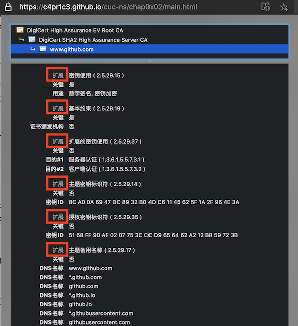
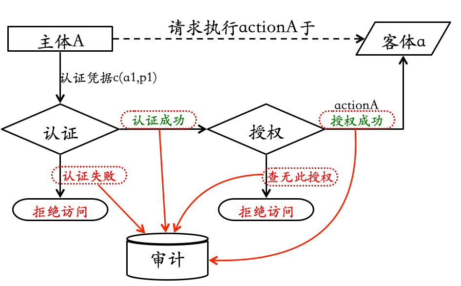

# 第二章 系统安全、风险评估理论与应用

---

## 温故

* 基本术语
    * 网络空间安全是什么？CIA的内涵？
    * 资产、威胁、风险、漏洞、影响、攻击
* 可度量安全
    * CVE / CVSS / CWE / CPE / CAPEC / ATT&CK
* P2DR模型
    * 安全是持续循环、动态变化过程
* 等级安全保护 

---

## 知新

* 操作系统中的
    * 安全策略：访问控制策略
    * 安全机制：访问控制机制
* 通用弱点评价系统 —— CVSS
    * **C**ommon **V**ulnerability **S**coring **S**ystem
* 风险评估的基本原理与案例分析

---

## 本章内容提要

* 数字标识理论
* 访问控制理论
* 风险评估理论与实践

# 数字标识理论

---

## 定义

* 实体
    * Entity
    * 业务操作的发起者（主体）或对象（客体）
* 标识
    * Identity
    * 对实体的数字化指代
    * 又可称为“数字标识”

---

## 数字标识的意义

* 对信息安全相关实体建立标识体系是构建信息安全系统的基础⼯作之⼀
    * 身份认证
    * 访问控制
    * 安全审计
    * ⽹络协议

---

## 常见的数字标识技术

* 系统实体标识
    * 系统资源标识
    * 用户、组和角⾊标识
    * 与数字证书相关的标识
* ⽹络实体标识
    * 主机、⽹络和连接标识
    * ⽹络资源标识
    * 连接及其状态标识

---

### 系统实体标识

* 操作系统 
    * ⽂件标识
        * ⽂件名和存储路径
    * 进程标识
        * 进程号：PID 
* 数据库系统 
    * 数据表标识 
        * 数据库名和表名

---

### 用户、组和角色标识

* 用户
    * 用户号：UID
* 用户组
    * 用户组号：GID
* 角⾊标识
    * 特殊用户分组

---

## 与数字证书相关的标识

* 数字证书用于绑定证书所有者情况及其公钥
    * 在数字签名和认证中用于向签名验证者或身份认证者提供这些信息
* X.509证书
    * 基本信息
    * 辅助（扩展）信息
* 数字证书通常由证书签发者对证书签名
    * 基于数字证书的标识具有抗篡改的特性

---

### X.509 证书基本信息

---

### X.509 证书扩展信息

---

## 主机、网络和连接标识

* 主机标识
    * 数据链路层：MAC地址
        * 例如：08-00-27-07-DD-0A
    * ⽹络层：⽹络地址
        * 对于TCP/IP⽹络，即 `IP地址`
    * 应用层：域名地址

---

## 网络资源标识

* 统⼀资源定位符（URL：Uniform Resources Locator）

---

## 连接及其状态标识 {id="con-state-id-1"}

* 唯⼀标识⼀个⽹络(会话)连接：`IP 五元组`
    * 源 IP 地址
    * 目的 IP 地址
    * 源端⼝
    * 目的端⼝
    * 传输层协议类型

---

## 连接及其状态标识 {id="con-state-id-2"}

* （会话）连接状态标识

# 访问控制理论

---

> 安全砖家： “报告老板，通往停车场的道路已经被我们 封锁 了！绝对安全！

---

## 访问控制的基本概念

---

### 主体

> 主动的实体，是访问的发起者，它造成了信息的流动和系统状态的改变，主体通常包括⼈、进程和设备等。

---

### 客体

> 包含或接受信息的被动实体，客体在信息流动中的地位是被动的，客体通常包括⽂件、设备、信号量和⽹络节点等。

---

### 访问

> 使信息在主体和客体之间流动的⼀种交互⽅式。

---

### 授权访问

> 主体访问客体的允许，授权访问对每⼀对主体和客体来说是给定的

---

### 安全访问策略

> ⼀套规则，可用于确定⼀个主体是否对客体拥有访问能⼒

> 主体对客体的操作⾏为集和约束条件集

---

### 访问控制三要素

> 主体、客体、安全访问策略

---

## 访问控制的三个基本面

* 认证
    * 身份认证：客体对主体的识别认证
    * 客体和主体的身份可以随着时间、应用场景⽽改变
* 授权
    * 访问控制 **策略实现**
    * 授权主体对客体可以正常访问
    * 非授权主体对客体⽆法访问
* 审计
    * 记录访问历史，实现 `不可抵赖性`

---

## 访问控制过程

---

## 访问控制策略

* 自主访问控制
    * DAC: Discretionary Access Control
* 强制访问控制
    * MAC: Mandatory Access Control
* 基于角⾊的访问控制
    * RAC: Role-Based Access Control

---

### 自主访问控制

* 已授权主体可以访问客体
* 非授权主体⽆法访问客体
* 访问授权可以自主分配（ **授权** 和 **取消授权**）
    * 用户A可以访问⽂件a，则用户A可以授权用户B也能访问⽂件a

---

### 自主访问控制实现⽅式举例

* 访问控制列表(ACL：Access Control List)
* 访问控制矩阵
* 面向过程的访问控制

---

* 访问控制矩阵实例

|       | 文件A        | 文件B    | 进程A              | 进程B              |
| :-    | :-           | :-       | :-                 | :-                 |
| 进程A | 读、写、属主 | 读       | 读、写、执行、属主 | 写                 |
| 进程B | 追加         | 写、属主 | 读                 | 读、写、执行、属主 |

> 属主：绝⼤多数现代操作系统，属主权限的拥有主体可以对所拥有的权限自⾏分配。

---

### 强制访问控制

* (操作)系统对访问主体和受控对象(客体)实⾏强制访问控制
* 多级访问控制策略
* (操作)系统预先分配好主客体安全级别：安全标签
* 主体访问客体时先进⾏安全级别属性比较，再决定访问主体能否访问该受控对象(客体)

---

## 访问控制机制

---

### 身份认证

* 将身份标识唯一的绑定到主体
* 外部实体能够向系统证明其身份标识唯一性的因素
    * 知道的（例如：口令或秘密信息） knows
    * 拥有的（例如：令牌或磁卡）     has
    * 生物特征（例如：指纹、虹膜）   is
    * 实体位置（例如：在特定终端上） where
* 以上因素可以单一使用，也可以多个同时使用

---

### 访问授权

* 授权类型
    * 授予(grant)权限
        * 拥有该权限的主体可以将所拥有的客体访问权限分配给其他主体
    * 属主(own)权限
        * 客体的创建者通常都会拥有属主权限，该权限可以由创建者自己授予他人
* 权限的弱化原则
    * 主体无法将自己不具备的权限授予他人
    * 主体如果具有属主权限则不受上述原则约束

---

### 撤销访问授权

* 为何需要撤销访问授权？
    * 认证凭据丢失/被盗
    * 人员变动（离职/岗位变动等）
* 如何取消访问授权？
    * 身份认证环节：禁用/取消/删除认证凭据
    * 访问授权环节：禁用/取消/删除/修改访问控制列表中的授权项

---

## 访问审计

* 内涵
    * 主体对客体的访问行为会被记录，用于安全责任追查和认定
* 意义
    * 检测是否存在违反安全(访问控制)策略的行为
* 重建安全事件
    * 手段
    * 日志

---

## 认证、授权和审计的关系

# 通用安全漏洞评估系统（CVSS）

---

## 简介

* 由 NIAC 开发、FIRST 维护的一个开放并且能够被各产品厂商免费采用的行业标准
* 量化评价，总分取值范围：[0, 10]
* 三组指标
    * 基本评估
    * 时效性评估
    * 环境评估

---

## 演进中的 CVSS {id="cvss-versions"}

* 2023.11 [CVSS 4.0](https://www.first.org/cvss/v4.0/specification-document) 
* 2019.6 [CVSS 3.1](https://www.first.org/cvss/v3.1/specification-document)
* 2015.6 [CVSS 3.0](https://www.first.org/cvss/v3.0/specification-document)
* 2007.6 [CVSS 2.0](https://www.first.org/cvss/v2/guide)

---

## 特别说明

以下内容主要针对 `CVSS 2.0` 和 `CVSS 3.x` 。

---

## 评估主体框架

* `基础评估` 指标描述安全漏洞 **固有的**、根本性的属性，这些属性不随时间或用户具体环境的变化而改变
* `时效性评估` 指标是指安全漏洞与 **时间相关** 的属性，这些属性可能随着时间的变化而变化
* `环境评估` 指标在不同的用户的 **具体使用环境** 中，产品安全漏洞所造成危害程度也不同

---

## 基础评估

* 入侵途径 2.0+
* 入侵复杂性 2.0+
* 身份认证要素 2.0
* **是否需要（被攻击）用户交互** 3.0+
* **影响波及范围** 3.0+
* 信息机密性影响 2.0+
* 信息完整性影响 2.0+
* 服务持续性影响 2.0+

---

### 基础评估指标的完善

|     | 2.0   | 3.0                        |
| :-  | :-    | :-                         |
| AV  | L,A,N | 新增 **P**                 |
| AC  | H,M,L | 移除 **M**                 |
| CIA | N,P,C | **P**artial 变更为 **L**ow |

---

## 时效性评估 - 可利用性 {id="exploitability"}

* 跳过评估 `Not Defined` / `E:X`
* 不确定是否存在漏洞利用工具 `Unproven that exploit exists` / `E:U`
* 存在漏洞存在性验证工具 `Proof of concept code` / `E:P`
* 存在漏洞利用工具 `Functional exploit exists` / `E:F`
* 存在自动化利用工具或无需特别利用工具且资料成熟 `High` / `E:H`

---

## 时效性评估 - 缓解措施级别 {id="remediation-level"}

* 跳过评估 `Not Defined` / `E:X`
* 存在官方补丁 `Official fix` / `RL:O`
* 存在临时补丁 `Temporary fix` / `RL:T`
* 存在缓解措施 `Workaround` / `RL:W`
* 无补丁 `Unavailable` / `RL:U`

---

## 时效性评估 - 报告可信度 {id="report-confidence"}

* 跳过评估 `Not Defined` / `E:X`
* 未知 / 未确认
    * `Unknown` / `RC:U` 3.0+ 倾向于「半信半疑」
    * `Unconfirmed` / `RC:UC` 2.0 强调报告来源单一或不同来源报告可能存在「自相矛盾」，倾向于「不相信」
* 部分确认 / 未经证实
    * `Reasonable` / `RC:R` 3.0+  强调已经存在「部分可验证」，倾向于「相信」
    * `Uncorroborated` /  `RC:UR` 2.0 强调漏洞报告来源是「小道消息」、可能不同来源的信息会「自相矛盾」，倾向于「不相信」
* 已确认 `Confirmed` / `RC:C`

---

## 环境评估 3.0+ {id="environmental-score-metrics-3"}

* 「基础评估指标」修正
* 「影响力指标」修正
* 「影响力子分数」修正：资产对特定影响力的风险承受能力匹配

---

## 环境评估 2.0 {id="environmental-score-metrics-2"}

* 「通用」修正
    * 综合损失估计：跳过评估、无影响、
    * （受影响）目标分布
* 「影响力子分数」修正

---

## 总体评估原则

1. 每个安全漏洞都必须单独评估 ，不得考虑与其他安全漏洞的交叉影响
2. 只考虑每个安全漏洞的直接影响 ，不考虑其他间接影响
3. 应该按照通常使用的权限 来评估安全漏洞的影响
    * 假设客户端应用使用的是根用户权限，而 Web 应用则假设使用的是普通用户权限
4. 当安全漏洞有很多种入侵途径时，应该能造成最大伤害的入侵途径为依据

---

## 从「定量」到「定性」

| 2.0    | 基础分范围 | 3.0      | 基础分范围  |
| :-:    | :-:        | :-:      | :-:         |
|        |            | None     | 0.0         |
| Low    | 0.0-3.9    | Low      | 0.1-3.9     |
| Medium | 4.0-6.9    | Medium   | 4.0-6.9     |
| High   | 7.0-10.0   | High     | **7.0-8.9** |
|        |            | Critical | 9.0-10.0    |

---

## CVSS 2.0 VS. CVSS 3.0+ 🌰  {id="cve-2014-6271-demo-1"}

---

## CVSS 2.0 VS. CVSS 3.0+ 🌰  {id="cve-2014-6271-demo-2"}

* [CVE-2014-6271 的 CVSS 3.0/3.1 评分详情](https://nvd.nist.gov/vuln-metrics/cvss/v3-calculator?name=CVE-2014-6271&vector=AV:N/AC:L/PR:N/UI:N/S:U/C:H/I:H/A:H&version=3.1)
* [CVE-2014-6271 的 CVSS 2.0 评分详情](https://nvd.nist.gov/vuln-metrics/cvss/v2-calculator?name=CVE-2014-6271&vector=(AV:N/AC:L/Au:N/C:C/I:C/A:C)&version=2.0)

---

## CVSS 的局限性和不足 {id="cvss-flaws"}

1. 每个安全漏洞都必须 **单独评估** ，不得考虑与其他安全漏洞的交叉影响
2. 只考虑每个安全漏洞的 **直接影响** ，不考虑其他间接影响
3. 当安全漏洞有很多种入侵途径时，应该能造成 **最大伤害的入侵途径** 为依据
4. 时效性指标，由于攻防信息的天然不对称性，守方通常倾向于低估漏洞危害
    * 基于客观事实的主观评价打分
5. 环境指标依赖于安全团队水平：对本方网络与系统的认知水平偏差
6. 高危漏洞的修复方式难度和低危漏洞修复方式难度并没有直接的可比性

---

## CVSS 的应用 {id="cvss-howto"}

* 管理层重视漏洞管理
    * 漏洞管理工作流程化、制度化、日常化，并有专门的部门和人员负责实施与检查
* 建立高效、准确、更新及时的资产清单管理系统
* 推进标准化和自动化配置 IT 资产

---

## CVSS 4.0 相比于 3.1 的主要变化

# 课后思考题

---

1.  生物特征身份认证方式有哪些？优缺点分析？应用场景举例。
2.  “找回口令功能”和“忘记密码”在访问授权机制中的意义？请尝试设计几种安全的“找回口令功能”，详细描述找回口令的用户具体操作过程。
3.  绘制用户使用用户名/口令+图片验证码方式录系统的流程图。考虑认证成功和失败两种场景，考虑授权成功和失败两种场景。
4.  用权限三角形模型来理解并描述下 2 种威胁模型：提权、仿冒。

---

5.  试通过操作系统的访问控制机制来达到预防一种真实病毒的运行目的。
6.  什么是 OAuth？
7.  什么是 OpenID？
8.  试用本章所学理论分析 OAuth 和 OpenID 的区别与联系。
9.  如何使用 OAuth 和 OpenID 相关技术实现单点登录（Single Sign On）？

