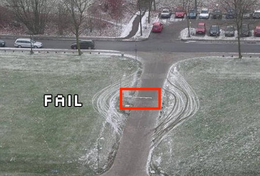
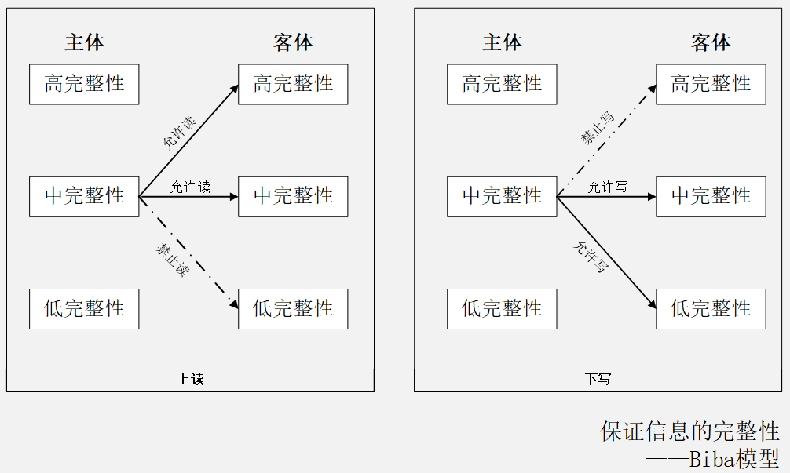

# 第二章 系统安全、风险评估理论与应用

---

## 温故

* 基本术语
    * 网络空间安全是什么？CIA的内涵？
    * 资产、威胁、风险、漏洞、影响、攻击
* 可度量安全
    * CVE / CVSS / CWE / CPE / CAPEC / ATT&CK
* 安全策略和安全机制
    * 声明和实现
* P2DR模型
    * 安全是持续循环、动态变化过程
* 等级安全保护 

---

## 知新

* 操作系统中的
    * 安全策略：访问控制策略
    * 安全机制：访问控制机制
* 通用弱点评价系统 —— CVSS
    * **C**ommon **V**ulnerability **S**coring **S**ystem
* 风险评估的基本原理与案例分析

---

## 本章内容提要

* 操作系统简史
* 数字标识理论
* 访问控制理论
* 风险评估理论与实践

# 操作系统简史

---

## Windows

---

### Windows XP -- 稳定、易用且快速

* ⚠️  自动播放：U盘病毒肆虐的推手
* ⚠️  默认管理员账户
* ✅ 用户权限模型改进：普通用户、管理员用户、受限管理员用户
* ✅ 细粒度系统级安全策略用户自定义
* ✅ 2005 年发布了免费公测版 `Windows Defender` ，专杀间谍软件和广告软件
* ✅ 系统级自动更新：微软全家桶自动更新
* ✅ 系统级防火墙

---

### Windows Vista -- 安全智能

* ✅ 用户账户控制（UAC）
* ✅ 内置 `Windows Defender` ，专杀间谍软件和广告软件
* ✅ BitLocker：系统级文件系统加密

---

### Windows 7

* ✅ 数据执行保护（DEP）
* ✅ 系统级「地址随机化（ALSR）」对抗内存破坏类攻击
* ✅ BitLocker 增强
* ✅ 密码学算法更新（废弃掉大量已过期密码学算法）

---

### Windows 8 -- 移动化

* ✅ 充分利用「硬件级别」安全机制
* ✅ 系统级「应用容器」
    * 允许「低完整性等级」应用访问「中」、「高」级别系统对象

---

### Windows 10

* ✅ 新增 `Windows Defender Credential Guard` 只允许「特权系统进程」访问账户相关敏感信息

---

### Windows 小结 {id="windows-summary"}

* 安全性成为越来越重要的「系统级」、「原生」特性
* 拥抱云计算
* 从参与开源到主导开源

# 数字标识理论

---

## 定义

* 实体
    * Entity
    * 业务操作的发起者（主体）或对象（客体）
* 标识
    * Identity
    * 对实体的数字化指代
    * 又可称为“数字标识”

---

## 数字标识的意义

* 对信息安全相关实体建立标识体系是构建信息安全系统的基础⼯作之⼀
    * 身份认证
    * 访问控制
    * 安全审计
    * ⽹络协议

---

## 常见的数字标识技术

* 系统实体标识
    * 系统资源标识
    * 用户、组和角⾊标识
    * 与数字证书相关的标识
* ⽹络实体标识
    * 主机、⽹络和连接标识
    * ⽹络资源标识
    * 连接及其状态标识

---

### 系统实体标识

* 操作系统 
    * ⽂件标识
        * ⽂件名和存储路径
    * 进程标识
        * 进程号：PID 
* 数据库系统 
    * 数据表标识 
        * 数据库名和表名

---

### 用户、组和角色标识

* 用户
    * 用户号：UID
* 用户组
    * 用户组号：GID
* 角⾊标识
    * 特殊用户分组

---

## 与数字证书相关的标识

* 数字证书用于绑定证书所有者情况及其公钥
    * 在数字签名和认证中用于向签名验证者或身份认证者提供这些信息
* X.509证书
    * 基本信息
    * 辅助（扩展）信息
* 数字证书通常由证书签发者对证书签名
    * 基于数字证书的标识具有抗篡改的特性

---

### X.509 证书基本信息

---

### X.509 证书扩展信息

---

## 主机、网络和连接标识

* 主机标识
    * 数据链路层：MAC地址
        * 例如：08-00-27-07-DD-0A
    * ⽹络层：⽹络地址
        * 对于TCP/IP⽹络，即 `IP地址`
    * 应用层：域名地址

---

## 网络资源标识

* 统⼀资源定位符（URL：Uniform Resources Locator）

---

## 连接及其状态标识 {id="con-state-id-1"}

* 唯⼀标识⼀个⽹络(会话)连接：`IP 五元组`
    * 源 IP 地址
    * 目的 IP 地址
    * 源端⼝
    * 目的端⼝
    * 传输层协议类型

---

## 连接及其状态标识 {id="con-state-id-2"}

* （会话）连接状态标识

# 访问控制理论

---

> 安全专家： “报告老板，通往停车场的道路已经被我们 封锁 了！绝对安全！

---

## 访问控制的基本概念

---

### 主体

> 主动的实体，是访问的发起者，它造成了信息的流动和系统状态的改变，主体通常包括⼈、进程和设备等。

---

### 客体

> 包含或接受信息的被动实体，客体在信息流动中的地位是被动的，客体通常包括⽂件、设备、信号量和⽹络节点等。

---

### 访问

> 使信息在主体和客体之间流动的⼀种交互⽅式。

---

### 授权访问

> 主体访问客体的允许，授权访问对每⼀对主体和客体来说是给定的

---

### 安全访问策略

> ⼀套规则，可用于确定⼀个主体是否对客体拥有访问能⼒

> 主体对客体的操作⾏为集和约束条件集

---

### 访问控制三要素

> 主体、客体、安全访问策略

---

## 访问控制的三个基本面

* 认证
    * 身份认证：客体对主体的识别认证
    * 客体和主体的身份可以随着时间、应用场景⽽改变
* 授权
    * 访问控制 **策略实现**
    * 授权主体对客体可以正常访问
    * 非授权主体对客体⽆法访问
* 审计
    * 记录访问历史，实现 `不可抵赖性`

---

## 访问控制过程

---

## 访问控制策略

* 自主访问控制
    * DAC: Discretionary Access Control
* 强制访问控制
    * MAC: Mandatory Access Control
* 基于角⾊的访问控制
    * RAC: Role-Based Access Control

---

### 自主访问控制

* 已授权主体可以访问客体
* 非授权主体⽆法访问客体
* 访问授权可以自主分配（ **授权** 和 **取消授权**）
    * 用户A可以访问⽂件a，则用户A可以授权用户B也能访问⽂件a

---

### 自主访问控制实现⽅式举例

* 访问控制列表(ACL：Access Control List)
* 访问控制矩阵
* 面向过程的访问控制

---

* 访问控制矩阵实例

|       | 文件A        | 文件B    | 进程A              | 进程B              |
| :-    | :-           | :-       | :-                 | :-                 |
| 进程A | 读、写、属主 | 读       | 读、写、执行、属主 | 写                 |
| 进程B | 追加         | 写、属主 | 读                 | 读、写、执行、属主 |

> 属主：绝⼤多数现代操作系统，属主权限的拥有主体可以对所拥有的权限自⾏分配。

---

### 强制访问控制

* (操作)系统对访问主体和受控对象(客体)实⾏强制访问控制
* 多级访问控制策略
* (操作)系统预先分配好主客体安全级别：安全标签
* 主体访问客体时先进⾏安全级别属性比较，再决定访问主体能否访问该受控对象(客体)

---

---

* 手机锁屏状态下的所有操作
    * ✅ 不解锁直接使用「照相机 📷 」功能： **上写** 行为被允许 
    * ✅ 可以查看「此次解锁期间」拍的所有照片： **下读** 行为被允许
    * 🚫 非「此次解锁期间」的照片均被禁止查看： **上读** 行为被禁止
* 生活中的 **上写下读**
    * 『校长信箱』允许所有人向其中投递（写）邮件，但仅限校长及其授权人才能查看（读）

---

### 小测试 🤔

> 你的手机在锁屏状态下可以查看到「系统通知信息内容」吗？符合 **上写下读** 原则吗？ 

---

---

* ✅ 操作系统安装「安全更新」只允许『特权进程』更改系统文件： **下写** 行为被允许
* ✅ `/etc/passwd` 允许『所有用户』用户权限读取： **上读** 行为被允许
* 🚫 `/etc/passwd` 只允许『管理员』用户权限修改： **上写** 行为被禁止

---

### 基于角色的访问控制 

* `强制访问控制` 模型的⼀种实现形式
    * 但不是基于多级访问控制策略的实现
* 用户和访问权限的逻辑分离
    * 访问权限首先是与角⾊相关联
    * 然后角⾊再与用户关联
    * 从⽽完成基于角⾊的访问授权
* 用户不能任意的将访问权限传递给其他用户
    * 和DAC的最基本区别

---

