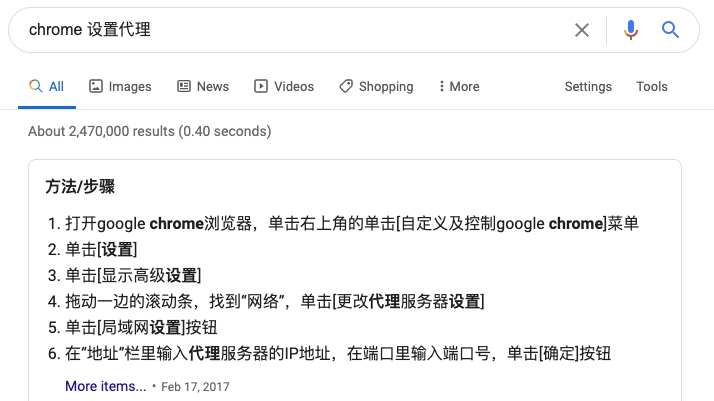
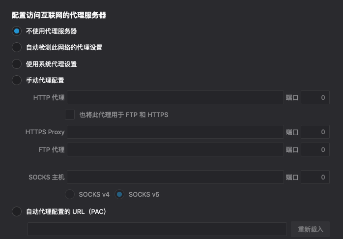
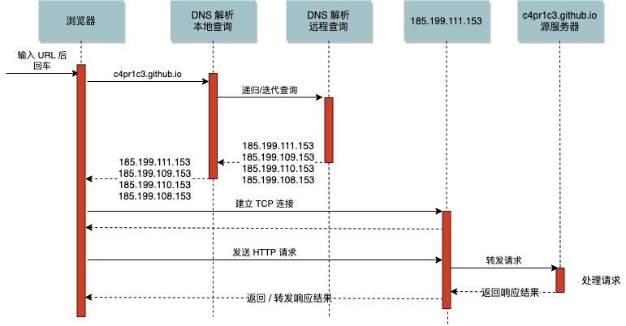
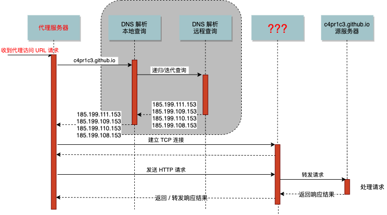
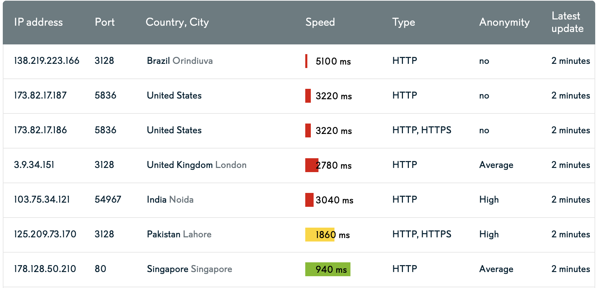
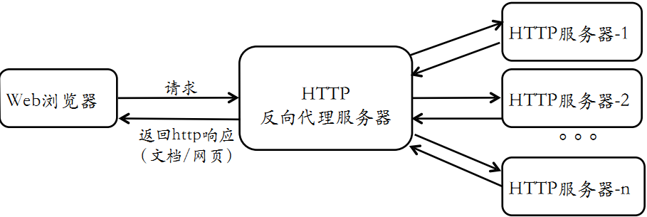
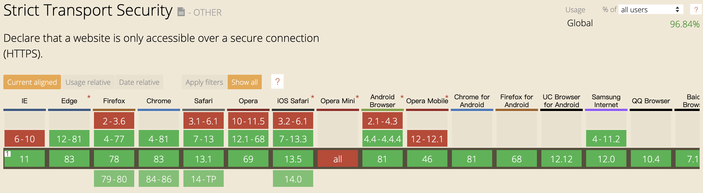
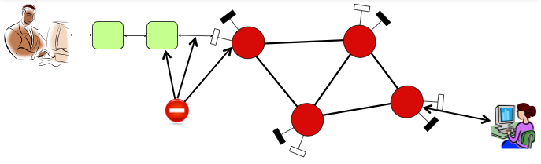

# 第三章 网络安全应用基础

---

## 温故

* TCP/IP网络分层模型
* 安全三要素: CIA
* 私有地址
* 公有地址
* 数字标识
    * 网络标识
    * 主机标识

---

## 知新

* IP地址不能作为确认攻击者身份的唯一标识
* 源和目的地址都是私有地址的数据包也能在“公网”上传输
* 代理服务的实现形式多种多样
    * 公开协议
    * 私有协议

---

## 本章内容提要

* 常见代理服务
    * HTTP代理
    * 虚拟专用网(VPN)
    * SOCKS代理
* 高级代理服务
* 代理服务的检测

# 经典代理服务模型

---


---

* 代理服务器同时扮演服务器和客户端两种角色
* 代理服务器是客户与服务器关系的 <font color="red">中间人</font>
* 「缓存」作为可选组件是常见的「安全风险点」

---

## 网络代理的基本类型

* **正向** 代理
    * 转发代理，最常见
        * 开放代理
            * 互联网上人人可访问的 `转发代理`
* **反向** 代理
    * 将客户端请求转发给后端服务器集群中的某个节点处理并返回处理结果给客户端

---

## 正向代理的应用场景

* 过滤
    * 内容过滤
* 缓存
* 绕过内容过滤和网络审查
* 日志和嗅探
* 私有网络的网关
* 匿名服务访问

---

## 反向代理的应用场景

* 提升加密链接性能
* 负载均衡
* 静态内容缓存
* 压缩（代理）
* 适配低网速客户端
* 安全网关
* 外网发布

---

## 网络代理的应用 —— 亦正亦邪 {id="proxy-apps-1"}

* ✅ 加密通信数据*
    * 防止通信数据被窃听和篡改（机密性和完整性保护）
* ⛑  审查网络通信数据*
    * 恶意流量检测和过滤
    * 失泄密行为发现和阻止
* 💡 改变网络拓扑结构*
    * 跨局域网/异构网络通信

> `* 视具体代理服务实现技术而定`

---

### ⛑  审查网络通信数据

* 用户隐私 🆚 网络与系统安全

---

## 网络代理的应用 —— 亦正亦邪 {id="proxy-apps-2"}

* ⚠️  隐藏来源 IP
* ⚠️  绕过网络安全审查/检测机制

> 威胁网络安全检测、监测、审计机制

---

网络安全的 <font color="red">对抗</font> 本质在「代理技术」的应用中体现地淋漓尽致。

# HTTP 代理 {id="http-proxy"}

---

## 回顾 HTTP {id="http-review-1"}

* RFC 2616: Hypertext Transfer Protocol -- HTTP/1.1
* RFC 2617: HTTP Authentication: Basic and Digest Access Authentication
* RFC 2818: HTTP Over TLS
* RFC 6265: HTTP State Management Mechanism
* RFC 2145 : Use and Interpretation of HTTP Version Numbers - Informational
* MIME相关RFC
    * RFC 2045, RFC 2046, RFC 2047, RFC 4288, RFC 4289, RFC 2049

---

## 回顾 HTTP {id="http-review-2"}

* HTTP （会话）基本过程
    * 建立连接（连接准备、连接）
    * 客户端发送请求 / 服务器发送响应
    * 关闭连接

---

## HTTP 代理类型 {id="http-proxy-types"}

* 正向代理
    * 通常意义上的“代理”
        * 改变通信数据内容*
* 反向代理
    * 面向用户完全透明
        * 对通信内容无修改*

> `* 和HTTP 代理的工作模式有关

---

### 不同浏览器的（正向）代理设置方法

> <浏览器名称> 设置代理



---

### 浏览器代理设置的常见陷阱 {id="proxy-setup-pitfalls-1"}



---

#### 浏览器输入URL 后发生了什么 {id="what-happened-after-url-typedin-1"}



---

### 浏览器代理设置的常见陷阱 {id="proxy-setup-pitfalls-2"}


---

#### 浏览器输入URL 后发生了什么 {id="what-happened-after-url-typedin-2"}



---

* 如果 DNS 解析的结果「被污染」？
* 如果 `代理服务器` 审查用户的 `访问请求` 和服务器 `响应内容` ？

---

## HTTP 代理的主要用途

* 访问受限制的Web站点
    * 限制机制：根据客户端来源IP过滤
* 优化Web站点访问速度
    * 预先缓存客户端要访问的数据
* 内容审查
    * 发现恶意内容并加以过滤阻止

---

## HTTP 代理的工作模式

* `X-Forwarded-For` (XFF)
    * 非 RFC 标准定义
    * Squid 代理的开发人员最早引入该 HTTP 消息头
    * 标识客户端真实IP
    * `X-Forwarded-For: client1, proxy1, proxy2`
* 匿名代理
    * 不提供 `X-Forwarded-For` 字段
* 非匿名代理
    * 提供 `X-Forwarded-For` 字段

---

### 实际应用中的 HTTP 代理类型

|            | REMOTE_ADDR          | HTTP_VIA                   | HTTP_X_FORWARDED_FOR                          |
| :-         | :-                   | :-                         | :-                                            |
| 透明代理   | 最后一个代理服务器IP | 代理服务器IP或内部代理别名 | 客户端真实IP，或（经过多个代理时）遵循XFF标准 |
| 普通匿名   | 最后一个代理服务器IP | 代理服务器IP或内部代理别名 | 部分遵循XFF标准（隐藏客户端真实IP）           |
| 欺骗代理   | 代理服务器IP         | 代理服务器IP或内部代理别名 | 伪造经过的代理服务器IP列表                    |
| 高匿名代理 | 代理服务器IP         | 无数值或不显示             | 无数值或不显示                                |

> [$_SERVER in PHP](https://www.php.net/manual/en/reserved.variables.server.php)

---

### 代理地址实例



---

### 本地代理模拟小实验

```php
// proxy.php
<?php
var_dump($_SERVER);
```

```bash
# 开启 PHP 测试用服务器
php -S 0.0.0.0:8080 proxy.php
```

```bash
# 使用 curl 模拟使用代理服务器的客户端
curl -H "X-Forwarded-For: 8.8.8.8" http://127.0.0.1:8080/proxy.php
# 样例输出（节选）
# array(18) {
#   ["REMOTE_ADDR"]=>
#   string(9) "127.0.0.1"
#   ["HTTP_X_FORWARDED_FOR"]=>
#   string(7) "8.8.8.8"
# }
```

---

## HTTP 反向代理 {id="reverse-http-proxy"}



---

### HTTP 反向代理主要用途 {id="reverse-http-proxy-usage"}

* 内网对外服务的堡垒主机
    * 负载均衡
    * 缓冲
* 内容小偷网站
    * 黑帽SEO

# HTTP 正向代理实验 {id="http-proxy-exp"}

---

## 必备理论知识

* **H**TTP **S**trict **T**ransport **S**ecurity
* `HSTS` 强制客户端和服务器之间的所有通信流量必须使用 HTTPS
* `HSTS` 的实现强烈依赖于「客户端」支持
    * 内置 `HSTS` 站点名单
    * 首次访问后按照服务器约定，在浏览器本地存储

---

### HSTS 的浏览器支持情况汇总 {id="hsts-compatibility-check-matrix"}

[](https://caniuse.com/#feat=stricttransportsecurity)

---

### 以 Google Chrome 浏览器为例

[chrome://net-internals/#hsts](chrome://net-internals/#hsts)


> auth.alipay.com 只有访问一次才能被「记忆」

* [Chromium 内置 HSTS 站点列表](https://www.chromium.org/hsts/)

---

## 实验环境

* Kali Rolling
* [tinyproxy](https://tinyproxy.github.io/)
* wireshark
* [burpsuite](https://portswigger.net/burp) （课后实验用）

---

## 主要操作步骤

```bash
# 安装 tinyproxy
apt update && apt install tinyproxy

# 启动 tinyproxy
systemctl start tinyproxy

# 访问前述 proxy.php
curl -x http://127.0.0.1:8888 http://127.0.0.1:8080/proxy.php
# array(19) {
#   ["REMOTE_ADDR"]=>
#   string(9) "127.0.0.1"
#   ["HTTP_HOST"]=>
#   string(14) "127.0.0.1:8080"
#   ["HTTP_VIA"]=>
#   string(32) "1.1 tinyproxy (tinyproxy/1.10.0)"
# }

# 在客户端请求头中加入客户端真实 IP
sed -i.bak "s/#XTinyproxy Yes/XTinyproxy Yes/" /etc/tinyproxy/tinyproxy.conf

# 重启 tinyproxy 服务
systemctl restart tinyproxy

# 在独立 shell 窗口开启 tinyproxy 日志监控小程序
tail -F /var/log/tinyproxy/tinyproxy.log

# 访问 HTTPS 站点
curl -x http://127.0.0.1:8888 https://auth.alipay.com/login/index.htm

# 查看
# CONNECT   Jul 06 17:17:15 [7672]: Connect (file descriptor 7): localhost [127.0.0.1]
# CONNECT   Jul 06 17:17:15 [7672]: Request (file descriptor 7): CONNECT auth.alipay.com:443 HTTP/1.1
# INFO      Jul 06 17:17:15 [7672]: No upstream proxy for auth.alipay.com
# INFO      Jul 06 17:17:15 [7672]: opensock: opening connection to auth.alipay.com:443
# INFO      Jul 06 17:17:15 [7672]: opensock: getaddrinfo returned for auth.alipay.com:443
# CONNECT   Jul 06 17:17:15 [7672]: Established connection to host "auth.alipay.com" using file descriptor 8.
# INFO      Jul 06 17:17:15 [7672]: Not sending client headers to remote machine
# INFO      Jul 06 17:17:15 [7672]: Closed connection between local client (fd:7) and remote client (fd:8)

# 查看 HSTS 响应头
curl -I -x http://127.0.0.1:8888 https://auth.alipay.com/login/index.htm
# HTTP/1.0 200 Connection established
# Proxy-agent: tinyproxy/1.10.0
# 
# HTTP/2 302
# server: nginx/1.6.2
# date: Mon, 06 Jul 2020 09:19:07 GMT
# content-length: 0
# location: https://authsa127.alipay.com:443/error.htm?exception_marking=the+requestMethod+%5BHEAD%5D+is+not+supported+by+handlers%2Cyou+can+try+with+%5BGET%2CPOST%5D%21&messageCode=common.uncaughtException
# set-cookie: zone=RZ54A; Domain=.alipay.com; Path=/
# strict-transport-security: max-age=31536000
# set-cookie: JSESSIONID=05BCA44886FEE4B2C3368F9167D55C83; Path=/; HttpOnly
# set-cookie: JSESSIONID=05BCA44886FEE4B2C3368F9167D55C83; Path=; HttpOnly
# set-cookie: ALIPAYJSESSIONID=RZ54drLXXabsSYlmZr5T8qeGb1zCKyauthRZ54; Domain=.alipay.com; Path=/
# set-cookie: ctoken=UH5ZAmhY7PZUtB7I; Domain=.alipay.com; Path=/
# content-language: zh-CN
# set-cookie: spanner=8YfCP1RF/xNEmob8naEHjZVRrhGwKYJXXt2T4qEYgj0=;path=/;secure;
# via: spanner-internet-5405.sa127[302]
```

---

## 课后实验

* [详见课本中本章实验](https://c4pr1c3.github.io/cuc-ns/chap0x03/exp.html)

# SOCKS 代理

---


---

## SOCKS 代理的应用 {id="socks-proxy-usage"}

* 电子邮件
* 新闻组软件
* 网络传呼
* 网络聊天
* 使用代理服务器「联网」打游戏

---

## 实战体验

```bash
# 建立宿主机到虚拟机的 SSH 隧道（socks5 代理）
# 推荐使用 Host-only 网卡对应的 VM IP 作为目标 IP
ssh -D 127.0.0.1:1080 cuc@192.168.56.136 -q -C -N -v

# 使用上述建立的 SSH 隧道访问虚拟机内的「本地网页」
curl http://127.0.0.1:8080/proxy.php -x socks5://127.0.0.1:1080

# 使用远程服务器完成 DNS 解析请求
curl http://127.0.0.1:8080/proxy.php -x socks5://127.0.0.1:1080 --socks5-hostname 127.0.0.1:1080

# 自行抓包研究通信过程
# TODO 是否存在「可辨识」的「网页访问」行为痕迹？

# 查看 PHP 终端日志
# TODO 访问来源 IP 是「宿主机」IP 吗？
```

---

## 常见代理服务小结

* 使用开放代理要谨慎
    * 避免敏感数据被嗅探
    * 避免重要数据被篡改
* 一般情况下的代理安全性排序
    * VPN ≥ Socks代理 > HTTP代理

# 代理服务的检测

---

## 检测需求

* 网络流量计费
    * 避免计费误差和损失
* 网络安全审计
    * 打击网络攻击源头
* 网络滥用
    * 打击网络滥用源头

---

## 检测手段

* 静态特征
    * 协议关键字
* 动态特征
    * 流量统计特征

---

### 静态特征检测

* 端口扫描
* 协议字段变量特征
    * 网络数据报文
        * 头部字段
        * 负载数据

---

### 端口扫描检测方式

* 端口扫描方式主要适用于对代理服务器的检测
* 代理服务器一般最为常用的端口有8080/3218等，可以通过扫描这些端口获得
* 对于采用非常用端口的代理服务器，端口扫描方式的效率低，准确性也差

---

### 变量特征

* HTTP 代理常见的变量特征：
    * VIA
    * X-FORWARDED-FOR
    * CACHE-CONTROL
    * FORWAREDED
    * PROXY-CONNECTION

---

### 动态特征

* 协议行为特征（照搬「对匿名通信系统」的攻击）
    * 流量形状攻击
        * 通信模式攻击
        * 消息频度攻击
        * 报文计数攻击
    * 交集攻击
    * 重放攻击
    * 刷新攻击
    * 时间攻击

---

## 代理服务检测

* 设置浏览器使用HTTP代理
* 伪造HTTP请求头
    * X-Forwarded-For 设置单个、多个IP地址
    * X-Forwarded-For 设置任意字符

---


---



* 代理检测方法的效果取决于检测方所拥有的资源多少、权限大小
    * 主机、交换机、路由器、核心网交换机、ISP路由器。。。
    * 主机监控软件、网络嗅探、网络篡改。。。

---


# 课后思考题

---

* 代理技术在网络攻防中的意义？
    * 对攻方的意义？
    * 对守方的意义？
* 常规代理技术和高级代理技术的设计思想区别与联系？

