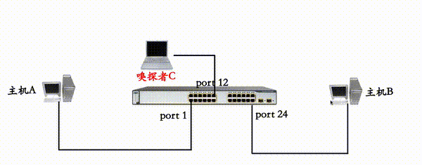
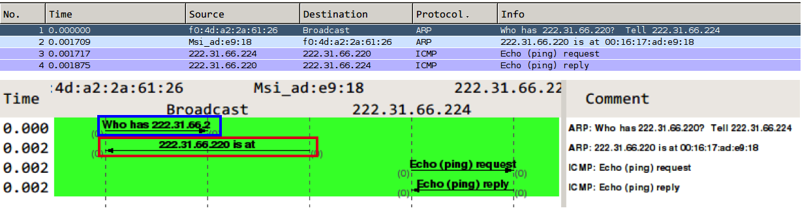
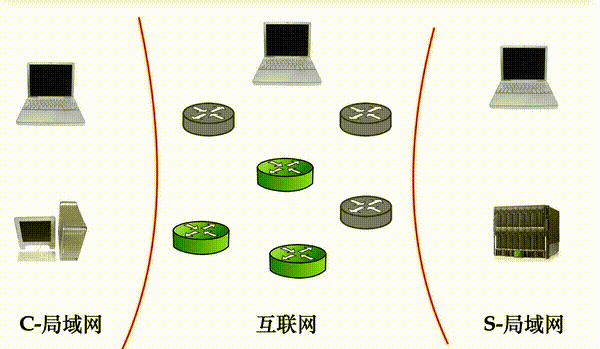
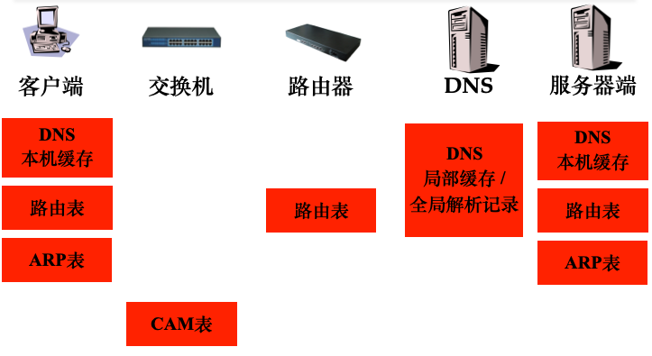
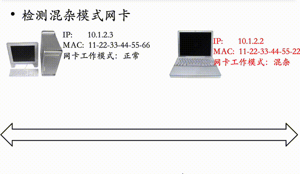

# 第四章 网络监听

---

## 温故

* 代理模型中的嗅探问题
    * 所有通信数据都会经过代理服务器
* 网络数据包嗅探工具
    * Wireshark工具的高级使用
        * 协议分析 / 网络故障诊断

---

## 知新

* 交换式网络环境依然可以网络监听
* 网络监听是通信内容机密性的大敌
* 如何抓出局域网中的嗅探者
* 如何防范网络监听

# 网络监听原理

---

* 被动监听
    * 共享式网络环境
    * 交换式网络环境
* 主动监听
    * 数据链路层的漏洞利用
    * ARP欺骗

---

## 共享式网络环境

* IEEE 802.3以太局域网采用广播机制
    * 局域网上的所有主机共享相同的通信链路
    * 单个主机的标识
        * MAC（Media Access Control）地址
* 网卡检查接收到的数据包的目的地址
    * 正常状态下的网卡操作
        * 只接收目的MAC地址是自己的数据包，其他数据包丢弃
* 混杂模式
    * 不检查目的 MAC 地址，来者不拒

---

> 完全被动的嗅探，很难发现嗅探者

---


---

## 交换式网络环境

* 交换机的 `CAM` 表
    * `Content Addressable Memory`
    * 存储局域网中每台计算机的 MAC 地址
    * MAC 地址关联存储到网卡所连接的交换机端口号
    * 数据包转发基于 `CAM` 表查找，不再广播

---



---

**交换式网络环境就没有被嗅探的可能了吗？**

---

> 主动监听！

# 主动监听

---

## 主动监听的原理

* 数据链路层的漏洞利用
* ARP欺骗的三种模式
    * 终端ARP缓存投毒
        * 主动嗅探/中间人攻击
    * 交换机 `DoS`
        * 强制交换机进入 `Hub` 模式：广播
    * 交换机投毒
        * 主动 **污染** 交换机的 `MAC-Port` 转发表
            * `Content Addressable Memory (CAM)`

---

### 温故：ARP {id="arp-review"}

* `ARP`: `Address Resolution Protocol`
    * 地址解析协议
    * 主机在发送帧前将 `目标 IP 地址` 转换成 `目标 MAC 地址` 的过程
    * 局域网中的主机间通信依赖于 `ARP` 找到目标主机
    * 局域网中的主机访问外网依赖于 `ARP` 找到网关
* ARP表
    * 动态学习
    * 静态配置

---


---



* `who has 222.31.66.220? Tell 222.31.66.224` <font color="blue">ARP 请求</font>
    * <font color="blue">提问</font>
* `222.31.66.220 is at 00:16:17:ad:e9:18` <font color="red">ARP 响应</font>
    * <font color="red">举手</font>

---

### 温故：GARP {id="garp-review"}

* `Gratuitous ARP (GARP)`
    * 无故 ARP
    * 检查重复地址或 IP 地址冲突（如果收到 ARP 响应则表明存在重复地址或 IP 地址冲突）
    * 用于通告一个新的数据链路标识
        * 当一个设备收到一个 `arp 请求` 时，发现 `arp 查找表` 中已有发送者的 IP 地址，则更新此 IP 地址对应的 MAC 地址条目

---


---


---


---


---


# 网络监听工具

---

## Wireshark 简介 {id="wireshark-intro-1"}

Wireshark是网络包分析工具，前身是Ethereal，主要用来捕获网络包，具有以下特性

* 多平台支持：Win / Mac / *nix
* 实时捕获网络数据包
* 详细显示数据包的协议信息
* 读取/保存数据包
* 支持基于规则的数据包/协议统计分析
* 支持多种方式过滤捕获/显示网络数据包
* 导入/导出其他网络嗅探程序支持的数据包格式
* 多种方式查找包

---

## Wireshark 简介 {id="wireshark-intro-2"}


---

## 命令行版 Wireshark 的基本使用 {id="tshark"}

```bash
# 捕获指定IP地址相关的数据包并保存到文件
sudo tshark -f "host <ip-address>" -w <output-file.pcap>

# 获取当前系统上所有可捕获的网卡ID
sudo tshark -D

# 指定数据包捕获所使用的网卡
sudo tshark –I <capture interface>
```

---

## 不可思议的 Wireshark 功能 {id="wireshark-feature-1"}

大流量数据捕获优化

* 非实时更新报文窗口
* 文件切割保存
* 禁用MAC地址/域名/协议类型反向解析
* 自定义数据包捕获终结条件
* 按报文个数 / 大小 / 捕获时间

---

## 不可思议的 Wireshark 功能 {id="wireshark-feature-2"}

自定义过滤规则

* 数据包捕获时过滤规则——大流量数据捕获优化
* 报文显示时过滤规则——协议分析辅助

---

## 不可思议的 Wireshark 功能 {id="wireshark-feature-3"}

网络状况分析

* 网络质量参数分析
    * 按协议分类报文速率
    * 丢包率/重传报文数/畸形包数量
    * TCP QoS参数
        * RTT / 带宽 / 时序图

---

## 不可思议的 Wireshark 功能 {id="wireshark-feature-4"}

一键导出防火墙规则

* Cisco IOS / iptables /windows firewall / IPFirewall

---

## 不可思议的 Wireshark 功能 {id="wireshark-feature-5"}

协议分析神器

* TCP/UDP会话跟踪
    * Follow TCP/UDP Stream
* VoIP协议分析
    * 信令 / 语音数据自动识别和提取
* 应用层负载数据关键词检索
    * 二进制 / 十六进制 / 文本
* 一键导出保存应用层负载到
    * 文本 / 二进制原始数据 / 十六进制 / C语言数组
* 报文统计规律
    * 按报文长度 / 按协议分层会话 / 自定义报文显示过滤

---

## 常用报文「捕获」过滤规则举例 {id="wirehsark-capture-filter"}

```bash
# 只捕获IP地址为172.18.5.4的相关报文
tshark -f "host 172.18.5.4"

# 只捕获指定网段的相关报文
tshark -f "net 192.168.0.0/24"

# 只捕获特定端口流量
tshark -f "port 53 or port 80"

# 只捕获指定端口范围的TCP报文
tshark -f "tcp portrange 1501-1549"
```

---

## 常用报文「显示」过滤规则举例 {id="wireshark-display-filter"}

```bash
# 只显示SMTP和ICMP相关报文
tshark -r sample.pcap "tcp.port eq 25 or icmp"

# 只匹配显示UDP报文头部或负载的连续3字节值为0x81, 0x60, 0x03
tshark -r sample.pcap "udp contains 81:60:03"

# 应用层正则式匹配查找
tshark -r sample.pcap 'sip.To contains "^a1762$"'
tshark -r sample.pcap 'http.request.uri matches "^id=[\d]*"'
```

---

## 协议分析样本资源

* [Wireshark官方的报文样本库](http://wiki.wireshark.org/SampleCaptures)
* [Web 2.0 Packet Samples](http://pcapr.net)

---

> 网络流量分析 Show Time

---

## 被动监听小结

* 网络管理
    * 网络质量监视
    * 网络故障排查
* 网络协议分析
    * 已知协议的自动化分析辅助
    * 未知协议的逆向分析辅助
* 一般方法
    * 应用命令行版数据捕获工具完成报文捕获
    * 使用 GUI 工具深入分析捕获的报文

# 一道二术三器

---


---

* 不变之「道」：持续对抗
* 演进之「术」：中间人攻击
* 走马灯「器」：dsniff, ettercap, mitmf, bettercap, ……

# 网络监听的检测与防范

---

## 回顾：网络监听的方法

* 被动监听
    * 共享式网络环境
    * 交换式网络环境
* 主动监听
    * 终端 ARP 缓存投毒
    * 交换机 DoS
    * 交换机投毒

---



---


---



---

## 扩展：任意网络拓扑主动监听的基本原理

* 寻址机制是主动监听的攻击重点
* 查找：CAM / ARP / 路由 / DNS
* 引流是主动监听的核心手段
* 让通信流量（双向）通过监听者控制的设备、系统
* 获取通信负载是主动监听的核心目标

---



---

## 检测终端 ARP 缓存投毒者 {id="detect-arp-poisoner-1"}

```bash
# 正常状态
arp -a
Internet 地址         物理地址              类型
 10.0.2.2              52-54-00-12-35-02     动态

# 被投毒状态（同一个 IP 地址对应多个不同 MAC 地址或异常的 IP-MAC ）
arp -a 
Internet 地址         物理地址              类型
 10.0.2.2              52-54-00-12-35-02     动态
 10.0.2.2              25-35-FE-12-35-12     动态
```

> 桌面 ARP 防火墙可以有效检测、发现和防护

---

## 检测终端 ARP 缓存投毒者 {id="detect-arp-poisoner-2"}

* 发送ARP请求包
    * 正确的 IP 地址
    * 错误目的 MAC 地址
* 只有工作于混杂模式的网卡会响应该ARP请求数据包
* 工作于混杂模式网卡的操作系统内核会自动回应该 ARP请求数据包

---

### 不同操作系统对 ARP 广播包的处理方式有差异 {id="arp-br-handler-except"}

例如，虚假广播消息:

* FF:FF:FF:FF:FF:FF:FF:FE (Br47): Last bit missing
* FF:FF:00:00:00:00:00:00 (Br16): Only first 16 bits are the same as for broadcast.
* FF:00:00:00:00:00:00:00 (Br8)
* F0:00:00:00:00:00:00:00 (Br4)

---

### 不同操作系统的内核过滤机制有差异

例如，虚假组播消息:

* 01:00:00:00:00:00:00:00 (Gr): Only group-bit set.
* 01:00:5E:00:00:00:00:00 (M0): Multicast address zero is usually not used
* 01:00:5E:00:00:00:00:01 (M1): (assigned to all) Multicast address one should be received by all in the test system
* 01:00:5E:00:00:00:00:02 (M2): (assigned to different set of nodes) Multicast address two should not be received by systems in the test group.
* 01:00:5E:00:00:00:00:03 (M3): (not registered)

---


---

### 非混杂模式 VS. 混杂模式网卡对 ARP 请求的响应实例 {id="arp-resp-comparison"}


* 左图：目标主机对「与己无关」的 ARP 请求「毫无反应」
* 右图：目标主机对「与己无关」的 ARP 请求「积极响应」

---

## 检测针对交换机的泛洪攻击

网络抓包分析

* 启用交换机的端口镜像
* 重点关注
    * 链路通信质量参数：丢包率/重传率
    * 未知MAC地址

---

## 检测交换机投毒者

交换机CAM表中的异常更新记录

* 同一个MAC地址反复被映射到不同物理端口

---

## 终端用户如何防范网络嗅探攻击

* 安装桌面型ARP防火墙
    * 防护终端ARP投毒
* 配置静态ARP地址表
    * 绑定网关IP与MAC地址
        * `arp -s <网关IP>  <网关MAC>`
* 敏感数据加密后再传输并使用加密通信协议
    * 应用层（负载）加密
    * 遵循 `纵深防御` 原则

---

## 网络管理员如何防范网络嗅探攻击

* 启用并正确配置交换机的安全机制
    * 交换机的端口安全机制
        * 交换机物理端口和MAC地址的静态绑定
        * 限制交换机单个物理端口可以动态绑定的MAC地址数量
    * 划分VLAN
* 部署内网安全监控设备
    * 监视异常网络状况
        * 丢包/ 重传 / 畸形包 / 广播风暴 …


