# 第五章 网络扫描

---

## 温故

* 访问控制是（操作）系统安全的基础
* 局域网的安全管理是网络安全的 **基础**
    * 任何网络层加密数据在一个 **不安全** 的局域网中都有可能被嗅探
    * 攻击者一旦渗透进入内部网络，后果不堪设想
    * 内网安全先从管好ARP协议开始
* 网络监听是 **被动** 分析网络安全的重要手段

---

## 知新

* 网络扫描是主动分析网络安全的重要手段
    * 对于黑客来说
        * 网络扫描是网络入侵的序曲
        * 网络扫描是信息收集的手段之一
* 对于网络管理员来说
    * 网络扫描是网络安全防御的自我检测手段

# 网络扫描与信息收集

---

## 信息收集

* 知己知彼，百战不殆

> 语出《孙子·谋攻》

> 知己知彼，百战不殆；不知彼而知己，一胜一负；不知彼，不知己，每战必殆。

---

## 信息收集的目标对象

* 目标主机
* 目标网络
* 目标应用/服务
* 目标人

---

## 信息收集之网络扫描

* 网络扫描是实现信息收集目的 **手段之一**
* 重点关注
    * 目标主机
    * 网络拓扑
    * 目标应用/服务

---

### 目标主机

* 在线状态
    * 端口开放情况
    * 网络服务详细信息
* 外网边界入口主机
* 内网目标主机

---

### 网络拓扑

* 网络边界：网关
* 子网划分 / VLAN / Windows 域控服务器 
* 网络基础设施：DNS、DHCP、NTP、Captive Portal、Radius Server、LDAP
* 网络安全基础设施：防火墙、入侵检测、入侵防护、蜜罐和蜜网等

---

### 目标应用/服务

* 版本信息
* 是否存在漏洞


---

## 信息收集之踩点

* 直接访问
    * 目标主机
    * 目标网络
    * 目标应用/服务
* 黑盒测试
    * 使用特定客户端连接指定端口/应用/服务
        * 浏览器 / FTP /telnet
    * 使用特定帐号和口令尝试登录
    * 模仿交互

---

## 信息收集之踩点

* 白盒分析
    * 通过 banner 抓取和应用指纹识别确定了开源组件信息之后

---

## 信息收集之社会工程学

* 目标人
    * 社交网络应用信息：微博 / SNS / blog …
* Google Hacking
    * site: / filetype: / inurl:
    * GHDB: Google Hacking Database
* 钓鱼
    * 电子邮件 / 即时通信 / 电话 …

---

### 一张图片中隐藏的信息


---

### 一张图片中隐藏的信息


---

### 一张图片中隐藏的信息

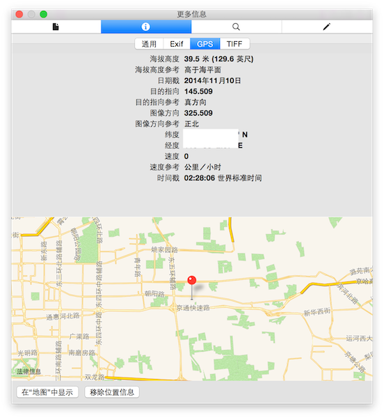

---

### 一张图片中隐藏的信息

[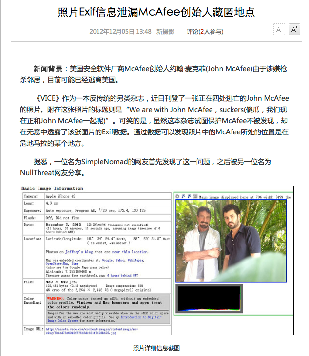](http://tech.sina.com.cn/digi/dc/2012-12-05/13487859580.shtml)

---

## 信息收集的自动化


---

## 信息收集的自动化

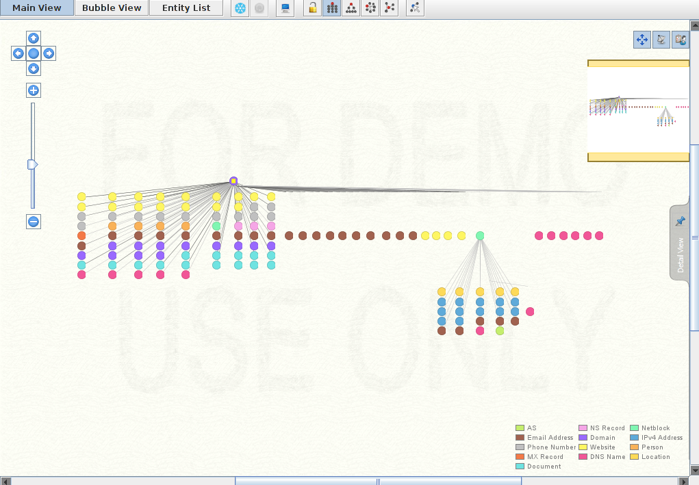

---

## 信息收集的自动化

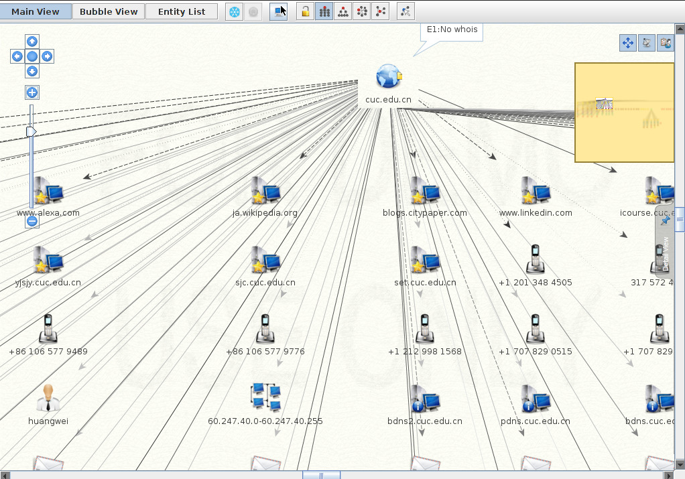

# 网络扫描原理

---

* 网络扫描的基本思想
* 网络扫描的基本原理
* 网络扫描的主要实现技术

---

## 基本思想


---

### 报文发送与接收

[](https://asciinema.org/a/pPklHDfK5vUquhbcMF70oOqbs)

---

### TCP/IP 协议栈视角看网络扫描 {id="scan-by-layers"}

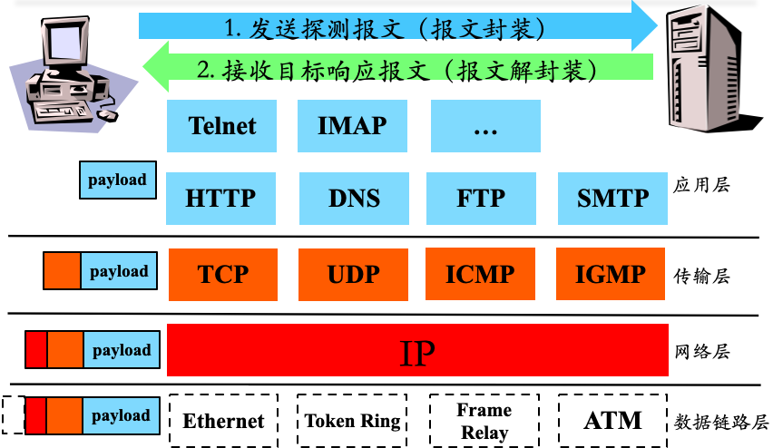

---

### TCP/IP 协议栈视角看网络扫描 {id="scan-by-layers-flowgraph"}

[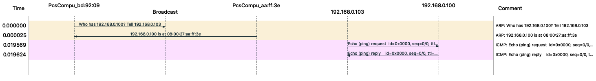](attach/chap0x05/scapy-ping.pcap)

> Wireshark 工具菜单里 Statistics --> Flow Graph

---

### 回顾：TCP 协议 {id="tcp-review"}

* Transmission Control Protocol
* TCP是一种面向连接的，可靠的传输层协议
* TCP建立连接过程称为三次握手

---

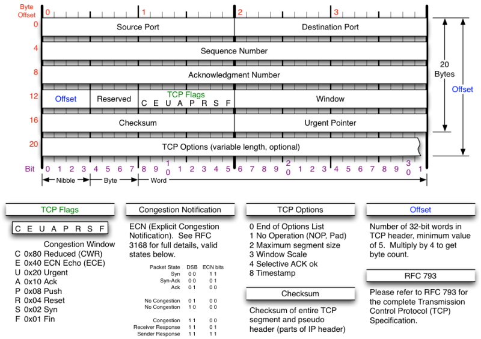

---

[](https://asciinema.org/a/gs6z4NnrB1SrW13cxq67s9P8P)

---

[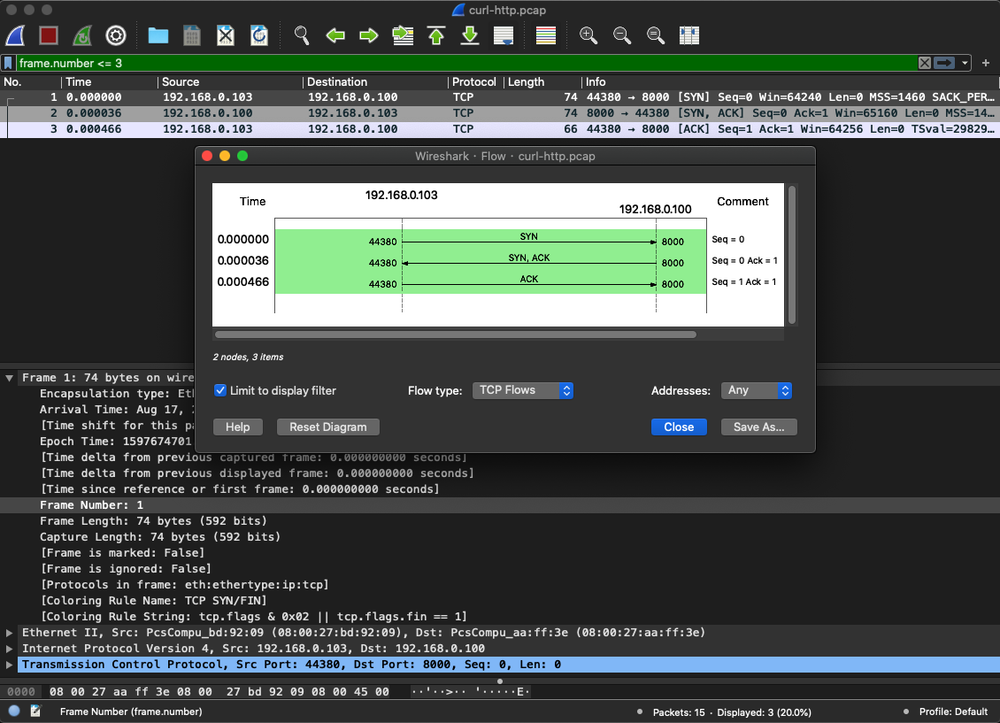](attach/chap0x05/curl-http.pcap)

---

### 回顾：UDP 协议 {id="udp-review"}

* User Datagram Protocol
* UDP 是一种提供面向事务的简单不可靠信息传送服务
    * 无连接协议：源和目的端在数据传输之前不建立连接
        * 收发双方均无需维护连接状态信息
        * 应用层按需维护连接状态信息
    * 尽力而为
        * 相比较于 TCP 协议的操作系统协议栈实现而言

---

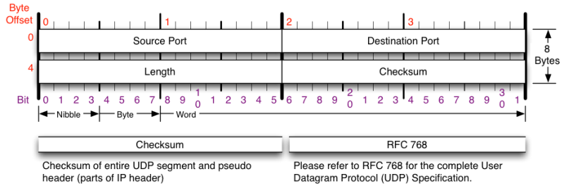

---

### 回顾：ICMP 协议 {id="icmp-review"}

* Internet Control Message Protocol
* 用途
    * 网关或者目标机器利用 ICMP 与源通讯
    * 当出现问题时，提供反馈信息用于报告错误
* 特点
    * 其控制能力并不用于保证传输的可靠性
    * 它本身也不是可靠传输的
    * 并不用来反映 ICMP 报文的传输情况

---


---

## 协议标准和（操作系统）协议栈的关系

* 协议标准（声明）
    * 严格统一和规范标准
        * RFC 793 TRANSMISSION CONTROL PROTOCOL
        * RFC 768 User Datagram Protocol
        * RFC 791 INTERNET PROTOCOL
        * RFC 792 Internet Control Message Protocol
* 协议栈（实现）
    * 严格遵循标准实现
    * 标准未尽之处的实现会略有 **差异**

---

## 扫描知识库构建与规则匹配


---

### 扫描知识库构建举例 —— [IANA 注册端口号](https://tools.ietf.org/html/rfc4340#section-19.9)

* 传输层报文头部字段特征
* 公用端口
    * 0 到 1023
* 注册端口
    * 1024 到49151
* 动态的或私有端口
    * 49152 到 65535

---

* `/etc/services`
* `/usr/share/nmap/nmap-services` （安装 `nmap` 之后）

---

### Service Name and Transport Protocol Port Number Registry

[](https://www.iana.org/assignments/service-names-port-numbers/service-names-port-numbers.xhtml)

---

## 端口状态 —— 知识库构建的基础 {id="port-status"}

* 开放 ✅
    * 应用/服务监听该端口
    * **有条件有规则** 地响应请求数据报文
* 关闭 ⛔
    * 无应用/服务监听该端口
    * **有条件有规则** 地响应或忽略请求数据报文
    * 操作系统会针对SYN请求报文回应RST报文
* 被过滤 ⚠️
    * 报文过滤程序监听该端口
    * **有条件有规则** 地响应或忽略请求数据报文
        * 报文过滤程序可能会返回报文拒绝消息

---

## 主机状态

* 可达（在线） 📶
    * 对至少一种类型的请求数据包有响应（充要条件）
        * 有开放端口（充分非必要条件）
* 不可达（离线） 📴 
    * 对任何类型的请求数据包均无响应（充分条件）
        * 无开放端口（必要非充分条件）
            * 例如普通PC机，在线时但无开放端口
    * 在线主机在防火墙的保护下也可能是不可达状态

---

ℹ️  注意事项

> 端口状态是传输层的概念，不要和网络层、数据链路层、物理层可达混淆

---

## 主机状态详细信息

* 操作系统信息
    * 发行版本、详细版本号、语言等
* 端口/应用/服务状态信息
    * 端口状态
    * 应用程序版本
* 远程获取主机状态详细信息的基础
    * 主机扫描
    * TCP/IP 协议栈实现知识库
        * 不同操作系统/应用程序的差异

# 主机扫描技术

---

## 可达状态检测

* 局域网
    * ARP 扫描
* 广域网
    * ICMP Echo 扫描
    * ICMP Sweep 扫描
    * ICMP Broadcast 扫描
    * ICMP Non-Echo 扫描

---

### 局域网 ARP 扫描 {id="arping"}

```python
#! /usr/bin/env python
# arping: arpings a network

import sys
from scapy.all import srp, Ether, ARP, conf


if len(sys.argv) != 2:
    print("Usage: arping <net>\n  eg: arping 192.168.56.1/24")
    sys.exit(1)

conf.verb = 0

pkt = Ether(dst="ff:ff:ff:ff:ff:ff")/ARP(pdst=sys.argv[1])
ans, unans = srp(pkt, timeout=2)

for snd, rcv in ans:
    print("{} {}".format(rcv.src, rcv.psrc))
```

---


---

### ICMP echo 扫描

* 实现原理
    * ping的实现机制
* 优点
    * 简单，系统支持
* 缺点
    * 很容易被防火墙限制

---

### ICMP Sweep 扫描

```python
#!/usr/bin/env python

import sys
import threading
import ipaddress
from scapy.all import ICMP, IP, sr1
from queue import Queue

if len(sys.argv) < 2:
    print("Usage: icmping <host> [icmp_type] [icmp_code]\n")
    print("eg: icmping 192.168.56.0/24")
    print("eg: icmping 192.168.56.0/24 13 0")
    print("eg: icmping 192.168.56.0/24 15 0")
    print("eg: icmping 192.168.56.0/24 17 0")
    sys.exit(1)

network = sys.argv[1]
if len(sys.argv) < 3:
    icmp_type = 8
else:
    icmp_type = int(sys.argv[2])

if len(sys.argv) < 4:
    icmp_code = 0
else:
    icmp_code = int(sys.argv[3])

max_threads = 100
ip_net = ipaddress.ip_network(network)
all_hosts = list(ip_net.hosts())
live_count = 0

print('Sweeping Network with ICMP: {} type={}/code={}'.format(network, icmp_type, icmp_code))


def pingsweep(ip):
    host = str(all_hosts[ip])
    resp = sr1(
        IP(dst=str(host))/ICMP(type=icmp_type, code=icmp_code),
        timeout=2,
        verbose=0,
    )

    if resp is None:
        # print(f"{host} is down or not responding.")
        return 0
    elif (
        int(resp.getlayer(ICMP).type) == 3 and int(resp.getlayer(ICMP).code) in [1, 2, 3, 9, 10, 13]
    ):
        # print(f"{host} is blocking ICMP.")
        return 0
    else:
        print(f"{host} is responding.")
        return 1


def threader():
    while True:
        worker = q.get()
        pingsweep(worker)
        q.task_done()


q = Queue()

for x in range(max_threads):
    t = threading.Thread(target=threader)
    t.daemon = True
    t.start()

for worker in range(len(all_hosts)):
    q.put(worker)

q.join()
```

---


---

### ICMP Broadcast 扫描

* 实现原理
    * 将ICMP请求包的目标地址设为广播地址或网络地址，则可以探测广播域或整个网络范围内的主机
* 缺点
    * 只适合于UNIX/Linux系统，Windows 会忽略这种请求包；
    * 这种扫描方式容易引起广播风暴

```bash
ping -b 192.168.0.255
```
---

[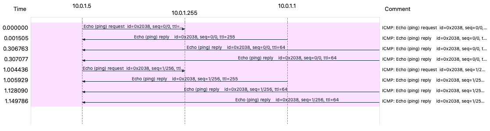](attach/chap0x05/icmp-broadcast-scan.pcap)
---

### Non-Echo ICMP 扫描

一些其它 ICMP 类型包也可以用于对主机或网络设备的探测，如：

* Stamp Request(Type 13) / Reply(Type 14)
* Information Request(Type 15) / Reply(Type 16)
* Address Mask Request (Type 17) / Reply(Type 18)

---

## 可达状态检测高级技术 {id="reachable-test-1"}

防火墙和网络过滤设备的存在，常常导致传统的探测手段变得无效，为了突破这种限制

* 异常的 IP 包头
* 在 IP 头中设置无效的字段值
* 错误的数据分片
* 通过超长包探测内部路由器
* 反向映射探测

---

### 异常的IP包头

* 向目标主机发送包头错误的 IP 包，目标主机或过滤设备可能会反馈 `ICMP Parameter Problem Error` 信息
    * 常见的伪造错误字段为 `Header Length Field` 和 `IP Options Field`

---

### 在 IP 头中设置无效的字段值

* 向目标主机发送的IP包中填充错误的字段值，目标主机或过滤设备会反馈 `ICMP Destination Unreachable` 信息

---

### 错误的数据分片

* 当目标主机接收到错误的数据分片,并且在规定的时间间隔内得不到更正时，将丢弃这些错误数据包，并向发送主机反馈 `ICMP Fragment Reassembly Time Exceeded` 错误报文

---

### 通过超长包探测内部路由器

* 若构造的数据包长度超过目标系统所在路由器的 `PMTU` 且设置禁止分片标志, 该路由器会反馈  `Fragmentation Needed and Don’t Fragment Bit was Set` 差错报文，从而获取目标系统的网络拓扑结构

---

### 反向映射探测

* 用处
    * 该技术用于探测被过滤设备和防火墙保护的网络和主机
* 方法
    * 构造可能的内部IP地址列表，并向这些地址发送数据包
    * 对方路由器进行IP识别并路由
    * 根据是否返回错误报文来进行探测

# 主机状态详细信息探测技术

---

* 开放扫描
    * 会产生大量审计数据，容易被对方发现，但其可靠性高
* 隐蔽扫描
    * 能有效避免对方入侵检测系统和防火墙的检测，但这种扫描使用的数据包在通过网络时容易被丢弃从而产生错误的探测信息
* 半开放扫描
    * 隐蔽性和可靠性介于前两者之间

---

## 开放扫描 —— TCP Connect 扫描 {id="tcp-connect-scan-1"}

| 序号 | 通信方向 | 流程 1      | 流程 2      | 流程 3                  |
| --   | --       | --          | --          | --                      |
| 1    | C -> S   | SYN+Port(n) | SYN+Port(n) | SYN+Port(n)             |
| 2    | S -> C   | SYN/ACK     | RST         | 无响应/其他拒绝反馈报文 |
| 3    | C -> S   | ACK         |             |                         |
| 4    | C -> S   | RST         |             |                         |
|      | 状态推断 | 开放 ✅     | 关闭  ⛔    | 被过滤 ⚠️                |

---

### TCP Connect 扫描 {id="tcp-connect-scan-2"}

* 实现原理
    * connect()
    * 完成TCP三次握手
* 优点
    * 稳定可靠，不需要特殊的权限
* 缺点
    * 扫描方式不隐蔽，服务器日志会记录下大量密集的连接和错误记录，并容易被防火墙发现和屏蔽

---

## 开放扫描 —— UDP 扫描 {id="udp-scan-1"}

| 序号 | 通信方向 | 流程 1               | 流程 2                        |
| --   | --       | --                   | --                            |
| 1    | C -> S   | UDP+Port(n)          | UDP+Port(n)                   |
| 2    | S -> C   | UDP+port(n) 响应数据 | 无响应/其他拒绝反馈报文       |
|      | 状态推断 | 开放 ✅              | 开放 ✅ / 关闭  ⛔ / 被过滤 ⚠️ |

---

### UDP 扫描 {id="udp-scan-2"}

* 实现原理
    * 向指定 UDP 端口发送数据
    * 如果「语言相通」，则服务端会根据“语言内容”（UDP 上层应用协议约定）「响应数据」
    * 如果「鸡同鸭讲」，则目标端口即使处于开放状态也可能会表现出「静默无响应」行为

---

## 半开放扫描 —— TCP SYN 扫描 {id="tcp-syn-scan-1"}

| 序号 | 通信方向 | 流程 1      | 流程 2      | 流程 3                  |
| --   | --       | --          | --          | --                      |
| 1    | C -> S   | SYN+Port(n) | SYN+Port(n) | SYN+Port(n)             |
| 2    | S -> C   | SYN/ACK     | RST         | 无响应/其他拒绝反馈报文 |
| 3    | C -> S   | RST         |             |                         |
|      | 状态推断 | 开放 ✅     | 关闭  ⛔    | 被过滤 ⚠️                |

---

## 半开放扫描 —— TCP SYN 扫描 {id="tcp-syn-scan-2"}

* 实现原理
    * 仅发送 SYN 包
    * 不建立完整TCP连接
    * 又称为半开放/半连接扫描
* 优点
    * 隐蔽性较全连接扫描好，很多系统对这种半扫描很少记录
* 缺点
    * 需要 **操作系统管理员权限** 构造 SYN 报文
    * 网络防护设备会有记录

---

## 半开放扫描 —— TCP 间接扫描 {id="tcp-proxy-scan-1"}


---

## 半开放扫描 —— TCP 间接扫描 {id="tcp-proxy-scan-2"}

* 实现原理
    * 伪造 **第三方源 IP**（`跳板机 IP`）发起 SYN 扫描
* 优点
    * 隐蔽性好
* 缺点
    * 对跳板主机的要求较高
    * 广域网中受制于路由器的包过滤规则

---

## 隐蔽扫描 —— TCP FIN 扫描 {id="tcp-fin-scan-1"}

| 序号 | 通信方向 | 流程 1          | 流程 2                         |
| --   | --       | --              | --                             |
| 1    | C -> S   | TCP FIN+Port(n) | TCP FIN+Port(n)                    |
| 2    | S -> C   | RST             | 无响应/其他拒绝反馈报文        |
|      | 状态推断 | 关闭  ⛔        | 开放 ✅ / 关闭  ⛔ / 被过滤 ⚠️  |

---

## 隐蔽扫描 —— TCP FIN 扫描 {id="tcp-fin-scan-2"}

* 实现原理
    * 仅发送 FIN 包
* 优点
    * FIN 数据包能够通过只监测 SYN 包的包过滤器
    * 隐蔽性较 SYN 扫描更高
* 缺点
    * 跟 SYN 扫描类似，需要自己构造数据包，要求由 **操作系统管理员** 或者授权用户访问专门的系统调用

---

## 隐蔽扫描 —— TCP Xmas 扫描 {id="tcp-xmas-scan"}

| 序号 | 通信方向 | 流程 1                            | 流程 2                            |
| --   | --       | --                                | --                                |
| 1    | C -> S   | TCP FIN(1),PUSH(1),URG(1)+Port(n) | TCP FIN(1),PUSH(1),URG(1)+Port(n) |
| 2    | S -> C   | RST                               | 无响应/其他拒绝反馈报文           |
|      | 状态推断 | 关闭  ⛔                          | 开放 ✅ / 关闭  ⛔ / 被过滤 ⚠️     |

---

## 隐蔽扫描 —— TCP Null 扫描 {id="tcp-null-scan"}

| 序号 | 通信方向 | 流程 1                            | 流程 2                            |
| --   | --       | --                                | --                                |
| 1    | C -> S   | TCP FIN(0),PUSH(0),URG(0)+Port(n) | TCP FIN(0),PUSH(0),URG(0)+Port(n) |
| 2    | S -> C   | RST                               | 无响应/其他拒绝反馈报文           |
|      | 状态推断 | 关闭  ⛔                          | 开放 ✅ / 关闭  ⛔ / 被过滤 ⚠️     |

---

## 隐蔽扫描 —— TCP Xmas 和 Null 扫描 {id="tcp-hidden-scan"}

* 实现原理
    * Xmas: 设置 TCP 报文头 FIN、URG 和 PUSH 标记
    * Null：关闭所有 TCP 报文头标记
* 优点
    * 隐蔽性好
* 缺点	
    * 需要自己构造数据包，要求有 **操作系统管理员** 或者授权用户权限

---

## 隐蔽扫描——分段扫描

* 实现原理
    * 将一个完整 TCP 报文分割封装到 2 个或多个 IP 报文分别独立发送
* 优点
    * 隐蔽性好，可穿越防火墙
* 缺点
    * 可能被丢弃
    * 某些程序在处理这些小数据包时会出现异常

---

## 隐蔽扫描 —— ACK 扫描 {id="tcp-ack-scan-1"}

| 序号 | 通信方向 | 流程 1                 | 流程 2      |
| --   | --       | --                     | --          |
| 1    | C -> S   | ACK+Port(n)            | ACK+Port(n) |
| 2    | S -> C   | RST / 其他拒绝反馈报文 | 无响应      |
|      | 状态推断 | 被过滤 ⚠️               | 关闭  ⛔    |

---

## 隐蔽扫描 —— ACK 扫描 {id="tcp-ack-scan-2"}

* 实现原理
    * 构造并发送 ACK 报文
    * 包过滤防火墙会检查 TCP 会话状态列表，若发现无匹配会话则有可能返回 RST 报文
    * 正常主机的关闭端口则不会响应该报文
* 优点
    * 探测目标主机的包过滤规则
* 缺点
    * 可能被丢弃
    * 不能用于判断端口是否开放

---

## 隐蔽扫描 —— IDLE 扫描 {id="tcp-idle-scan-1"}

* 跳板主机处于网络空闲状态
* 跳板主机的IP序列号产生规则是连续递增
* 广域网上的路由器必须允许伪造源IP地址


---

## 隐蔽扫描 —— IDLE 扫描 {id="tcp-idle-scan-2"}

* 实现原理
    * 如前图所示
* 优点
    * 相比较于 TCP 间接扫描，无需监听跳板主机的通信流量
    * 目标主机很难发现真正的扫描源，扫描隐蔽性高
* 缺点
    * 对跳板主机的要求较多

# 栈指纹 OS 识别技术 {id="os-detection-techniques-1"}

---

* 实现原理
    * 根据各个操作系统在 TCP/IP 协议栈实现上的不同特点
    * 采用黑盒测试方法
    * 研究其对各种探测的响应形成识别指纹进行识别
* 根据采集指纹信息的方式，分为
    * 被动扫描方式
    * 主动扫描方式

---

## 被动扫描

* 实现原理
    * 通过网络嗅探工具收集数据包，再对数据包的不同特征（TCP Window-size、IP TTL、IP TOS、DF位等参数）进行分析，来识别操作系统
* 优点
    * 隐蔽性好
* 缺点
    * 速度慢
    * 可靠性不高

---

## 主动扫描

* 实现原理
    * 采用向目标系统发送构造的特殊包并监控其应答的方式来识别操作系统的类型
* 优点
    * 速度快，可靠性高
* 缺点
    * 严重依赖目标系统网络拓扑结构和过滤规则

---

### Windows 指纹示例 {id="windows-os-fingerprint"}


---

* Windows 主机的 ping 程序实现特征
    * TTL
    * payload
        * Data
        * Length

---

### Linux 指纹示例 {id="linux-os-fingerprint"}

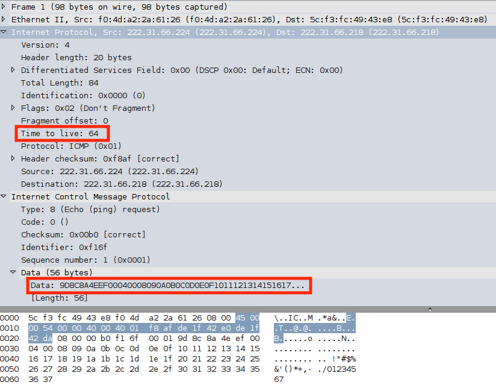

---

* Linux 主机的 ping 程序实现特征
    * TTL
    * payload
        * Data
        * Length

---


---

## 栈指纹 OS 识别的其他技术  {id="os-detection-techniques-2"}

* FIN 探测
    * 发送一个 FIN 包给一个开放端口，一般的行为是不响应，但某些实现例如 MS Windows, BSDI, CISCO, HP/UX, MVS, IRIX 等会 响应一个 RST 报文
* BOGUS 标记探测
    * 设置一个未定义的 TCP 标记（64或128）在 SYN 包的 TCP 头里
* 不分段位
    * 许多操作系统开始在送出的一些包中设置IP的 `Don't Fragment` 位

---

## 栈指纹 OS 识别的其他技术  {id="os-detection-techniques-3"}

* ACK 值
    * 不同实现中一些情况下 ACK 域的值是不同的
* ICMP 错误信息终结
    * 一些操作系统跟从限制各种错误信息的发送率
* SYN 洪水限度
    * 如果收到过多的伪造 SYN 数据包，一些操作系统会停止新的连接尝试
    * 某些操作系统默认只处理 8 个伪造的 SYN 包	

---

## 小结：扫描知识库构建与规则匹配

* 在扫描实践中总结知识库构建
    * TCP/IP协议栈的每一层
    * 报文的发送和接收均有规律可循，有规则可总结
    * 黑盒模糊测试思想
* 规则匹配
    * 不仅仅是字符串静态匹配
    * 可以是基于行为的匹配
        * 会话：传输层 / 应用层
        * 报文交互序列

# 扫描报告生成

---

* 数据的可视化呈现技术

> 非本课程关注重点

# 扫描行为的检测与防护

---

* 扫描行为的检测
    * 被动监听
        * 利用第四章所学的知识、工具和方法
* 扫描行为的防护
    * 防火墙
        * 将在第八章介绍
    * 入侵检测
        * 将在第九章介绍

# 网络扫描工具

---


---

## Nmap

* Nmap 简介
* Nmap 使用方法
* ping 扫描
    * 端口扫描
    * 隐蔽扫描
    * 选项功能
        * 操作系统识别
        * 防火墙/IDS躲避和哄骗
* Nmap 常见应用

---

### Nmap 简介 {id="intro-2-nmap"}

* Network Mapper的缩写
* 功能特性（ **网络扫描的瑞士军刀** ）
    * 多种协议扫描
        * 例如：TCP / UDP / ICMP
    * 支持大多数系统
        * 例如：Linux, macOS, Microsoft Windows
    * 支持插件扩展
        * NSE: Nmap Script Engine

---

### Nmap 应用程序目录结构解析

* 可执行程序目录
    * /usr/bin
* 文档目录
    * /usr/share/man
    * /usr/share/doc/nmap
* 插件目录
    * /usr/share/nmap/nselib **重点关注**
    * /usr/share/nmap/scripts **重点关注**
* 知识库目录
    * /usr/share/nmap

---

```bash
dpkg -L nmap
dpkg -L nmap-common
```

---

> /usr/share/nmap

| 文件                | 作用说明                      |
| --                  | --                            |
| nmap-mac-prefixes   | MAC地址对应厂家知识库         |
| nmap-os-db          | 操作系统指纹知识库            |
| nmap-protocols      | 协议类型字段标识知识库        |
| nmap-rpc            | RPC应用类型指纹知识库         |
| nmap-service-probes | 应用程序交互行为指纹知识库    |
| nmap-services       | 端口与应用/服务映射关系知识库 |

---

## nmap 扫描一般流程 {id="nmap-scan-flow"}

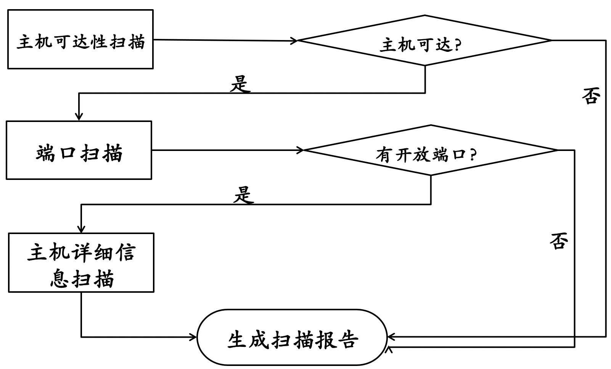

---

## nmap 使用帮助 {id="howto-get-help"}

> nmap --help

> man nmap

---

## nmap 实验指南 {id="howto-use-nmap"}

* 前述扫描原理在 nmap 中的对应命令行参数组合实现
* 操作系统识别
* 防火墙/入侵检测躲避和哄骗

---

> nmap cheatsheet

# 课后思考题

---

* 通过本章网络扫描基本原理的学习，试推测
    * 应用程序版本信息扫描原理
    * 网络漏洞扫描原理
* 网络扫描知识库的构建方法有哪些？
* 除了 nmap 之外，目前还有哪些流行的网络扫描器？和 nmap 进行优缺点对比分析。

