# 第六章 网络与系统渗透

---

## 温故

* 网络扫描是网络入侵的序曲
* 网络扫描的目的是信息收集
* 网络监听是内网安全的大敌

---

## 知新

* 网络与系统渗透基本原理
* 网络与系统渗透案例讲解
* 渗透测试工具
    * 工具只是辅助，最重要的是人

# 序曲

---

* 先有网络应用，后有网络安全
    * 脱离应用，谈安全是空谈
    * **保护资产价值是信息安全一切问题的本原需求**
        * 等级安全保护
* 信息安全是一个 **持续对抗** 过程
    * 应用技术发展带动安全技术发展
    * 攻击技术发展带动防御技术发展
        * 此消彼长，知己知彼
        * 猫鼠游戏

---

[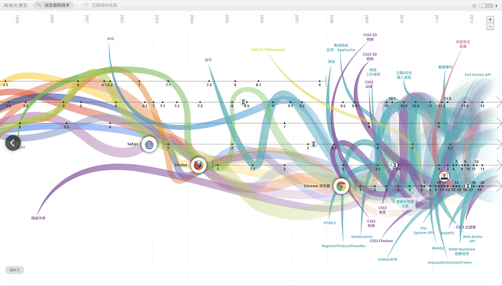](http://www.evolutionoftheweb.com/?hl=zh-cn)

---

[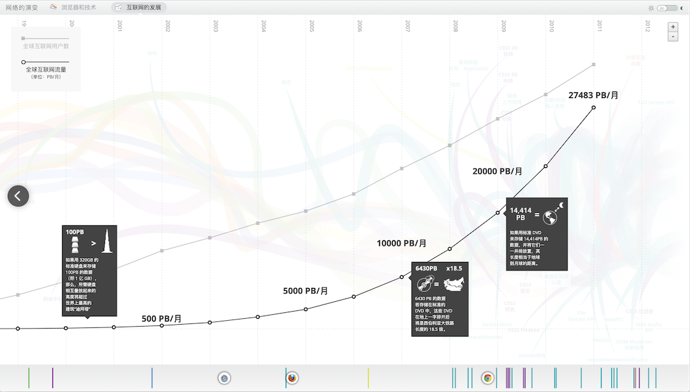](http://www.evolutionoftheweb.com/?hl=zh-cn)

---

> 我们谈到「网络空间安全」的时候到底指的是哪些方面的安全问题？

---

> **网络空间安全** 涉及到在网络空间中 **电磁设备、信息通信系统、运行数据、系统应用** 中所存在的安全问题，既要保护信息通信技术系统及其承载的数据不受损害；也要防止对这些信息通信技术系统的运用或滥用对 **政治安全、经济安全、文化安全、社会安全与国防安全** 的冲击。 

—— [方滨兴 《从“六论”视角论网络空间安全观念》2017.9](https://www.easyaq.com/news/137389782.shtml)

---

## **新** 应用场景

* 区块链
* 容器
* 边缘计算、雾计算
* 工控
* 物联网
* 智能家居

# 专业术语与概念定义

---

* 交换机 Switch
* 客户端 Client
* 服务器 Server
* 骨干网 / 广域网 / 局域网
* 虚拟主机 / VPS / 主机托管

---

* 域名解析服务器 DNS: Domain Name System
    * 域名解析：将域名翻译、转换成IP地址 
* Web服务器 Web Server：Static Page Serve
* 应用程序服务器 App Server：Dynamic Pages Serve
* 数据库服务器 Database Server

---

* 网络渗透/系统渗透 Network Penetration / System Penetration
* 内容分发网络 CDN: Content Delivery Network

---

## 内容分发网络

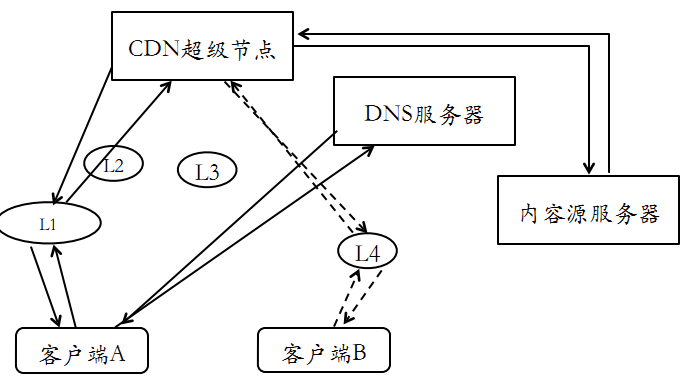

---

## 云防火墙

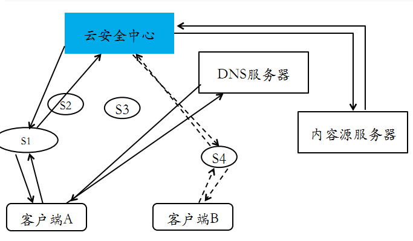

---

## 云安全？

* 基于 CDN 的云安全
    * 保护第三方 Web 站点
* 云计算安全
    * IDC 安全
    * VPS 安全
    * Web 安全

---

> 新概念不断，但网络安全的基本原理并没有改变

---

## 网络应用与网络安全问题示例

| 网络应用 | 网络安全                       |
| --       | --                             |
| 电子邮件 | 垃圾邮件、社会工程学攻击       |
| 局域网   | ARP 投毒、网络嗅探与中间人攻击 |
| 网购     | 诈骗、钓鱼、羊毛党             |
| 网游     | 盗号、虚拟货币盗窃             |
| 微博     | 盗号、垃圾@、虚假信息          |
| 论坛     | 盗号、垃圾广告与反动言论       |
| 视频     | 畸形视频（恶意代码捆绑）       |
| 电子书   | 恶意代码捆绑                   |

# 网络安全简史

---

* 1984 年 英国菲利普王子的电子邮箱被黑
* 1988 年 莫瑞斯蠕虫，感染了 6000 台主机（全球互联网1/10的主机）
* 1995 年 美国法院、CIA、空军的门户网站页面被篡改
* 2003 年 冲击波蠕虫
    * 针对 Windows 操作系统 RPC 服务（445端口）
    * 导致运营商们大规模运用防火墙、访问控制技术封锁互联网上的非 Web 服务端口
    * 每小时感染 2500 台主机

---

* 2005 年 MySpace Samy 蠕虫：史上第一个利用XSS漏洞传播的蠕虫
    * 传播速度惊人：20 小时感染上百万台主机（每小时感染 50000 台主机）
* 2008 年 全球范围内频繁出现大规模 SQL 注入攻击网站事件。
* 2010 年 6 月，震网（Stuxnet）病毒被曝光，这是史上第一个“超级破坏性武器”，就此揭开了「高级持续威胁（Advanced Persistent Threat, APT）」这个研究主题

---

* 2016 年 8 月，一个名为 “Shadow Brokers” 的黑客组织号称入侵了方程式组织窃取了大量机密文件，并有选择的公开了一部分黑客工具（0day 漏洞利用工具），其中就包含一个名为 `Eternalblue（永恒之蓝）` 的针对 Windows 445 端口远程代码执行的漏洞利用工具。
    * 方程式（Equation Group）据称是美国国家安全局（NSA）下属的黑客组织，有着极高的技术手段
* 2017 年 WannaCry **勒索** 病毒袭击了全球 150 多个国家和地区，影响领域包括政府部门、医疗服务、公共交通、邮政、通信和汽车制造业。这次事件的罪魁祸首正是来自于 `永恒之蓝` 漏洞利用工作所针对的漏洞。

---

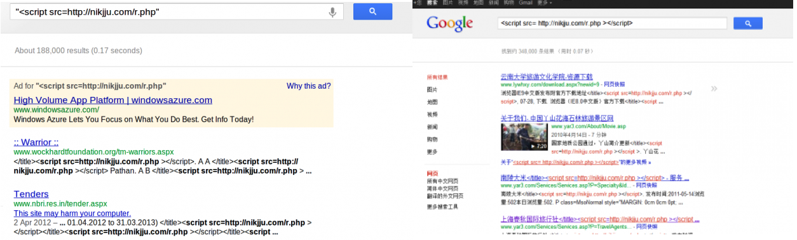

---

## 全球个人口令泄露总量惊人

[](https://haveibeenpwned.com/Passwords)

---

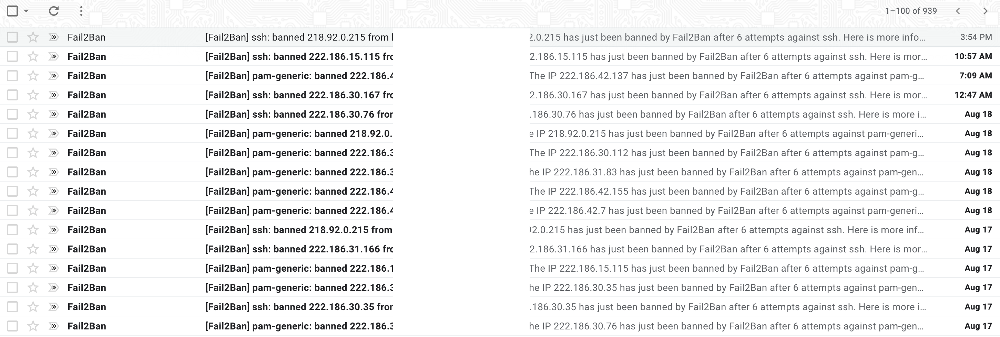

---

## 网络安全的威胁态势历史

* 1999 年~2002 年 萌芽：摸索
* 2003 年~2006 年 暗黑：混乱、攻击
* 2007 年~2011 年 光明：有序、防御
* 2012 年~       泛在：移动、物联网

---

## 网络安全的威胁分类

* 代码执行是网络安全的最严重威胁
* 拒绝服务攻击是网络安全永恒的主题
* Web 安全是网络安全当前的主战场
* Everything is connected! Everything is Hackable!
    * **新应用场景** 安全需求蓬勃发展

---

[](https://nvd.nist.gov/vuln/search/statistics?form_type=Basic&results_type=statistics&search_type=all)

# 网络与系统渗透基本原理

---

## 总体差异

|      | 渗透测试                             | 网络入侵             |
| --   | --                                   | --                   |
| 目的 | 发现漏洞，提出漏洞修补建议           | 破坏 CIA             |
| 手段 | 业务连续性和数据完整性是红线         | 无限制的漏洞利用手段 |
| 结果 | 渗透测试报告，所有已发现漏洞得到修补 | CIA 被破坏           |

---

## 方法论区别与联系

|                              | 渗透测试 | 网络入侵 |
| --                           | --       | --       |
| **取得被测试目标的法律授权** | ✅       | ❌       |
| 信息收集                     | ✅       | ✅       |
| 目标踩点                     | ✅       | ✅       |
| 网络扫描                     | ✅       | ✅       |
| 漏洞发现                     | ✅       | ✅       |
| 漏洞扫描（识别已知漏洞）     | ✅       | ✅       |
| 漏洞挖掘（发现未知漏洞）     | ✅       | ✅       |
| 漏洞利用之提升权限           | ✅       | ✅       |
| **漏洞利用之后门植入**       | ❌       | ✅       |
| **提供测试报告**             | ✅       | ❌       |
| **擦除入侵痕迹**             | ℹ️        | ✅       |

---

> ℹ️  正常的渗透测试由于不会对被测试目标系统及网络造成破坏、点到即止。既然不是「入侵」，当然不存在「擦除入侵痕迹」的需求。但是，有时会在测试过程中出于评估漏洞危害的目的出发做的一些轻微的系统改动或测试数据获取（例如创建用户、读取指定用户数据），会在渗透测试结束后清理掉本地保存的测试数据以及还原测试前数据和系统状态。

---

## 渗透测试的核心关键技术

* 第五章 网络扫描
    * 信息收集
    * 目标踩点
    * 网络扫描
* 本章重点
    * 漏洞扫描
    * 漏洞利用
        * 提升权限

---

## 黑客入侵的一般思维方式

1. 信息收集
    * 社会工程学手段
    * 网络扫描
    * 漏洞发现
2. 目标踩点
    * 确认收集到的信息
3. 漏洞利用
    * 实现攻击目标
4. 维持系统控制权
    * 后门植入
5. 清理访问痕迹

> ℹ️  周而复始，按需执行 1. 和 2.

---

## 网络空间杀伤链（Cyber Kill Chain）模型

洛克希德-马丁公司提出的网络空间杀伤链如下图所示：

[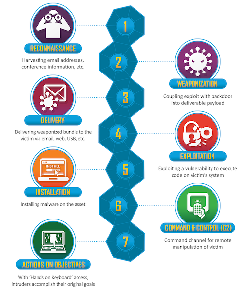](https://www.lockheedmartin.com/en-us/capabilities/cyber/cyber-kill-chain.html)

---

## 军事学中的杀伤链（Kill Chain）模型

* 发现 - 定位- 跟踪  - 瞄准   - 打击   - 评价
* Find - Fix - Track - Target - Engage - Assess
    * F2T2EA
* 可以用于对抗上述「网络空间杀伤链」模型，又被称为「反杀伤链」模型

---

## 网络防御的意识误区

* 我购买并部署了价格昂贵的安全设备就可以高枕无忧了
    * 任何安全设备都是由程序员开发的
        * [无论是硬件还是软件，都是依赖于代码执行](https://mp.weixin.qq.com/s/qJGLQaJM0FrHto3uJhh09w)
* 过滤所有监听端口的入站数据就可以高枕无忧了
    * 过滤策略和机制都可能由于存在漏洞而被绕过
* 攻击之前一定会有扫描行为
    * 社会工程学手段、滥用第三方服务都可以实现信息收集而不留下任何扫描行为记录

> 黑客是一群不按常理出牌的人。

# 案例一：从信息收集到入侵提权

---

> 案例“目标”：www.hack-test.com

> ℹ️  重要的不是具体站点，而是方法。

---

* 从域名获取 IP
* 从 IP 获取旁站
* 收集系统与网络配置详细信息
* 踩点
* 发现漏洞
* 漏洞利用
* 维持系统控制权
* 清理访问痕迹

---

## 从域名获取 IP {id="step1-get-ip-from-dns"}

[](https://asciinema.org/a/XdZH8ROTEFtUKDUJVMAIyui2N)

---

## 从 IP 获取旁站 {id="step2-get-sites-from-ip-1"}

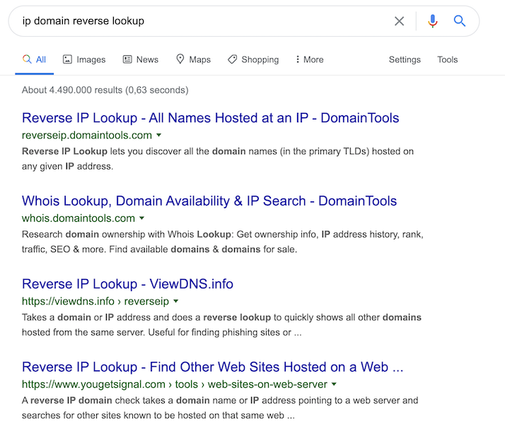

---

## 从 IP 获取旁站 {id="step2-get-sites-from-ip-2"}

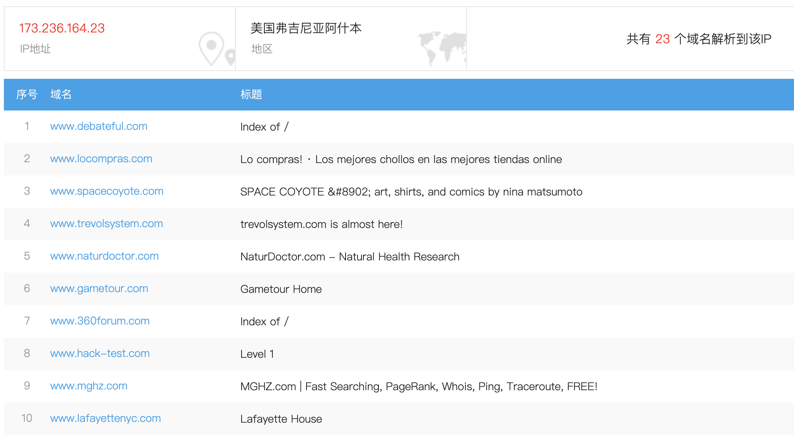

---

> ℹ️  主站不得入，绕道拿旁站。

---

## 收集系统与⽹络配置详细信息

* 网络拓扑信息
    * 域名解析记录
        * 域名注册人信息、公司信息、邮箱地址等
    * 开放端口
    * 服务器数量及分布
* 系统配置信息
    * 操作系统版本
    * Web服务器版本
    * Web应用系统架构信息
        * 脚本类型、开发框架

---

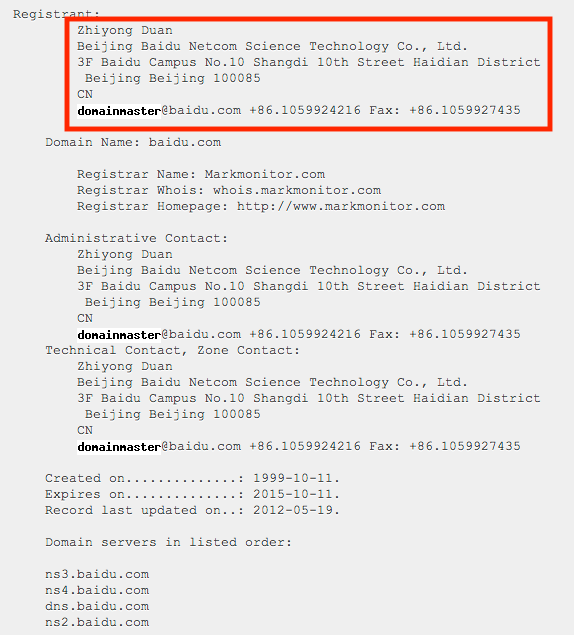

---

[开源情报收集思路（可选，课后自行阅读学习）](https://inteltechniques.com/blog/2018/03/06/updated-osint-flowcharts/)

---


---

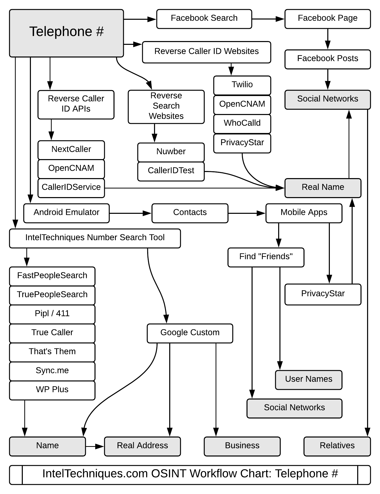

---


---

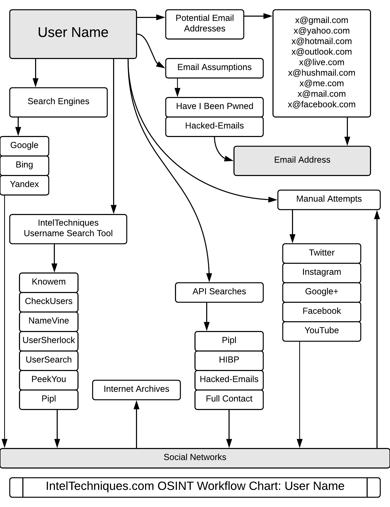

---


---
## 踩点

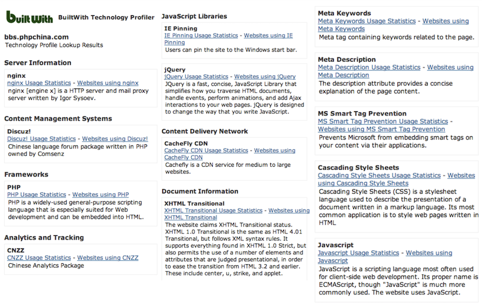

---

## 发现漏洞

* 漏洞扫描工具
    * 基于「应用和版本指纹识别」
* 手工分析
    * 针对开源软件：直接基于源代码分析
    * 针对闭源软件：黑盒 Fuzz 测试

---

## 漏洞利用

* 利用 [开放漏洞信息库](http://www.exploit-db.com)
* 利用自动化工具
    * [metasploit](https://www.metasploit.com/)
    * [burpsuite](https://portswigger.net/burp)
* 针对具体漏洞的定制开发漏洞利用程序

---

## 维持系统控制权

* 上传木马
    * 网页木马
    * 系统级木马
* 创建后门账户

---

## 清理访问痕迹

* 系统日志清理
* 临时文件删除
* 后门隐藏
    * 后门软件隐藏
    * 后门进程隐藏
    * 后门账户隐藏
    * 后门端口隐藏

# 案例二：2012 年新浪微博用户密码泄露漏洞（旁站注入） {id="2012-weibo-sqli"}

---

* 2012 年元旦 新浪微博网友 `evilniang` 发现新浪爱问频道存在 `SQL 注入漏洞`
    * 利用该漏洞课读取爱问频道数据库内内容
        * 包括明文密码在内的 7000 多万新浪用户信息
* 刘谦微博被 PoC 代码测试

---

## 后续应急响应

* 修复新浪爱问频道的网站代码漏洞
* 对用户信息数据库中的敏感信息进行脱敏操作
    * 使用更安全的 [口令散列算法](https://cheatsheetseries.owasp.org/cheatsheets/Password_Storage_Cheat_Sheet.html) 处理用户的明文口令后再持久化存储，例如 `Argon2`，`PBKDF2` 和 `Bcrypt` 等

# 案例三：Google Hacking

---


---


---

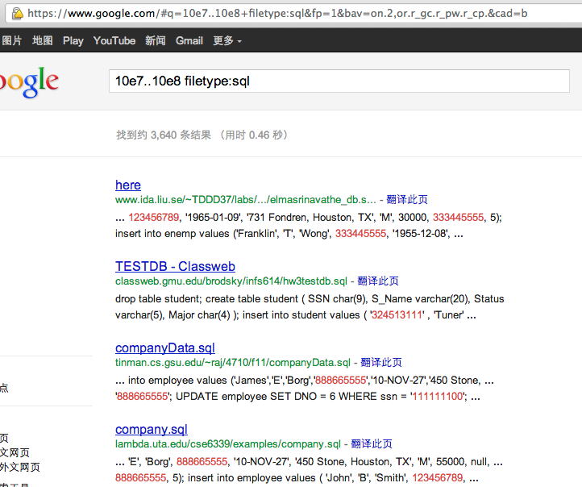

---

## 防范 Google Hacking

* 机密信息不上网
* 小心使用 robots.txt 

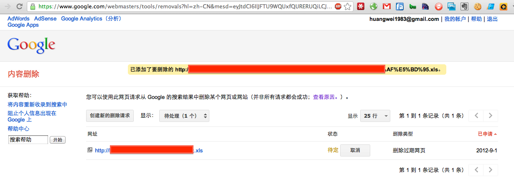


# 不仅是 Google Hacking {id="beyond-google-hacking"}

---

### 搜索 webshell —— 百度

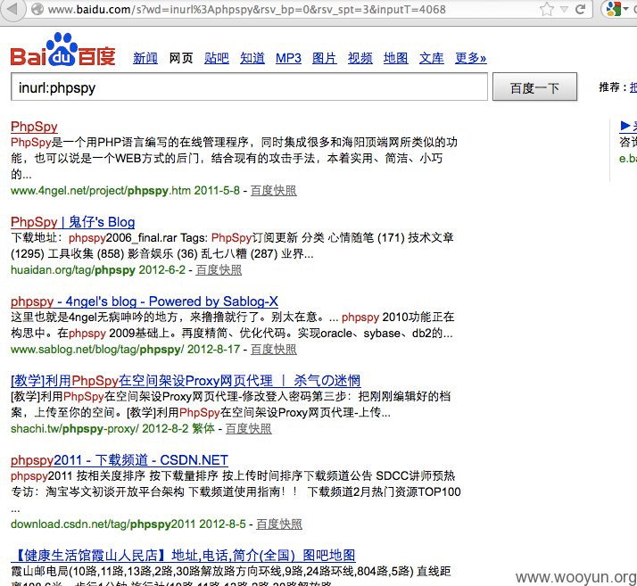

---

### 搜索 webshell —— Google


---

### 搜索 webshell —— 360


---

## 网络空间搜索引擎之 shodan.io

[](https://www.shodan.io/)

---

## 网络空间搜索引擎之 fofa.so

[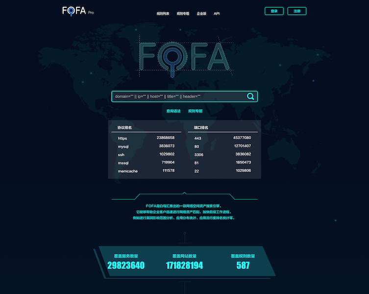](https://fofa.so/)

---

## 网络空间搜索引擎之 zoomeye.org

[](https://www.zoomeye.org/)

# 回到课堂，进入模型与方法论

---


---

## 网络与系统渗透的入口点选择

* 人
    * 社会工程学
    * 一种通过对受害者 **心理弱点、本能反应、好奇心、信任、贪婪** 等 **心理弱点** 进行诸如欺骗、伤害等危害手段
    * 骗取秘密（如口令）/ 控制行为（如钓鱼）
* 技术
    * 应用层
    * 网络层
    * 物理层

---

## 网络与系统渗透的入口点选择——技术方向

* nmap官方对互联网上端口开放频率的统计

```bash
sort -rk 3 /usr/share/nmap/nmap-services | grep -v -E '^#' | head -n20
# http    80/tcp  0.484143        # World Wide Web HTTP
# ipp     631/udp 0.450281        # Internet Printing Protocol
# snmp    161/udp 0.433467        # Simple Net Mgmt Proto
# netbios-ns      137/udp 0.365163        # NETBIOS Name Service
# ntp     123/udp 0.330879        # Network Time Protocol
# netbios-dgm     138/udp 0.297830        # NETBIOS Datagram Service
# ms-sql-m        1434/udp        0.293184        # Microsoft-SQL-Monitor
# microsoft-ds    445/udp 0.253118
# msrpc   135/udp 0.244452        # Microsoft RPC services
# dhcps   67/udp  0.228010        # DHCP/Bootstrap Protocol Server
# telnet  23/tcp  0.221265
# domain  53/udp  0.213496        # Domain Name Server
# https   443/tcp 0.208669        # secure http (SSL)
# ftp     21/tcp  0.197667        # File Transfer [Control]
# netbios-ssn     139/udp 0.193726        # NETBIOS Session Service
# ssh     22/tcp  0.182286        # Secure Shell Login
# isakmp  500/udp 0.163742
# dhcpc   68/udp  0.140118        # DHCP/Bootstrap Protocol Client
# route   520/udp 0.139376        # router routed -- RIP
# upnp    1900/udp        0.136543        # Universal PnP
```

---

* Web 应用是最常见的网络渗透入口点
* Web 软件是最普遍的云服务实现载体
    * 云存储
    * 即时通信
    * 微博
    * 视频
    * 手机和物联网终端设备的云端服务

---


---

* 异构应用和服务多
* 网络拓扑结构复杂
* 业务应用模型多样

---


---

> 如何全面的理解Web应用程序漏洞原理呢？

---

且待下一章分解！

# 课后思考题

---

* 渗透过程中最重要的是什么？各抒己见。
* 用自己的话去阐述“网络与系统安全是一个持续对抗过程”。
* 在了解了网络与系统渗透基本原理之后，你对如何做好网络与系统安全加固有何见解？

