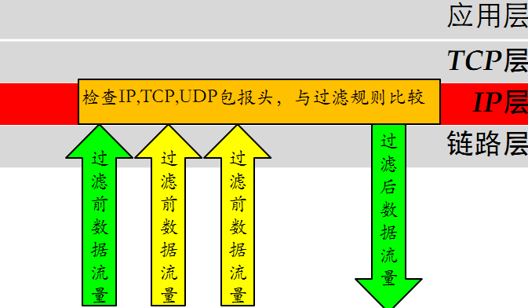
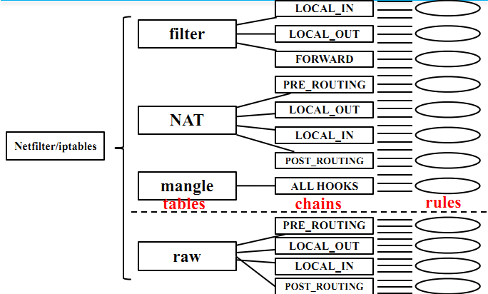
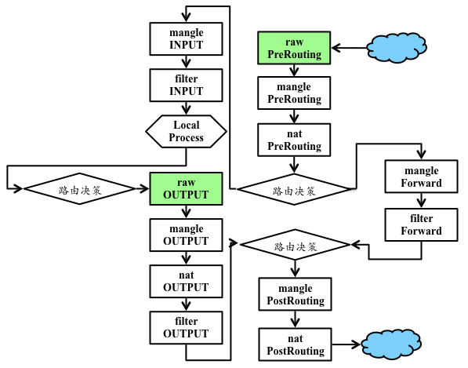
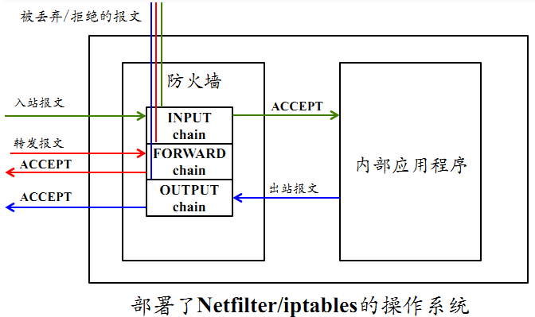
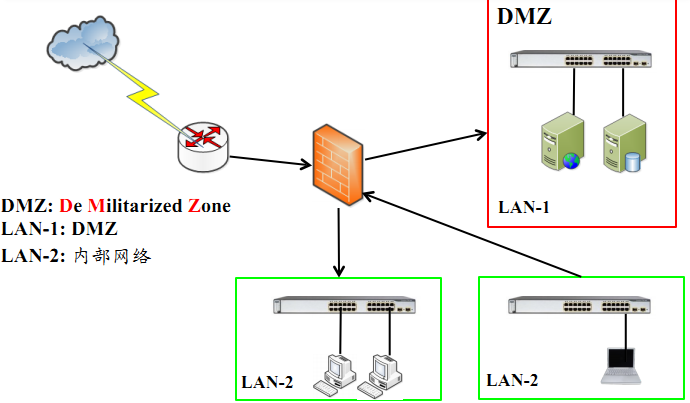

# 第八章 防火墙

---

## 温故

* 网络与系统渗透无孔不入
    * 人
    * 应用程序
    * 网络设备
    * 主机/服务器操作系统
    * 物理设备
* 掌握网络与系统渗透方法
    * 知己知彼，百战不殆

---

## 知新

* 防火墙在网络与系统防御中的作用和地位
* 防火墙实现的关键技术
* 防火墙实例及应用

# 防火墙概述

---

## 定义

> 在两个 **信任程度不同** 的网络之间设置的、用于加强 `访问控制` 的 **软硬件** 保护措施。


---

### 信任程度不同的网络

* 外网：外部网络，不仅包括互联网，泛指一切非当前防火墙保护范围的网络
* 内网：内部网络，此处特指防火墙保护范围内的网络
* 边界：外网和内网之间的通信过程必须经过「防火墙」的 `访问控制` ，此时防火墙在整个网络拓扑中的逻辑位置相当于就是网络「边界」

---

### 访问控制 {id="network-acl-1"}

* 入站（`Inbound`）。从 `外网` 发起，目的地是 `内网` 的流量方向
* 出站（`Outbound`）。从 `内网` 发起，目的地是 `外网` 的流量方向
* 防外不防内
    * 防外：与外部网络有关的流量可以被防火墙审查，进而达到保护效果
    * 不防内：非 `入站` 和 `出站` 流量，属于内部网络中节点之间的流量由于不流经防火墙，所以防火墙无法对流量进行审查，自然就无法保护了

---

### 访问控制 {id="network-acl-2"}

* 粗粒度防护：取决于网络防火墙对网络流量的检查 **粒度** ，绝大多数情况下我们使用的都是网络层防火墙，不具备 **深度包检测** 能力
* 深度包检测（`Deep Packet Insepction`, `DPI`）：又称 **完全数据包探测（complete packet inspection）** 或 **信息萃取（Information eXtraction，IX）**，是一种网络数据包过滤技术，用来检查通过检测点数据包的内容负载部分（也可能包含其报文头部）

---

为什么要强调 **深度包检测** 这个概念？

---

> 因为只有看见，才能让「访问控制」有的放矢，才能落实保护。

---

## 防火墙发展简史


---

### “上古” 防火墙 {id="legacy-fw"}

* 第一代防火墙
    * 采用了包过滤技术
* 第二代、第三代防火墙
    * 1989 年，推出了电路层防火墙和应用层防火墙的初步结构
* 第四代防火墙
    * 1992 年，开发出了基于动态包过滤技术的第四代防火墙
* 第五代防火墙
    * 1998 年，NAI公司推出一种自适应代理技术，可以称之为第五代防火墙

---

### 现代防火墙 {id="modern-fw"}

* 一体化安全网关 UTM
    * 统一威胁管理
    * 整合防火墙、入侵检测、入侵保护、防病毒、防垃圾邮件等综合功能
* 应用防火墙
    * 又可以称为IPS：入侵保护
    * 普遍采用了 `深度包检测` 技术
        * 病毒防火墙
        * Web 防火墙
        * VoIP 防火墙
        * 。。。

---

## 防火墙现状与发展 {id="fw-status-and-future-1"}

* 网络安全基础设施必有一席之地
* 开源产品和商业产品百家齐放
    * 开源防火墙代表：[pfSense](https://www.pfsense.org/)、[OPNSense](https://opnsense.org/)、[Untangle – NG Firewall](https://www.untangle.com/)、[ClearOS](https://www.clearos.com/)、[IPFire](https://www.ipfire.org/)、[Smoothwall Express](http://www.smoothwall.org/)、[IPCop](https://distrowatch.com/)、[ufw](https://help.ubuntu.com/community/UFW)、[Shorewall](http://www.shorewall.org/)、[Endian Firewall Community](https://www.endian.com/)、[VyOS](https://www.vyos.io/)
* 不断提升的 **吞吐性能**
    * 接入带宽：百兆 / 千兆 / 万兆
    * 并发处理能力（状态检测防火墙）：千、万、十万、百万

---

## 防火墙现状与发展 {id="fw-status-and-future-2"}

* 持续发展的 `深度包检测`
    * 支持识别的应用层协议种类越来越多
    * 加密流量的处理方式「八仙过海各显神通」
    * 集成恶意代码、垃圾信息检测等多样化防护能力
* 增值功能越来越多
    * 代理、负载均衡、计费、VPN 等
* 满足云计算环境中的防火墙部署需求
    * 虚拟化能力
    * SDN 能力

---


> 华为、深信服（Sangfor）、启明星辰（Venustech）、山石网科（Hillstone）、新华三（H3C）

# 防火墙技术原理

---

## 防火墙关键技术

* 包过滤技术
* 状态检测技术
* 应用级代理技术

---

## 包过滤技术



---

### 检查数据包的报头信息

1. IP 数据报的源 IP 地址、目的 IP 地址、协议类型，选项字段等
2. TCP 数据包的源端口、目标端口、标志段等
3. UDP 数据包的源端口、目标端口
4. ICMP 类型

---

### 包过滤技术的优点

* 不需要内部网络用户做任何配置，对用户来说是完全透明的
* 过滤速度快，效率高

---

### 包过滤技术的缺点

* 不能进行数据内容级别的访问控制
* 一些应用协议不适合用数据报过滤
* 过滤规则的配置复杂，容易产生冲突和漏洞

---

## 状态检测技术


---


---

### 状态检测技术的优点

* 状态表是动态建立的，可以实现对一些复杂协议建立的临时端口进行有效的管理
* 状态检测技术是为每一个会话连接建立、维护其状态信息，并利用这些状态信息对数据包进行过滤
* 动态状态表是状态检测防火墙的核心，利用其可以实现比包过滤防火墙更强的控制访问能力

---

### 状态检测技术的缺点

* 没有对数据包内容进行检测，不能进行数据内容级别的控制
* 允许外网主机与内网主机直接连接，增加了内网主机被外部攻击者直接攻击的风险

---

## 应用级代理


---

### 应用级代理示例


---

### 应用级代理优点

* 内部网络的拓扑、IP 地址等被代理防火墙屏蔽，能有效实现内外网络的隔离
* 具有强鉴别和日志能力，支持用户身份识别，实现用户级的安全
* 能进行数据内容的检查，实现基于内容的过滤，对通信进行严密的监控
* 过滤规则比数据包过滤规则简单

---

### 应用级代理缺点

* 代理服务的额外处理请求降低了过滤性能，其过滤速度比包过滤器速度慢
* 需要为每一种应用服务编写代理软件模块，提供的服务数目有限
* 对操作系统的依赖程度高，容易因操作系统和应用软件的缺陷而受到攻击

# 防火墙的实现技术

---

以 Linux 操作系统上的 Netfilter/iptables 机制为例

---

## Netfilter/iptables 框架简介

* `Netfilter/iptables` 从 `Linux` 内核版本 `2.4` 开始，默认被包含在内核源代码树中
* 可以对操作系统的流入和流出数据报文进行控制
    * 防火墙
    * NAT
    * 数据报文自定义修改
* `Netfilter` 工作在系统内核层
* `iptables` 工作在用户态

---

## Netfilter/iptables 架构 {id="netfilter-iptables-arch-1"}


---

## Netfilter/iptables 架构 {id="netfilter-iptables-arch-2"}



---

## iptables 基本概念 {id="iptables-basics-1"}

* 表(tables)
    * filter表、nat表、mangle表、raw表
* 链(chains)
    * 数据包的传输路径，每条链其实就是众多规则中的一个检查清单
        * Input、Forward、PreRouting、PostRouting、Output
* 规则(rules)
    * 网络管理员预定义的网络 **访问控制策略**

---

## iptables 基本概念 {id="iptables-basics-2"}

* filter 表
    * 报文过滤
    * 只读过滤报文
* nat 表
    * 实现 NAT 服务
* mangle表
    * 报文处理：修改报文和附加额外数据到报文
* raw表
    * 可以对收到的报文在连接跟踪前进行处理
    * 只作用于 `PreRouting` 和 `Output` 链

---

## iptables 中的报文检查流程 {id="iptables-workflow"}



> raw > mangle > nat > filter

---

## netfilter 架构的数据流图 {id="netfilter-internal-workflow"}


---

## 部署了 Netfilter/iptables 的操作系统 {id="netfilter-iptables-on-host"}



---

## 硬件防火墙

* 通用 CPU 架构
* ASIC 架构
* 网络处理器架构

---

### 通用 CPU 架构防火墙 {id="x86-fw"}

* 又被称为x86架构
    * 采用通用CPU和PCI总线接口
* 可编程性高
    * 更灵活
    * 更易扩展
* 产品功能主要由软件实现
* 代表产品
    * 大部分的开源/商业软件防火墙（基于*nix系统）

---

### ASIC 架构防火墙 {id="asic-fw"}

* Application Specific Integrated Circuit
    * 专用集成电路
    * 一种带有逻辑处理的加速处理器
* 把一些原先由 CPU 完成的经常性和重复工作交给 ASIC 芯片来负责完成
    * 交换机、路由器、智能 IC 卡
* 通常配合通用CPU单元来完成复杂运算
* 代表产品
    * 大部分国外的商业硬件防火墙

---

### NP 架构防火墙 {id="np-fw"}

* Network Processor：网络处理器
* 通用 CPU 架构和 ASIC 架构的折衷
    * 开发难度
    * 性能
    * 灵活性/可扩展性
* 代表产品
    * 大部分国内的商业硬件防火墙

---

### 三种硬件架构的横向比较

| 架构类型 | X86  | NP   | ASIC |
| :---     | :--- | :--- | :--- |
| 灵活性   | ★★★  | ★★   | ★    |
| 扩展性   | ★★★  | ★★   | ★    |
| 性能     | ★    | ★★   | ★★★  |
| 安全性   | ★    | ★★   | ★★★  |
| 价格     | 低   | 中等 | 较高 |

# 防火墙的配置和应用 {id="setup-iptables"}

---

## 路由模式


---

## 透明模式


---

## 混合模式



---

## 防火墙部署的其他细节 {id="fw-setup-tips-1"}

* 双机热备模式
    * 避免单点故障
* 负载均衡模式
    * 性能扩展
    * 避免单点故障

---

### 负载均衡模式部署的防火墙


---

## 防火墙部署的其他细节 {id="fw-setup-tips-2"}


---

## 单机防火墙配置

* ufw
    * ufw 简介
    * ufw 使用
* iptables
    * iptables 简介
    * iptables 使用

---

### UFW - Uncomplicated Firewall

* UFW 是 `Ubuntu` 开发团队为 `Ubuntu` 发行版量身定制的简化版 `iptables` 命令行配置工具

---

### ufw 使用 {id="ufw-howto-use"}

[UFW 官网文档](https://help.ubuntu.com/community/UFW)

---

## iptables

> sudo iptables --help

---

### 推荐的 iptables 规则管理方法 {id="recommended-rules-manage"}

```bash
# 需要 root 权限
# 导出当前防火墙规则到文件
iptables-save > iptables.rules

# 备份当前规则文件
cp iptables.rules iptables.rules.bak

# 用文本编辑器编辑上一步备份出来的当前 iptables 规则文件的副本 iptables.rules

# 应用编辑后的防火墙规则
# -c  指定在还原 iptables 时候，重置当前的数据包计数器和字节计数器的值为零
iptables-restore < iptables.rules

# 随时可以使用之前备份的 iptables.rules.bak 来重置回最近一次没问题的规则
```

# 基于防火墙实现 NAT {id="nat-based-on-fw"}

---

* 私有地址（private address）属于非注册地址，是专门为组织机构内部使用而划定的。如下图：


---

* NAT 是将一个地址域（如专用 Intranet）映射到另一个地址域（如 Internet）的标准方法
* NAT 可以将内部网络中的所有节点的地址转换成一个 IP 地址，反之亦然
* 可以应用到防火墙技术里，把个别 IP 地址隐藏起来不被外部发现，使外部无法直接访问内部网络设备

---

## NAT 工作原理 {id="nat-internals"}

* 静态网络地址转换
* 动态网络地址转换
* 网络地址端口映射

---

### 静态地址转换

* 将公网 IP 地址一一对应地转换为内部私有 IP 地址


---

### 动态地址转换

* 将内部本地地址与内部合法地址一对一的进行转换
    与静态地址转换不同的是它是从内部合法地址池动态分配临时的 IP 地址来对内部本地地址进行转换


---

### 网络地址端口映射

将公网 IP 映射到私有 IP ，而外网多个 IP 被映射到同一内部共有 IP 地址的不同端口


# 防火墙规则调试和审查

---

## 防火墙规则调试

按照课本里的 [实验四：防火墙规则调试](https://c4pr1c3.github.io/cuc-ns/chap0x08/exp.html#%E5%AE%9E%E9%AA%8C%E5%9B%9B%EF%BC%9A%E9%98%B2%E7%81%AB%E5%A2%99%E8%A7%84%E5%88%99%E8%B0%83%E8%AF%95) 动手实验完成。

---

## 防火墙规则审查

* 静态分析工具（主要是商业工具，缺开源解决方案）
    * 防火墙规则的语义理解
        * 数据流图分析
        * 自动化规则树生成
* 黑盒测试工具
    * 基于网络扫描器的模糊测试

# nftables

---

摘录 [nftables 官网](https://www.netfilter.org/projects/nftables/index.html) 的一句话描述

> **nftables** replaces the popular **{ip,ip6,arp,eb}tables**. This software provides a new in-kernel packet classification framework that is based on a network-specific Virtual Machine (VM) and a new **nft** userspace command line tool. **nftables** reuses the existing Netfilter subsystems such as the existing hook infrastructure, the connection tracking system, NAT, userspace queueing and logging subsystem.

---

## nftables 与 iptables 的关系 {id="nftables-vs-iptables"}

* 均基于 `Netfilter` 内核
* `nftables` 简化了配置语法和新增了「语法糖」
    * 一个工具整合了多重协议栈多个独立工具 {ip,ip6,arp,eb}tables
    * 允许一条规则定义多重匹配条件
    * 允许一条规则匹配后执行多个 action
* `nftables` 提升了规则匹配和报文处理性能
* `nftables` 支持导出数据为 `JSON` 和 `XML` 格式
* `nftables` 增强了调试便利性
* `nftables` 没有内置默认「表/链」

---

## [从 iptables 迁移到 nftables](https://wiki.nftables.org/wiki-nftables/index.php/Moving_from_iptables_to_nftables) {id="moving-from-iptables-to-nftables"}

```bash
# 检查当前系统内核是否加载了 nf_tables 内核模块
modinfo nf_tables
# 如下输出信息表示已加载
# filename:       /lib/modules/5.7.0-kali1-amd64/kernel/net/netfilter/nf_tables.ko
# alias:          nfnetlink-subsys-10
# author:         Patrick McHardy <kaber@trash.net>
# license:        GPL
# depends:        nfnetlink
# retpoline:      Y
# intree:         Y
# name:           nf_tables
# vermagic:       5.7.0-kali1-amd64 SMP mod_unload modversions

# 检查加载了哪些 nf_tables 有关的模块
lsmod | grep nf_tableso
# nf_tables             229376  237 nft_compat,nft_counter,nft_chain_nat
# nfnetlink              16384  4 nft_compat,nf_conntrack_netlink,nf_tables
# 检查当前系统上是否已安装 nftables 工具

apt policy nftables
# nftables:
#   Installed: 0.9.6-1
#   Candidate: 0.9.6-1
#   Version table:
#  *** 0.9.6-1 500
#         500 http://http.kali.org/kali kali-rolling/main amd64 Packages
#         100 /var/lib/dpkg/status

# 如果没有安装，则执行安装操作
sudo apt update && sudo apt install nftables

# 导出 iptables 规则
iptables-save > iptables.rules

# 使用 iptables-restore-translate 翻译 iptables 规则并保存
iptables-restore-translate -f iptables.rules > ruleset.nft

# 查看当前 nftables 规则
nft list ruleset

# 确认已备份当前主机的防火墙规则
# nftables 已加载了当前防火墙规则
# 清空 iptables 规则，并准备禁用 iptables 只保留 nftables 用来规则防火墙规则
sudo iptables -F
sudo ip6tables -F
```

---

## 主流 Linux 发行版对 nftables 的支持情况

* 从 2014 年 1 月 19 日发布的 Linux 内核源代码 3.13 开始支持 `nftables`
* [2020 年 4 月 28 日发布的 Fedora 32 默认启用 nftables 代替 iptables](https://fedoraproject.org/wiki/Releases/32/ChangeSet#Firewalld_Default_to_nftables)
* [2019 年 5 月 7 日发布的 RedHat 企业版 8 开始默认启用 nftables 代替 iptables](https://access.redhat.com/documentation/en-us/red_hat_enterprise_linux/8/html/configuring_and_managing_networking/getting-started-with-nftables_configuring-and-managing-networking)
* [2019 年 7 月 6 日发布的 Debian Buster(10.0) 版本开始默认启用 nftables 代替 iptables](https://wiki.debian.org/nftables)

# 网闸

---

* 其他别名：安全隔离与信息交换系统 / 物理隔离网闸 / 安全隔离网闸
* 实现 **不同安全级别网络** 之间的安全隔离，并提供适度可控的 **数据交换** 的软硬件系统
    * 从「隔离」网络的角度来说，和防火墙的作用有相似之处

---

## 网闸与防火墙的区别与联系 {id="ng-vs-fw-1"}

* 网闸是相对新的一个产品概念，与防火墙相比，网闸缺少标准化的学术模型
    * 只应用在「高安全等级」网络保护环境
* 网闸直接采用 `物理隔离` 方式实现 **不同信任程度** 之间网络的隔离

---

## 网闸与防火墙的区别与联系 {id="ng-vs-fw-2"}

* 网闸采用基于非 TCP/IP 协议的 **数据交换** 方式，杜绝基于 TCP/IP 协议的网络攻击手段
* 网闸软硬件实现均不基于通用操作系统，而是走定制化（基于 BSD 或精简安全加固后 Linux 系统、嵌入式操作系统 VxWorks 等）专用操作系统路线
* 网闸不支持跨网络的访问，不同网络之间实现 **通信协议** 级别隔离，只支持 **数据交换** ，且同一时刻只允许「 **单向** 数据流动」
    * 类似「自动化」U 盘数据摆渡系统

# 防水墙

---

填补防火墙「防外不防内」的防护能力空白：专注于「内部网络」安全问题

* 信息泄露
* 限制内网的「横向移动」行为

---

* 和网闸类似，防水墙同样缺少标准化的学术模型，防水墙的安全能力边界并没有统一定义
* 缺少开源解决方案，只有商业解决方案

# 课后思考题

---

1. 防火墙的典型网络部署方式有哪些
2. 防火墙能实现的和不能实现的防护各有哪些

