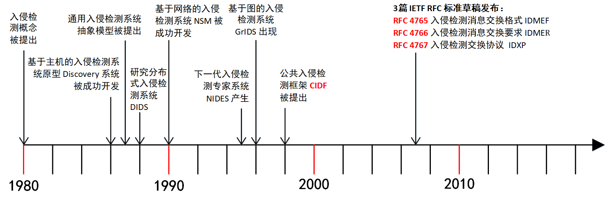
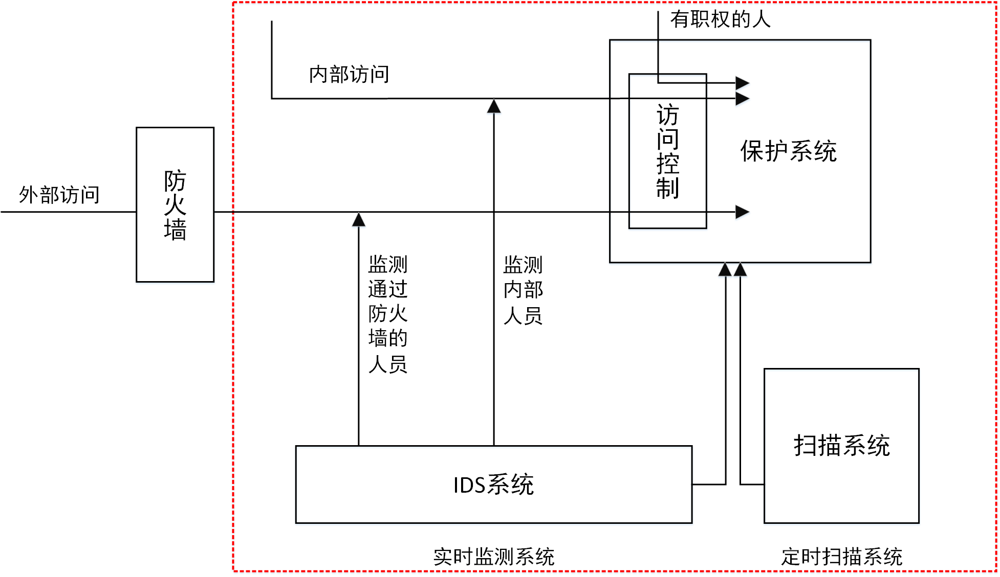
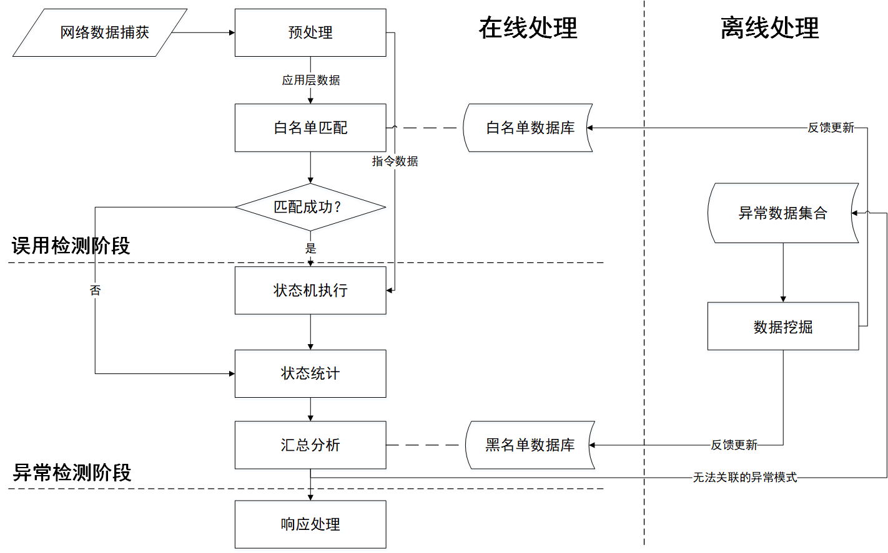
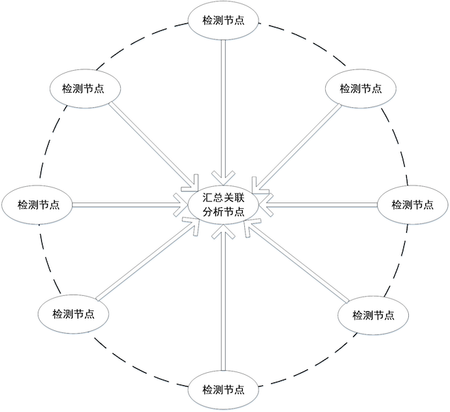
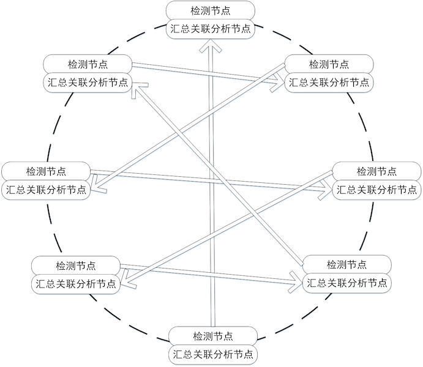

# 第九章 入侵检测

---

## 温故

* 防火墙在网络与系统防御中的作用和地位
    * 在两个信任程度不同的网络之间设置的、用于加强访问控制的软硬件保护措施
    * 防外不防内
* 防火墙的实现技术
    * 软件技术
    * 硬件架构
        * NP / ASIC / x86
* iptables / nftables 的配置

---

## 知新

* 应用防火墙的实现原理
    * 入侵检测的核心技术原理
* 入侵检测系统和防火墙的关系
* 入侵检测系统的应用场景

# 入侵检测概述

---

## 入侵检测发展简史



---

## 入侵检测经典理论 {id="ids-james-p-anderson-1"}

> 将入侵尝试（Intrusion attempt）或 **威胁** （Threat）定义为潜在的、有预谋的且未经授权而访问信息、操作信息、致使系统不可靠或无法使用的企图

|                  | 未授权使用数据/程序资源 | 授权使用数据/程序资源  |
| --               | --                      | --                     |
| 未授权使用计算机 | 外部渗透                | N/A                    |
| 授权使用计算机   | 内部渗透                | 滥用行为（misfeasance）|

—— [J. P. Anderson. Computer security threat monitoring and surveillance, Technical report, James P. Anderson Co., Fort Washington, PA, 1980.](http://ranger.uta.edu/~dliu/courses/cse6392-ids-spring2007/papers/Anderson80-IDS-TechReport.pdf)

---

## 入侵检测经典理论 {id="ids-james-p-anderson-1"}

系统访问控制要面对三类用户

* 合法用户（Legitimate User）
* 伪装（Masquerade）—— 攻破「流程控制」
    * 身份仿冒（可能是最早提出不能仅依赖于身份认证，还要加强行为监控以防范身份仿冒和滥用的学者）
* 秘密用户（Clandestine User） —— 攻破「逻辑控制」
    * 后门

—— J. P. Anderson. [Computer security threat monitoring and surveillance](attach/chap0x09/Anderson80-IDS-TechReport.pdf), Technical report, James P. Anderson Co., Fort Washington, PA, 1980.

---

## 检测检测经典模型 {id="ids-classic-model"}

通用的入侵检测系统抽象模型

* 主体（Subjects）
* 对象（Objects）
* 审计记录（Audit records）
* 活动档案（Profiles）
* 异常记录（Anomoly records）
* 活动规则（Activity rules）

—— Dorothy Denning. [An Intrusion-Detection Model](attach/chap0x09/IEEEToSE1987-ID-Model.pdf). IEEE TRANSACTIONS ON SOFTWARE ENGINEERING, VOL. SE-13, NO. 2, FEBRUARY 1987, 222-232.

---

## 入侵检测相关经典标准

* RFC 4765 入侵检测消息交换格式（The Intrusion Detection Message Exchange Format, IDMEF）
* RFC 4766 入侵检测消息交换要求（Intrusion Detection Message Exchange Requirements
, IDMER）
* RFC 4767 入侵检测交换协议（The Intrusion Detection Exchange Protocol, IDXP）

**可以看做是「SCAP」和「威胁情报」的先行探路者**

---

**SCAP**: `Security Content Automation Protocol`

> 从「人读」到「机读」

---

## 入侵检测的作用 {id="ids-role-1"}



---

## 入侵检测的作用 {id="ids-role-2"}

* 识别入侵者
* 识别入侵行为
* 检测和监视已成功的安全突破
* 为对抗入侵及时提供重要信息，阻止事件的发生和事态的扩大

---

## 入侵检测的意义 {id="ids-effects-1"}


---

## 入侵检测的意义 {id="ids-effects-2"}

* 防火墙的有力补充
* 不是为了预防，是为了检测和提供响应决策
* 及时、准确、全面的 **发现** 入侵

---

## 入侵检测技术的发展趋势

* 提高处理能力: 高宽带、大流量、高频率到达报文
* 增强协作能力
    * 协作采集 / 协作分析 / 协作响应
    * 针对大规模、协同化网络攻击的趋势
* 丰富检测范围
    * 检测更高级、更隐蔽、更多样化的应用层协议和网络攻击行为
* 标准化
    * 协议 /  产品 / 测试等多个方面

---

## 附：入侵检测领域其他经典论文 {id="ids-classic-papers"}

1. T. L. Heberlein et al, [A Network Security Monitor](attach/chap0x09/SP90-NetSecMonitor.pdf), **IEEE Symposium on Security and Privacy**, Oakland, CA, May 1990.
2. H.S. Javitz, A. Valdes, [The SRI IDES statistical anomaly detector](attach/chap0x09/SP91-IDES-StatisticalAnomalyDetectr.pdf) , in Proceedings of the **IEEE Symposium on Security and Privacy**, Oakland, CA, May 1991. （ **异常(anomaly)** 检测）
3. S. Kumar and E. H. Spafford. [An Application of Pattern Matching in Intrusion Detection](attach/chap0x09/kumar-spaf-overview.pdf). Purdue University Technical Report CSD-TR-94-013. 1994 （ **误用(misuse)** 检测理论）

# 入侵检测理论

---

## **IDS** : `Intrusion Detection System`

* 对系统的运行状态进行监视，发现各种攻击企图、攻击行为或者攻击结果，以保证系统资源的机密性、完整性和可用性
* 进行入侵检测的软件与硬件的组合便是入侵检测系统

---

## 警报（Alert）

* 当一个入侵正在发生或者试图发生时，`IDS` 将发布一个警报信息通知系统管理员
* 如果控制台与 `IDS` 同在一台机器，警报信息将显示在监视器上，也可能伴随着声音提示
* 如果是远程控制台，那么警报将通过 `IDS` 内置方法（通常是加密的）、`SNMP`（简单网络管理协议，通常不加密）、`email`、`SMS`（短信息）、`IM（即时通信）`或者以上几种方法的混合方式传递给管理员

---

## 异常（Anomoly）

* 当有某个事件与一个已知攻击的信号相匹配时，多数IDS都会告警
* 一个基于异常的 IDS 会构造一个当时活动的主机或网络的大致轮廓（`Profile`），当有一个在这个轮廓以外的事件发生时，IDS 就会告警

---

## 特征（Signature）

* IDS 的核心是攻击特征（签名），它使 IDS 在（入侵）事件发生时触发警报
* 特征信息过短会经常触发 IDS，导致误报或错报，过长则会减慢 IDS 的工作速度
* 基于「特征」检测算法的 IDS 又被称为使用了「误用（`misuse`）」检测

---

### 特征库越大越好？ {id="does-signature-count-matter"}

* 有的厂商用一个特征涵盖许多攻击
* 有些产商则会将这些特征单独列出
* 特征与特征之间可能存在「冲突」
    * 特别是黑名单特征与白名单特征

> 如何评价 IDS 好坏？

---

### 国家标准

[信息安全技术 网络入侵检测系统技术要求和测试评价方法 GB/T 20275-2013》](http://std.samr.gov.cn/gb/search/gbDetailed?id=71F772D8069AD3A7E05397BE0A0AB82A) 

---

## 入侵检测系统评价指标

* 可靠性，指系统的容错能力和可持续运行能力
* 可用性，指系统开销大小，对网络性能影响的大小
* 可测试，指系统能够通过模拟攻击进行检测测试
* 适应性，指系统易于开发和扩展
* 实时性，指系统能够及早发现入侵企图
* 安全性，指系统可确保自身的安全
* 准确性，指系统正确识别入侵行为的能力

---

### 准确性指标

* 误报率（False Positive Rate ，FPR）

> FPR = FP / N

* 漏报率（False Negative Rate ，FNR)

> FNR = FN / N

* N 警报总数
* FP 误报事件总数
* FN 为漏报事件总数

---

最理想的入侵检测系统的评估结果是误报率 `FPR=0` 且漏报率 `FNR=0` ，但实际上误报率和漏报率常常是成反比的


---

## `异常检测` 和 `误用检测` 比较 {id="cmp-with-anomoly-misuse"}

|          | 异常检测         | 误用检测                 |
| -------- | -------          | -----------              |
| 可靠性   | 不稳定           | 较稳定                   |
| 可用性   | 较低             | 较高                     |
| 可测试   | 测试结果波动较大 | 测试结果较稳定           |
| 适应性   | 较强             | 较弱（难以检测未知攻击） |
| 实时性   | 易造成延时       | 延时较小                 |
| 准确性   | 误报率较高       | 漏报率较高               |
| 安全性   | -                | -                        |

# 入侵检测关键技术

---

## 入侵检测技术分类

* 检测模型
    * 异常检测 / 误用检测 / 融合两种模型
* 体系架构
    * 主机入侵检测 / 网络入侵检测
        * 网络入侵检测：集中式 / 分布式
* 检测时效性
    * 在线（实时）检测 / 近实时检测 / 离线检测

---


---

## 检测生命周期

* 信息收集：用数据来刻画系统和网络运行历史和现状
* 信息分析：用收集的数据去 **研判** 现状和 **预测** 未来
* 结果处理：记录、告警和视觉呈现

---

## 信息收集的目标和来源

* 系统或网络的日志文件
* 网络流量
* 系统目录和文件的变化
* 程序执行行为
    * 资源加载 /API调用序列 / IO规律 …

---

## 信息收集的方法

* 基于主机
* 基于网络
* 基于传感器
    * 基于主机运行的软件
    * 基于网络的数据捕获传感器
    * 物联网中的各种传感器

---

## 信息分析

* 异常检测
    * 例如：统计分析、完整性分析
* 误用检测
    * 例如：模式匹配
* 融合使用异常检测和误用检测
    * 实际系统的普遍做法

---

## 异常检测之统计分析

* 统计分析对象
    * 如用户、文件、目录和设备等
* 统计分析方法
    * 为统计分析对象创建一个统计描述，统计正常使用时的一些测量属性
        * 如访问时间（工作时间/休息时间）、访问次数、操作失败次数和延时等
* 统计匹配
    * 测量属性的平均值将被用来与网络、系统的行为进行比较，任何观测/测量值在正常值范围之外时，就认为有入侵发生

---

## 异常检测之完整性分析

* 完整性分析对象
    * 文件 / 目录 / 任意数字资源
        * 例如：文件和目录的内容及属性
* 完整性分析方法
    * 建立完整性分析对象在正常状态时的完整性签名
* 完整性分析匹配
    * 匹配签名值是否发生改变
        * 若发生改变，则认定目标对象被入侵篡改

---

## 常见异常检测算法

* 基于特征选择异常检测
* 基于贝叶斯推理异常检测
* 基于贝叶斯网络异常检测
* 基于神经网络异常检测
* 基于贝叶斯聚类异常检测

---

## 误用检测之模式匹配

* 模式匹配就是将收集到的信息与已知的网络入侵和系统误用模式规则集进行比较，从而发现违反安全策略的行为
* 入侵模式的表示方法
    * 一个过程（如执行一条指令）
    * 一个输出（如获得权限）
* 入侵模式的匹配过程
    * 字符串匹配：精确匹配、模糊匹配
    * 状态机迁移序列匹配

---

## 常用误用检测算法

* 基于条件概率误用检测
* 基于专家系统误用检测
* 基于状态迁移误用检测

---

## 融合使用异常检测和误用检测



---

## 结果处理

* 产生告警
    * 记录告警日志
    * 请求其他安全设备的协作联动
        * 防火墙联动
* 视觉呈现
    * 「态势感知」产品的原型

---

## 入侵检测体系架构

* 主机入侵检测系统
    * 监视与分析主机的审计记录
        * 能否及时采集到审计记录
    * 可以不运行在监控主机上
        * 如何保护作为攻击目标的主机审计子系统？
* 网络入侵检测系统
    * 对通信数据进行侦听采集数据 
    * 提供对网络通用的保护
        * 不消耗主机额外资源
        * 如何适应高速网络环境？

---

### 网络入侵检测体系架构——集中式 {id="ids-arch-centralized-1"}



---

### 网络入侵检测体系架构——集中式 {id="ids-arch-centralized-2"}

* 特点
    * 分布式信息收集
    * 汇总上报
    * 集中关联分析
* 缺点
    * 单点故障
        * 汇总关联分析节点一旦出现故障，则整个系统就会无法工作
    * 单点瓶颈
        * 汇总关联分析节点的处理能力决定了整个系统的处理能力

---

* 应用场景
    * 小型公司网络范围内的 IDS 协作
    * 不适合于互联网范围内的大规模 IDS 协作（通信延时）

---

### 网络入侵检测体系架构——等级分布式 {id="ids-arch-tree-1"}


---

### 网络入侵检测体系架构——等级分布式 {id="ids-arch-tree-2"}

* 特点
    * 分区
        * 地理位置 / 管理域 / 相近软件平台 / 预期入侵种类
    * “逐层”汇聚式关联分析
* 缺点
    * 可扩展性略高于集中式架构，但仍受困于高层次节点能力
    * 单点故障仍有可能（高层节点）
    * 检出率较低
        * 信息在“汇聚”的过程中会由于“压缩”而导致“损失”和“失真”

---

### 网络入侵检测体系架构——完全分布式 {id="ids-arch-distributed-1"}



---

### 网络入侵检测体系架构——完全分布式 {id="ids-arch-distributed-2"}

* 特点
    * 无超级管理节点
    * 节点间通信
        * P2P / Gossip协议 / 组播 / 发布/订阅机制
* 缺点
    * 检测精度低
    * 可扩展性差
    * 负载均衡难度高


---

## 协作式攻击与分布式检测

* 协作式攻击的特点
    * 分布式 / 协同 / 有发起源
* 分布式检测的优势
    * 快速定位协作式攻击的真正源头
    * 避免对同源攻击的重复报警

# 入侵检测标准化

---

## 通用入侵检测框架——CIDF 概述

* 美国国防高级研究项目局（DARPA）为 IDS 数据交据交换而作出的一个尝试
    * RFC 4765 The Intrusion Detection Message Exchange Format
    * RFC 4766 Intrusion Detection Message Exchange Requirements
    * RFC 4767 The Intrusion Detection Exchange Protocol
* 定义了IDS表达检测信息的标准语言以及IDS组件之间的通信协议
    * 符合CIDF规范的IDS和安全设备可以共享检测信息，协同工作
* 集成各种安全设备使之协同工作
    * 分布式入侵检测的基础

---

## 通用入侵检测框架——CIDF文档组成 {id="cidf-documents"}

* 体系结构
    * 提出了一个标准的IDS的通用模型
* 规范语言
    * [**CISL: A Common Intrusion Specification Language**](http://gost.isi.edu/cidf/drafts/language.txt)
    * 诞生于 **1999** 年，定义了一个用来描述各种检测信息的标准语言
* 内部通讯
    * 定义了IDS组件之间进行通信的标准协议
* 程序接口
    * 提供了一整套标准的应用程序接口（API函数）

---

## CISL 和它的“继承者”们 {id="cisl-and-its-forks"}

* [MISP](https://github.com/MISP/MISP)
    * 最早是`恶意软件信息共享平台`（`Malware Information Sharing Platform`），后来重新定位为 `开源威胁情报和共享平台` （`Open Source Threat Intelligence and Sharing Platform`）
* `IODEF` - `Incident Object Description Exchange Format`
    * [RFC 5070 IODEFv1](https://tools.ietf.org/html/rfc5070) | [RFC 7970 - IODEFv2](https://tools.ietf.org/html/rfc7970)
* [RFC 4765 - IDMEF 入侵检测消息交换格式](https://tools.ietf.org/html/rfc4765)
* [OpenTPX - Threat Partner eXchange](https://github.com/Lookingglass/opentpx/)
    * 开源的机读威胁情报和网络操作数据交换格式和工具
* [STIX](https://www.oasis-open.org/committees/tc_home.php?wg_abbrev=cti) Structured Threat Information eXpression
* [Sigma](https://github.com/Neo23x0/sigma) - Generic Signature Format for SIEM Systems
* [YARA](https://github.com/virustotal/yara) - 恶意软件特征匹配描述语言和工具

---

## 从「入侵」检测到「威胁」检测 {id="explain-of-intrusion"}

> an occasion when someone **goes into** a place or situation where they are not wanted or expected to be

[入侵（intrusion）](https://dictionary.cambridge.org/zhs/%E8%AF%8D%E5%85%B8/%E8%8B%B1%E8%AF%AD-%E6%B1%89%E8%AF%AD-%E7%AE%80%E4%BD%93/intrusion)

---

## 从「入侵」检测到「威胁」检测 {id="explain-of-threat"}

> a suggestion that something unpleasant or violent **will happen**, especially if a particular action or order is not followed

[威胁（threat)](https://dictionary.cambridge.org/zhs/%E8%AF%8D%E5%85%B8/%E8%8B%B1%E8%AF%AD-%E6%B1%89%E8%AF%AD-%E7%AE%80%E4%BD%93/threat)

---

## 从「入侵」检测到「威胁」检测 {id="ids-vs-threat-detection-1"}

* 检测范围扩大
    * `入侵` 检测强调在能区分『内外网』的场景下，重点关注『从外到内』的攻击行为
    * `威胁` 检测不区分『内外网』
* 检测时间提前
    * `入侵` 检测强调检测『已经发生』的攻击行为
    * `威胁` 检测强调预防『尚未发生』的攻击事件发生

---

## 从「入侵」检测到「威胁」检测 {id="ids-vs-threat-detection-2"}

* 检测目标扩充
    * `入侵` 检测虽然在最早的术语定义中是包含『滥用』行为的，但在实际研究和产品落地实现时主流 IDS 依然以『狭义』的漏洞利用行为检测为主
    * `威胁` 检测的目标不再有遗漏：攻击、滥用、恶意代码等等一网打尽
* 自动化和协作共享防御目标没有变化

# 入侵检测系统的部署

---


# Snort

---

## Snort 的产品定位 {id="snort-work-modes"}

* [多模式报文分析工具](http://manual-snort-org.s3-website-us-east-1.amazonaws.com/node3.html)
    * 嗅探工具
    * 报文记录：将网络报文写入磁盘持久化存储
    * 网络入侵检测系统(NIDS)
* 应用场景
    * 在线分析
    * 离线分析

---

## Snort 简史 {id="snort-and-cisco"}

* Snort 最早是由 `Martin Roesch` 在 1998 年用 C 语言开发
* 2001 年应众多 Snort 商业化需求，`Martin Roesch` 创建了公司 `Sourcefire`
* 2013 年 10 月，思科收购了 `Sourcefire` 并主导 `Snort` 的开源项目
    * 以 `Snort` 核心代码和订阅规则为基础，开发了商业版的防火墙、入侵检测等设备与服务并持续回馈到 `Snort` 开源项目

---

## OpenAppID

> OpenAppId is an open, application-focused detection language and processing module for Snort that enables users to create, share, and implement application and service detection.

* 思科收购 `Sourcefire` 之后发布的 `Snort` 新衍生项目
    * 解决网络流量的「深度识别」需求之一：识别产生流量的具体关联应用
* 兼容 `Snort2` 和 `Snort3` 

---

## Snort3 / Snort++

* 思科在 2013 年收购了 `Snort` 的母公司之后，于 2014 年发布了用 `C++` 语言重写的 `Snort3 Alpha` ，又被称为 `Snort++`
* 相比于 `Snort2` ，`Snort3` 的产品定位从 `IDS` 悄然变为 `IPS(Intrusion Prevention System)` 
* 相比于 `Snort2` 的 [主要变化](https://github.com/snort3/snort3) 如下：
    - 支持多线程报文处理
    - 配置简化，支持脚本编程
    - 核心组件的插件化

# Suricata

---

## 对比 Snort {id="suricata-vs-snort"}

| 对比项 | Snort |	Suricata |
|--------|-------|-----------|
| 开发者 | Sourcefire, Inc.	| Open Information Security Foundation (OISF) |
| 项目历史 |	1998 - |	2009 - |
| 编程语言 | 	C |	C |
| 操作系统 | 跨平台 | 跨平台 |
| 并行处理 | 单线程（[Snort3完全重写支持多线程](https://github.com/snort3/snort3)） | 多线程 |
| IPv6支持 | 有 | 有 |
| Snort (VRT)规则语法兼容性 | 兼容 | 兼容 |
| Emerging Threats Rules 兼容性 | 兼容 | 兼容 |
| 日志格式 | Unified2 |	Unified2 / JSON |

---

## 兼容 Snort2 的检测规则 {id="suricata-use-snort-rules"}

* 不兼容 `OpenAppId`
* 兼容 `Snort Talos(VRT)`

---

## [Suricata 规则](https://suricata.readthedocs.io/en/suricata-5.0.2/rules/intro.html) {id="suricata-rules"}


* <font color="red">`action`</font> 匹配规则后执行的 `动作`
* <font color="green">`header`</font> IP 五元组定义
* <font color="blue">`rule options`</font> 详细规则定义

---

## [Emerging Threats](https://rules.emergingthreats.net/)

* 支持主流开源 IDS 
    * Suricata 5.0.x / 4.1.x / 4.0.x
    * Snort 2.9.x
* `Emerging Threats Ruleset` 由 `开源社区` 维护
* `Emerging Threats Pro Ruleset` 由 [`Proofpoint/ET`](https://www.proofpoint.com/us/threat-insight/et-pro-ruleset) 维护

---

## 体验 Suricata {id="quick-start-of-suricata"}

```bash
sudo apt update && sudo apt install -y suricata

# 检查当前 suricata 版本
suricata -V
# This is Suricata version 5.0.3 RELEASE

# 查看 suricata-update 的内置命令帮助手册
sudo suricata-update --help
sudo suricata-update enable-source --help

# 检查当前 suricata 可订阅的规则库
sudo suricata-update list-sources

# 检查 suricata 已启用订阅的规则库
sudo suricata-update list-enabled-sources

# 检查当前 suricata 可「免费」订阅的规则库
sudo suricata-update list-sources --free
# Name: et/open
#   Vendor: Proofpoint
#   Summary: Emerging Threats Open Ruleset
#   License: MIT
# Name: oisf/trafficid
#   Vendor: OISF
#   Summary: Suricata Traffic ID ruleset
#   License: MIT
# Name: ptresearch/attackdetection
#   Vendor: Positive Technologies
#   Summary: Positive Technologies Attack Detection Team ruleset
#   License: Custom
# Name: sslbl/ssl-fp-blacklist
#   Vendor: Abuse.ch
#   Summary: Abuse.ch SSL Blacklist
#   License: Non-Commercial
# Name: sslbl/ja3-fingerprints
#   Vendor: Abuse.ch
#   Summary: Abuse.ch Suricata JA3 Fingerprint Ruleset
#   License: Non-Commercial
# Name: etnetera/aggressive
#   Vendor: Etnetera a.s.
#   Summary: Etnetera aggressive IP blacklist
#   License: MIT
# Name: tgreen/hunting
#   Vendor: tgreen
#   Summary: Threat hunting rules
#   License: GPLv3

sudo suricata-update enable-source et/open
sudo suricata-update enable-source oisf/trafficid
sudo suricata-update enable-source ptresearch/attackdetection

# 启用「越多」特征订阅「越好」？
# 请回忆前述「特征库越大越好？」一节内容

sudo suricata-update list-enabled-sources
# Enabled sources:
#   - et/open
#   - oisf/trafficid
#   - ptresearch/attackdetection

# 下载所有「已启用」订阅源的规则库更新
sudo suricata-update update

# 所有订阅的规则被合并写入 /var/lib/suricata/rules/suricata.rules

# 修改 /etc/suricata/suricata.yaml 里的 default-rule-path 值为
# /var/lib/suricata/rules

# 测试用 pcap https://c4pr1c3.github.io/cuc-ns/chap0x12/attack-trace.pcap
suricata -r attack-trace.pcap

# 默认生成 4 个日志文件
# eve.json
# fast.log
# stats.log
# suricata.log

# 查看所有「告警」
cat fast.log

# 需要自行安装工具 jq
cat eve.json | jq -c 'select(.event_type=="alert")'
```

# Zeek / Bro

---

[2018 年 10 月 11 日](https://blog.zeek.org//2018/10/renaming-bro-project_11.html) 原 `Bro` 开发者团队宣布将拥有 20 年历史的开源项目 `Bro` 更名为 `Zeek` ，原有 `Bro` 相关文档和工具包内包含的程序命名将经历一段 `Bro` 和 `Zeek` 共存的时期，最终会将所有名称中包含 `bro` 的工具和术语统一迁移到 `zeek` 相关命名规范。

> Zeek is the new name for the long-established Bro system. Note that parts of the system retain the "Bro" name, and it also often appears in the documentation and distributions.

---

## 安装 Zeek {id="install-zeek"}

推荐优先阅读 [Zeek 官方文档](https://docs.zeek.org/en/lts/install/install.html) 。

---

### 测试验证 Zeek 的安装 {id="test-of-zeek-install"}

```bash
lsb_release -a
# No LSB modules are available.
# Distributor ID:	Kali
# Description:	Kali GNU/Linux Rolling
# Release:	2020.3
# Codename:	kali-rolling

cat /etc/os-release
# PRETTY_NAME="Kali GNU/Linux Rolling"
# NAME="Kali GNU/Linux"
# ID=kali
# VERSION="2020.3"
# VERSION_ID="2020.3"
# VERSION_CODENAME="kali-rolling"
# ID_LIKE=debian
# ANSI_COLOR="1;31"
# HOME_URL="https://www.kali.org/"
# SUPPORT_URL="https://forums.kali.org/"
# BUG_REPORT_URL="https://bugs.kali.org/"

# ref: https://software.opensuse.org//download.html?project=security%3Azeek&package=zeek
echo 'deb http://download.opensuse.org/repositories/security:/zeek/Debian_Testing/ /' | sudo tee /etc/apt/sources.list.d/security:zeek.list
curl -fsSL https://download.opensuse.org/repositories/security:zeek/Debian_Testing/Release.key | gpg --dearmor | sudo tee /etc/apt/trusted.gpg.d/security:zeek.gpg > /dev/null
sudo apt update
sudo apt install zeek-lts

sudo /opt/zeek/bin/zeek --version
# /opt/zeek/bin/zeek version 3.0.8

apt show zeek-lts
# Package: zeek-lts
# Version: 3.0.8-0
# Priority: optional
# Section: Network
# Maintainer: Johanna Amann <johanna@icir.org>
# Installed-Size: 246 kB
# Depends: zeek-lts-core (= 3.0.8-0), zeekctl-lts (= 3.0.8-0), zeek-lts-core-dev (= 3.0.8-0)
# Conflicts: libbroker-dev, zeek, zeek-core, zeek-core-dev, zeek-libcaf-dev, zeekctl
# Download-Size: 240 kB
# APT-Manual-Installed: yes
# APT-Sources: http://download.opensuse.org/repositories/security:/zeek/Debian_Testing  Packages
# Description: Zeek is a powerful framework for network analysis and security monitoring.
```

# OPNsense®

---

* 开源易用的基于安全加固 BSD 的防火墙和路由平台（入侵防护系统）
    * 基于 `pfSense®` 和 `m0n0wall` 自 2014 年起独立分支开发


# 入侵检测规则的绕过

---

* [滥用 PHP 的查询字符串解析规则绕过 IDS/WAF](https://www.secjuice.com/abusing-php-query-string-parser-bypass-ids-ips-waf/)

# 课后思考题

---

1. 如何理解“入侵检测系统的误报率越高，漏报率低的概率就越高”这句话？
2. 描述入侵检测系统的误用检测算法和异常检测算法，并各举一实际算法说明

