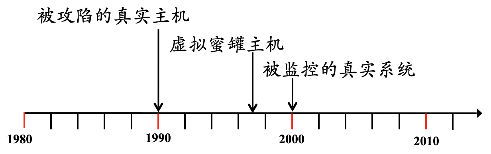
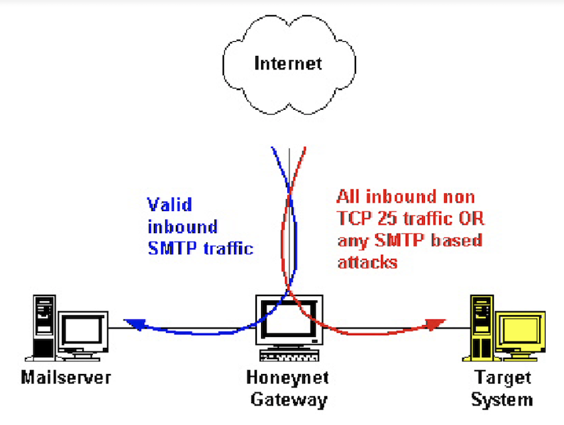
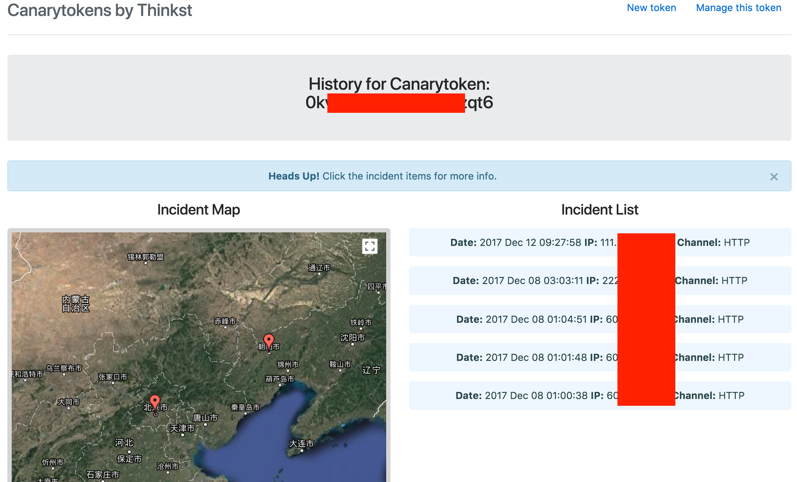
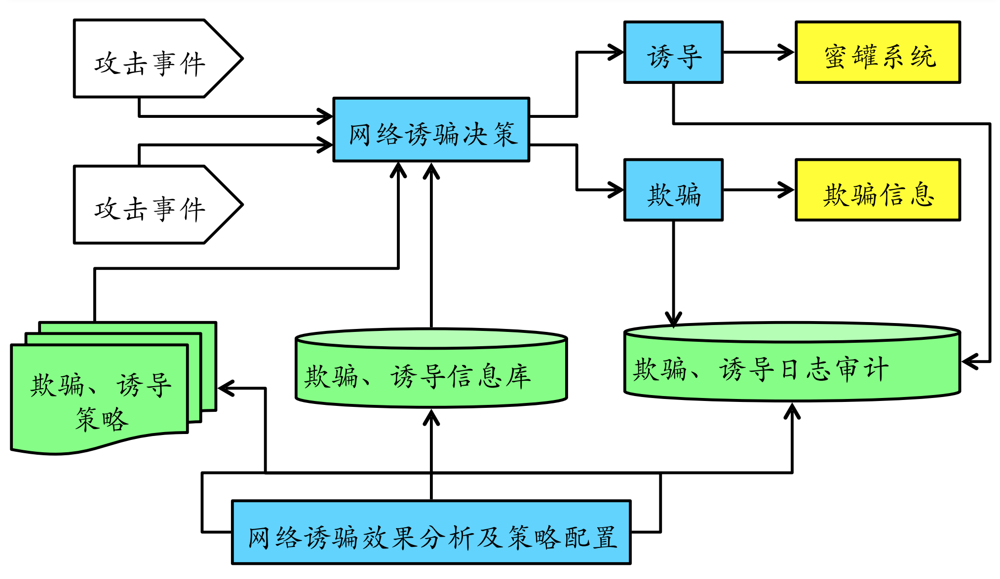
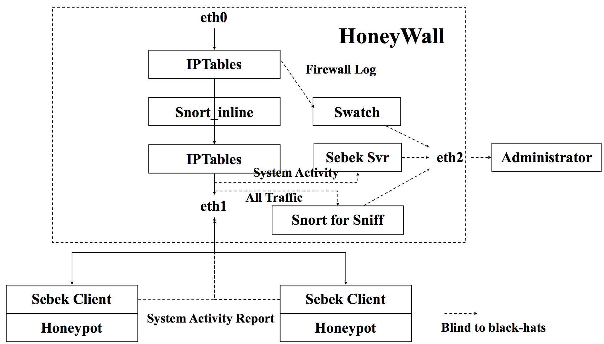
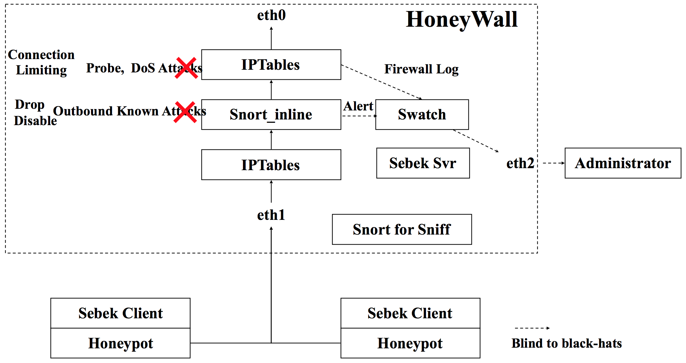

# 第十一章 蜜罐和蜜网

---

## 温故 {id="review-1"}

* 信息安全的本质——持续对抗
    * 网络渗透与系统入侵 VS. 防火墙 / 入侵检测 / 应用程序安全加固
* 持续对抗的双方是 **非对称** 的对抗

---

## 温故 {id="review-2"}

* 工作量不对称
    * 攻击方：夜深人静, 节假日，攻其不备
    * 防守方：24*7, 全面防护，木桶原理
* 信息不对称
    * 攻击方：通过信息收集、网络扫描、探测、踩点对攻击目标全面了解
    * 防守方：对攻击方一无所知
* 后果不对称
    * 攻击方：任务失败，极少受到损失
    * 防守方：安全机制被突破，资产损失，其他影响

---

## 知新

* 使用蜜罐和蜜网来扭转对抗不对称局面
    * 扭转工作量不对称
        * 增加攻击成本－假目标
    * 扭转信息不对称－了解你的敌人！
        * 他们是谁？
        * 他们使用什么工具？如何操作？
        * 为什么攻击你？
    * 扭转后果不对称
        * 防守方避免资产损失和其他影响
        * 计算机取证－对攻击方的威慑

## 本章内容概要

---

* 蜜罐发展史
* 欺骗防御
* 动态防御
* 动态攻击
* 蜜罐关键技术
* 蜜网技术

# 蜜罐发展史

---

## 基本概念

* Honeypot
    * 首次出现在Cliff Stoll的小说 `The Cuckoo's Egg` (1990)
* 蜜网项目组给出如下定义（价值/意义）：
    * `A security resource who's value lies in being probed, attacked or compromised`
    * 没有业务上的用途
        * 所有流入/流出蜜罐的流量都预示着扫描、攻击及攻陷
* 用以监视、检测和分析攻击

---

## 蜜罐发展的里程碑 {id="history-of-honeypot"}

* 1990: `The Cuckoo's Egg`
* 1997: Fred Cohen: DTK
    * 模拟网络服务，虚拟系统
* 2000: 蜜网项目组: Gen II 蜜网

---

## 蜜罐的分类 {id="classification-of-honeypot-1"}

* 部署目标
    * 产品型
    * 研究型
* 交互性：攻击者在蜜罐中活动的交互性级别
    * 低交互型
    * 高交互型
    * 混合型

---

## 蜜罐的分类 {id="classification-of-honeypot-2"}

* 新型蜜罐
    * 主动式蜜罐
    * 蜜场（honeyfarm）
    * 蜜信（honeytoken）
    * 应用层蜜罐（honeyapp）
    * 客户端蜜罐（honeyclient）

---

## 产品型蜜罐

* 部署目标: 保护单位网络
    * 防御
    * 检测
    * 帮助对攻击的响应
* 需要网管尽可能少的工作
* 商业产品
    * [KFSensor](http://www.keyfocus.net/kfsensor/index.php) 

---

## 研究型蜜罐

* 部署目标：对黑客攻击进行捕获和分析
    * 这些“坏家伙”在干什么
    * 了解攻击方法
    * 捕获他们的击键记录
    * 捕获他们的攻击工具
    * 监控他们的会话
* 需要大量时间和精力投入！！
* 实例
    * [GenII 蜜网](http://honeynet.onofri.org/papers/gen2/) 
    * [Honeyd](https://github.com/DataSoft/Honeyd)

---

## 低交互蜜罐

* 模拟服务和操作系统
* 只能捕获少量信息
* 容易部署，减少风险
* 实例
    * [Dionaea](https://github.com/DinoTools/dionaea)
    * [Honeyd](https://github.com/DataSoft/Honeyd)
    * [KFSensor](http://www.keyfocus.net/kfsensor/index.php) 

---

## 高交互蜜罐

* 提供真实的操作系统和服务，而不是模拟
* 可以捕获更丰富的信息
* 部署复杂，高安全风险
* 实例
    * [Shadow Daemon](https://shadowd.zecure.org/overview/introduction/)
    * [Lyrebird](https://hub.docker.com/r/lyrebird/honeypot-base/)

---

## 主动式蜜罐技术

* 动态蜜罐
    * 即插即用的解决方案
    * 自动调整
* 被动指纹识别技术
    * 了解所处的网络环境
* 动态配置
    * 虚拟蜜罐

---

## 蜜场基本思想

---

## 重定向机制

* 对高价值目标映射蜜罐系统
    * 动态蜜罐技术
* 不需创建新的目标，而使用已存在的目标
* 将恶意的、未经授权的活动重定向到蜜罐
* 监视和捕获攻击者在蜜罐中的活动
* 计算机取证技术

---

## 什么时候重定向

* 非预期的流量 – Hot Zoning
    * 非业务(Non-production)目标端口
    * 非业务源端口
    * Time of day
* 已知攻击 – Bait-n-Switch
    * Snort 的修改版本，内联网关
    * 将检测到的活动重定向到蜜罐中
* 基于主机的监控
    * 监控主机上的未授权活动、或恶意活动, 然后重定向: PaX, Systrace

---

## 重定向示例

---

## 蜜罐的欺骗性

* 真实的系统环境
    * 系统标识
        * IP、traceroute 路径
        * 主机名、操作系统内核版本…
* 系统配置和应用程序
    * 开放的网络服务…
    * 安装的应用程序
* 数据内容
    * Proxy and cache?
* 优势：在一个高度可控的环境中愚弄/观察攻击者的所有行动

---

## 蜜信（HoneyToken）

* 概念出发点：威胁不仅仅是针对信息系统，也针对 **信息** 本身
* HoneyToken: 正常情况不会使用的一些诱饵信息
    * 数据库诱饵记录
    * 伪造的弱用户名/口令对
* 如果 HoneyToken 一旦被访问, 预示着攻击发生, 对它进行监视跟踪

---

### CanaryTokens

免费且开源的蜜信制作工具

---

---

## 应用层蜜罐（Honeyapp）

* 模拟应用层的服务对非自动化的攻击更具吸引力
* 在应用层能够更有效地对攻击进行分析
* 实例
    * Web application honeypot

---

## 客户端蜜罐（Honeyclient）

* 越来越多的攻击针对客户端软件
    * Web 浏览器
    * Email 客户端
* Honeyclient 的设计要考虑
    * 应用协议本身
    * 需要捕获的攻击
* 基于完整性测试判断是否遭受攻击
    * 程序本身
    * 配置文件、注册表等
* 分类
    * Active honeyclient: 同步交互，如 web-based honeyclient
    * Passive honeyclient: 异步交互，如 email honeyclient

---

## 蜜罐实例

[Awesome Honeypots](https://github.com/paralax/awesome-honeypots)

---

## 蜜罐技术优势

* 高保真－高质量的小数据集
    * 低误报率和低漏报率
* 捕获新的攻击及战术
* 并不是资源密集型
* 简单

---

## 蜜罐技术弱势

* 劳力/技术密集型
* 局限的视图
* 不能直接防护信息系统
* 引入新的安全风险
    * 蜜罐被攻陷

---

## 安全风险

* 发现蜜罐
    * 蜜罐指纹识别 VS. 消除蜜罐的指纹
        * 一旦识破蜜罐：攻击者会向蜜罐反馈虚假、伪造的信息
* 利用蜜罐攻击第三方
    * 期望黑客获得蜜罐的 `root` 权限 VS. 获得 `root` 权限之后是否真的可以为所欲为？
        * 系统仿真程度越高、开放服务越多会引入更多攻击暴露面
    * 完全隔离网络？ or 伴随仿真蜜网？

# 欺骗防御

---

## 军事学渊源

* 孙子兵法有云：`兵者诡道也` 、`实者虚之，虚者实之`
    * `诡道` 是一切战略的核心与基础
        * 运用「千变万化的方法」去迷惑敌人，使得敌人进退维谷，从而使得防御方在对抗中获得主动权和争取到行动时间

---

## [孙子兵法·虚实篇](https://baike.baidu.com/item/%E5%AD%99%E5%AD%90%E5%85%B5%E6%B3%95%C2%B7%E8%99%9A%E5%AE%9E%E7%AF%87/19831524)

* 通过「分散集结」、「包围迂回」，造成 **预定会战地点** 上的我强敌劣，以少胜多
* 蜜罐和蜜网就是防御者为攻击者精心准备的「会战之地」
    * `凡先处战地而待敌者佚，后处战地而趋战者劳，故善战者，致人而不致于人`
    * `故知战之地，知战之日，则可千里而会战`

---

## 经典欺骗防御理论模型

[A Note on the Role of Deception in Information Protection (c) 1998 Fred Cohen](http://all.net/journal/deception/deception.html)

* 欺骗增加了攻击者工作量，因为他们无法轻易预测哪些攻击行为会成功哪些会失败
* 欺骗允许防御者追踪攻击者的种种入侵尝试并在攻击者找到防御者的真实漏洞之前进行响应
* 欺骗消耗攻击者资源
* 欺骗增加了对攻击者的更高技能要求
* 欺骗增加了攻击者的不确定性

---

## Cohen 设计的欺骗防御模型

* 影响攻击者的策略选择，使其按照防御者设计的攻击路径执行
* 尽快检测到攻击者，联动切断其他攻击路径
* 消耗攻击者资源

---

## 蜜罐与欺骗防御的关系

* 蜜罐是「欺骗防御」策略在网络安全领域最早落地的产品级实现
* 网络安全的核心特征： **持续** 对抗
* 蜜罐的天然弱点促使其演进方向必然是「动态」和「自适应」
    * 无论是低交互还是高交互蜜罐，蜜罐的核心组成是「代码」
    * 随着代码规模的增长，代码漏洞将无法避免
    * 蜜罐作为一个软硬件混合产品，全生命周期都不是一劳永逸的

---

## 回顾第六章的「杀伤链」和「反杀伤链」模型

|    | 杀伤链模型   | 反杀伤链模型 |
| -- | --           | --           |
|    | 识别         | 发现         |
|    | 武器化       | N/A          |
|    | 投递         | 定位         |
|    | 漏洞利用     | 跟踪         |
|    | 安装（后门） | 瞄准         |
|    | 命令与控制   | 打击         |
|    | 达成目标     | 评价         |

---

## 让对手误判

* 网络安全的核心特征：「持续对抗」
    * 攻防双方都希望在对抗中「击败对手」
* 防御方的欺骗之道
    * 蜜罐：让攻击者对「陷阱」目标「信以为真」，从一开始就误导对手「白费力气」并「越陷越深」
    * 动态防御：让攻击者「投递」的攻击载荷到达「真实目标」成为「随机或低概率」事件

# 动态防御

---

## 攻击面（Attack Surface）

* 系统中可被利用、遭受攻击的系统资源集合
    * 攻击目标（网络和主机）
    * 通道和协议（`CVSS 3.x` 中定义的 `Attack Vector`）
    * 访问控制（权限约束条件）

---

## Moving Target Defense, MTD

* [2009 年](https://www.nitrd.gov/nitrdgroups/index.php?title=National_Cyber_Leap_Year) 在美国的《National Cyber Leap Year》活动中征集到的「改变游戏规则」研究方向：移动目标防御
* 这是一个基于 `动态化`、`随机化`、`多样化` 思想改造现有信息系统防御缺陷的理论和方法，其核心思想致力于构建一种 「动态、异构、不确定」 的网络空间目标环境来增加攻击者的攻击难度，以系统的 **随机性** 和 **不可预测性** 来对抗网络攻击
    * 让 `攻击面` 持续移动起来

---

## MTD 的常见维度 {id="mtd-implementation"}

* 网络
* 主机

---

### 网络层面的 MTD {id="mtd-in-networks-1"}

* 动态网络架构：通过实施 `网络攻击面` 资源的转移，动态变换网络资源及配置，同时保持架构内各部分组件的信息交换和协同转移，以此提高应对网络攻击的动态防御能力
    * 可变网络(mutable networks, MUTE)
    * 自屏蔽动态网络架构(self-shielding dynamic network architecture, 简称SDNA)
    * MOTAG架构
    * 移动自组网络(mobile ad hoc networks, MANETs)
    * 基于 SDN 的动态网络架构

---

### 网络层面的 MTD {id="mtd-in-networks-2"}

* 网络地址随机化：为网络地址引入动态变换更新机制, 通过对网络数据包进行特殊的处理或通过一定机制协同变换网络地址, 使得攻击者始终无法确定通信双方的真实地址, 从而破坏了攻击者的嗅探攻击, 实现了对主机的隐私保护, 以此提升通信双方的安全性
* 端信息随机跳变：在端到端的数据传输中, 通信双方或一方按照协定伪随机地改变端口、地址、时隙、加密算法甚至协议等信息, 从而实现网络的主动防御.
    * 基于 SDN 的端信息跳变技术

---

### 主机层面的 MTD {id="mtd-in-host-1"}

* 硬件
    * 指令集随机化(ISR)
* 操作系统及基础软件
    * 多操作系统轮换
    * 基础软件轮换
    * 基于虚拟化的动态迁移

---

### 主机层面的 MTD {id="mtd-in-host-2"}

* 应用软件
    * 目标代码生成阶段：「异构同效」代码（软件的 `多态化`）
        * 地址空间布局随机化(ASLR)
        * 代码生成随机化
            * 对抗 ROP（返回导向编程）、JOP（跳转导向编程）
    * 运行时阶段：（拟态防御）动态异构冗余（Dynamic Heterogeneous Redundancy, DHR）
        * 地址空间布局随机化(ASLR)

---

## 拟态防御

* `Cyber Mimic Defense`, `CMD`
* 中国工程院院士、国家数字交换系统工程技术研究中心主任邬江兴主导创立的理论
    * [拟态防御理论](http://jcs.iie.ac.cn/xxaqxb/ch/reader/create_pdf.aspx?file_no=20160401&year_id=2016&quarter_id=4&falg=1)

---

### 8122

1. 针对一个前提：防范未知漏洞后门等不确定威胁
2. 基于一个公理：相对正确公理
3. 依据一个发现：熵不减系统能稳定抵抗未知攻击
4. 借鉴二种理论：可靠性理论与自动控制理论
5. 发明一种构造：动态异构冗余构造（IT领域创新使能技术）
6. 导入一类机制：拟态伪装机制
7. 形成一个效应：测不准效应
8. 获得一类功能：内生安全功能
9. 达到一种效果：融合现有安全技术可指数量级提升防御增益
10. 实现二个目标：归一化处理传统/非传统安全问题—- 获得广义鲁棒控制属性

---

## MTD 与 CMD

|          | MTD                                              | CMD      |
| --       | --                                               | --       |
| 理论定位 | “道”                                             | “术”     |
| 设计目标 | 以动态变化增加对抗成本、让对手测不准、提升安全性 | 同 MTD   |
| 技术路线 | 异构同效                                         | 异构同效 |

---

## 举一反三：从「移动」防御到「移动」对抗

**多维度** 移动以降低 **对手** 优势从而增加对抗胜算。

# 动态攻击

---

## Moving Target Attacks, MTA {id="mta-1"}

* 多态（Polymorphism）：改变恶意代码的签名，躲避杀软检测
* 变形（Metamorphism / self-modification）：恶意代码运行时自我修改，躲避杀软检测
* 混淆（Obfuscation）：降低代码可读性，隐藏关键代码逻辑，对抗逆向工程
* 自加密（Self-encryption）：用加密手段达到多态、变形和混淆等价效果

---

## Moving Target Attacks, MTA {id="mta-2"}

* 反沙箱/沙盒（Anti-VM/sandboxes）：识别动态取证环境并在运行时改变关键代码逻辑
* 反调试（Anti-Debugging）：识别调试环境并在运行时改变关键代码逻辑
* 加密漏洞利用载荷（Encrypted exploits）：用加密手段达到对抗检测与取证分析目的

# 蜜罐关键技术

---

## 设计目标

* 捕获数据
* 避免被识别
* 防止被攻陷
* 提供有价值的分析报告
    * 攻击来源
    * 攻击意图
    * 攻击过程
    * 攻击结果

---

## 蜜罐的基本功能

* 伪装和模拟
    * 服务/应用/系统/网络/主机
* 数据捕获
    * 网络流量
    * 系统操作记录
    * 日志
* 数据控制
* 数据分析

---

## 蜜罐的基本体系架构 {id="honeypot-arch-1"}

---

## 蜜罐的基本体系架构 {id="honeypot-arch-2"}

* 决策
    * 监听收集事件，根据策略与欺骗、诱导信息库中的记录进行比较后决定诱导或欺骗
* 诱导
    * 将攻击者的连接转向蜜罐系统
* 欺骗（误导）
* 分析
    * 系统所作的欺骗和诱导事件都记录到日志中，由分析模块进行分析，调整欺骗诱导策略

---

## 蜜罐和入侵检测的关系

|      | 蜜罐     | 入侵检测           |
| ---  | ---      | ---                |
| 目的 | 还原入侵 | 发现入侵           |
| 手段 | 异常检测 | 误用检测、异常检测 |

---

### 还原入侵 VS. 发现入侵

|                    | 还原入侵 | 发现入侵 |
| ---                | ---      | ---      |
| where （来源）     | ✅       | ✅       |
| what  （类型）     | ✅       | ✅       |
| how   （攻击图）   | ✅       | ❌       |
| why   （攻击意图） | ✅       | ❌       |
| who   （幕后推手） | ✅       | ❌       |
| 影响评估           | ✅       | ❌       |

# 蜜网技术

---

##  Gen II 蜜网技术的数据捕获的数据流

---

##  Gen II 蜜网技术的数据控制架构的数据流

---

> 欺骗防御一节的「网络层面 MTD」

---

## 蜜罐与蜜网技术的典型应用场景

* 恶意代码捕获
* 恶意代码分析
* 入侵取证
* 分流攻击流量

# 课后思考题

---

* 举几个生活中的类比蜜罐实例
* 用自己的话去描述蜜罐的核心思想关键字：诱、骗、捕
