# 第十三章 社会化网络安全

---

## 温故 {id="review-1"}

> 网络空间（Cyberspace）是一种包含互联网、通信网、物联网、工控网等信息基础设施, 并由人-机-物相互作用而形成的动态虚拟空间

---

## 温故 {id="review-2"}

> 网络空间安全既涵盖包括人、机、物等实体在内的基础设施安全, 也涉及到其中产生、处理、传输、存储的各种信息数据的安全

---

## 温故 {id="review-3"}

* 网络（空间）安全的研究对象是：具备通信和计算能力的「机器节点」
    * 人「控制」机器与机器之间的通信过程
        * 交互式控制：通过鼠标、键盘、触摸屏、语音、体感等
        * 可编程控制：自动化、智能化、恶意代码等
* 网络空间安全问题的影响力不再局限于数据篡改、系统控制和信息泄露等「狭义」网络安全问题，真实世界和社会的行为可以被来自其「数字孪生」世界的特定组织所操控

---

## 知新 {id="agenda-1"}

* 社会化网络
    * 远早于互联网而独立存在和发展

---

## 知新 {id="agenda-2"}

* 美国早期传播学实用主义三大代表之一，也是芝加哥学派的先驱 **约翰·杜威** 提出的经典传播学论断

> 社会不仅是由于传递、传播而得以持续存在, 而且还应该是在传递、传播之间存在着。在共同、共同体、**沟通** 这几个语词之间不仅存在字面上的联系，人们因享有共同的东西而生活于共同体，而 **沟通** 是使他们享有共同的东西的途径

---

## 知新 {id="agenda-3"}

* `互联网等新兴技术` 赋予「社会化网络」新的 **沟通** 内涵和形式
    * 载体类型：语音、纯文字、富文本、图像、录播视频、直播/实时视频、VR/AR 等
    * 通信手段：电信技术、即时通信、兴趣社群、电子商务等

---

## 知新 {id="agenda-4"}

* 社会化网络安全的研究对象是：具备通信、思考（计算）和行动能力的「人」
    * 人与人之间的传承、传播和沟通借助「机器」收发和在「网络空间」传输

---

## 知新 {id="agenda-5"}

|                    | 通信网/计算机网络 | 社会化网络              |
| --                 | --                | --                      |
| 通信对象           | 机器与机器（M2M） | 人与人（P2P）`over M2M` |
| 安全性需求（属性） | CIA               | CIA + **隐私**          |

> M2M: Machine to Machine

> P2P: Person to Person

---

## 知新 {id="agenda-6"}

1. 社交网络安全
2. 电信诈骗与防范
3. 电子商务网络安全
4. 网络勒索
5. 大数据应用与隐私保护

# 社交网络安全

---

* 本章所关注的「社交网络」安全特指「互联网+社交网络」安全
    * 互联网构建在计算机网络之上，相应的本章所关注的社交网络也是构建在计算机网络之上的

---

## 闪回第一章威胁「分层模型」基本理论

- 每一层的安全威胁是既相互独立，又相互联系、相互影响的
- 每一层的安全威胁必须依靠当前层的安全策略和安全机制解决
- 下一层的安全机制是上一层安全机制的基础
- 上一层的安全机制等级不会高于下一层的安全机制等级
- 下层不安全，上层的安全无法保障；下层安全，并不代表上层安全

---

## 本章关注『社交网络』层特有的威胁形式

* 社会工程学与网络钓鱼
* 谣言
* 恶意营销

# 社会工程学与网络钓鱼

---

## 什么是「社会工程学」

* 「社会工程学」（以下简称“社工”）在 **信息安全专业** 语境条件下泛指 `人们对执行行为或泄露机密信息的心理操纵`。
* “社工”是一种用于信息收集，欺诈或系统访问的信任技巧，它与传统的“骗局”不同，它通常是更复杂的欺诈方案中的众多步骤之一

> 任何影响他人采取可能符合或不符合其最佳利益的行为的行为。

---

## 「社工」手段概述

* 所有社会工程学攻击都建立在使人决策产生认知偏差的基础上。这种认知偏差可以被称为 `人类意识漏洞`。
    * 社工不仅会利用 `人类意识漏洞` ，也会配合使用「软硬件漏洞利用」的技术手段
* [CAPEC-403: Social Engineering (Version 3.3)  ](https://capec.mitre.org/data/definitions/403.html)

---

## 社工手段分类

|          | 钓鱼 | 窥视 | 垃圾搜索 | 反向社工 | 水坑攻击 | 诱饵 |
| :-:      | :-:  | :-:  | :-:      | :-:      | :-:      | :-:  |
| 电邮     | ✓    | ✓    | ✓        | ✓        |          | ✓    |
| 即时通信 | ✓    | ✓    | ✓        | ✓        |          | ✓    |
| 电话     | ✓    | ✓    |          | ✓        |          |      |
| 社交网络 | ✓    | ✓    | ✓        | ✓        |          | ✓    |
| 云计算   | ✓    | ✓    | ✓        |          |          |      |
| 网站     | ✓    | ✓    | ✓        | ✓        | ✓        | ✓    |
| 物理实体 | ✓    | ✓    | ✓        | ✓        |          | ✓    |

---

### 窥视

* `肩窥`（`shoulder surfing`）

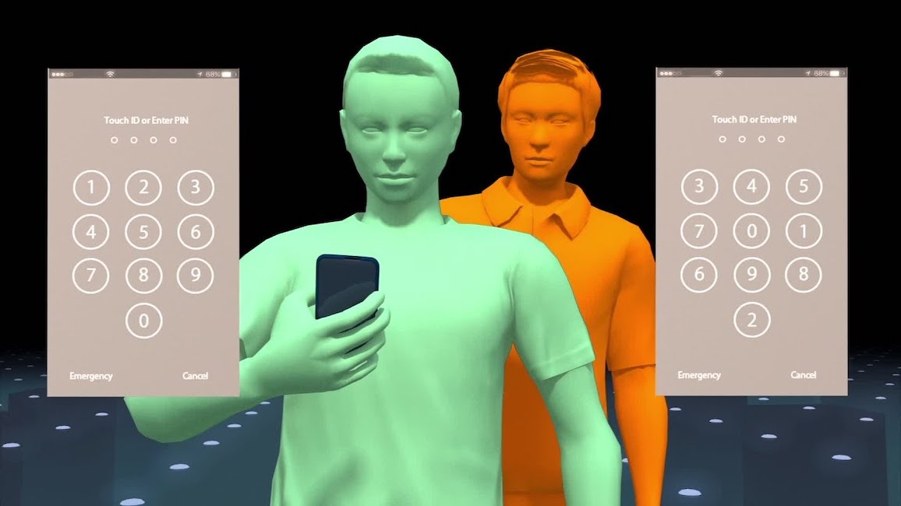

---

### 防御窥视

* 查看和输入敏感信息时注意观察周围环境风险
* 使用 **防偷窥贴膜**

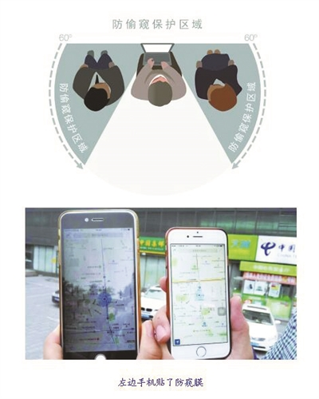

---

### 垃圾搜索（Dumpster Diving）

---

从海量电子数据中进行数据挖掘也可以被视为技术手段的「垃圾搜索」

---

### 防御垃圾搜索

* 使用碎纸机处理废弃纸质文档
* 根据数据保护等级选择合规的数据销毁标准

---

### 反向社工

* 不同于主动联系受害者的社工方法
* 反向社工会「设计」让受害者主动联系攻击者

---

### 反向社工的三个阶段

1. 蓄意攻击（制造问题）
2. 广而告之自己有办法解决（增加曝光，提供联系方式，吸引受害者）
3. 协助解决（取得信任，顺手牵羊）

---

### 防御反向社工

* 遇到问题不要慌张
* 多种渠道查找解决办法
    * 识别搜索引擎结果里的「推广」结果
    * 主动联系官方售后
    * 拒绝「主动找上门」的解决方案

---

### 钓鱼

* 使用 IT 技术的「劝说型」社工手段
* 常见 IT 钓鱼技术
    * 钓鱼邮件
        * 鱼叉式钓鱼：更有针对性、目标接收者范围更小
    * 即时通信钓鱼
    * 社交网络钓鱼

---

### 防范钓鱼

* 不要轻易下载和打开（邮件或聊天窗口中接收到的）链接和附件
    * 使用杀毒软件扫描附件
    * 使用搜索引擎搜索链接
    * 使用 [在线威胁检测工具](https://www.virustotal.com/gui/) 检测链接和附件
* 不要轻信「诱惑性」或「劝说性」图文、语音等

---

### 水坑攻击

---

### 防御水坑攻击

* 做好终端安全防护
    * 安装终端安全软件
* 依赖于其他专业人士做好网络安全加固与监测
    * “祈祷” 你经常访问的网站和应用没有被攻陷、没有被植入后门
    * “祈祷” 你的上网环境没有被攻陷、不存在网络嗅探者

---

### 诱饵

* 🌰 本课程教学 Wiki 上的 `期末试题样本.docx`
* 🌰 遗落在角落的 U 盘

---

### 防御诱饵

* 提高安全意识
* 控制自己的好奇心
* 抑制自己的贪欲

---

## 一次虚构的社工案例演示

---

## 钓鱼测试

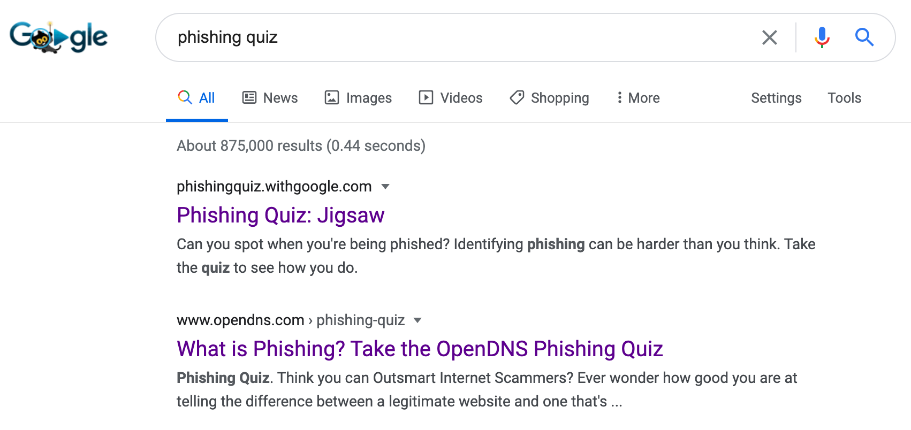

---

* [钓鱼测试（中文版）](https://phishingquiz.withgoogle.com/)
* [钓鱼测试（英文版）](https://www.opendns.com/phishing-quiz/)

# 用「钓鱼网址识别」来检验一下你的反社工能力

---

---

3 道题，每道题 10 分，你能得多少分？😁

# 谣言

---

## 关键特征

* 内容
* 渠道
* 传播

---

### 内容特征

没有事实依据或有真有假（为了提高内容的可信度）的信息，往往具备明显的「话题性」和「争议性」。

---

### 渠道特征

言论发布者、转载者均非官方权威渠道。

---

### 传播特征

快速传播，类似网络空间中的蠕虫病毒传播。

---

## 谣言造成的危害

* 恐吓营销
    * 让消费者感受到对某种东西，或者是某种可能的担忧，从而促使他们购买了商家的产品
* 操纵民意
* 舆情、煽动民意

---

## 谣言管控手段

* 预防
* 检测
* 溯源
* 辟谣

---

### 面向内容特征的管控

* `检测` 为主
    * 内容识别和理解
* `预防` 为辅
    * 开通谣言举报渠道

---

### 面向渠道特征的管控

* 建立官方信息发布渠道和 `辟谣` 平台
* 信息发布渠道监管（ `检测` ）
    * 2017 年 6 月 1 日起，[《互联网新闻信息服务管理规定》正式实施](http://www.xinhuanet.com/yuqing/2017-05/09/c_129596824.htm) ，将各类新媒体纳入管理范畴

---

### 面向传播特征的管控

* `检测` 为主
    * 舆情热点发现
* `溯源` 为上
    * 传播路径按照时间线还原和追溯

# 恶意营销

---

利用谣言夸大威胁影响和风险发生概率进行恐吓营销则属于恶意营销范畴。

---

## 诱导分享+裂变+诈骗+套取个人隐私 {id="malicious-share-1"}

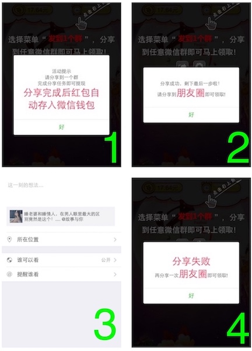

---

## 诱导分享+裂变+诈骗+套取个人隐私 {id="malicious-share-2"}

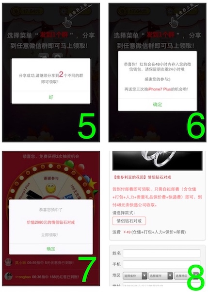

---

## 其他恶意营销案例

* 「货到付款」骗局
* 集赞骗局
    * 奖励“缩水”风险
    * 套取个人隐私

---

## 恶意营销管控

参考『谣言管控手段』。

# 电信诈骗与防范

---

* 网络听号诈骗
* 网络改号诈骗
* 伪基站诈骗
* 木马远控
* 换号诈骗

---

## 网络听号诈骗

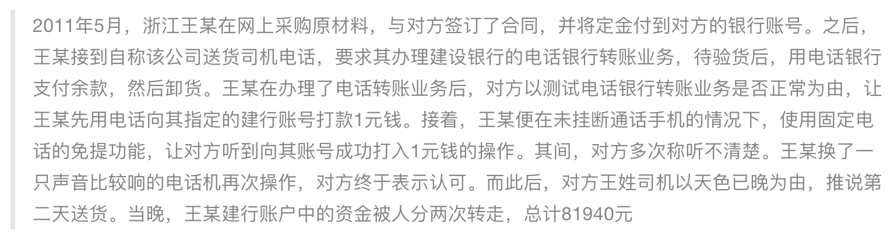

---

### 手机拨号音在专业音频处理软件中呈现出的波形图

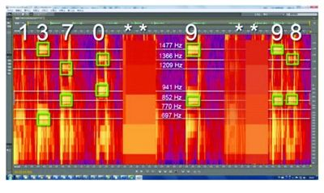

---

### 看似人畜无害甚至有些有趣的手机拨号音

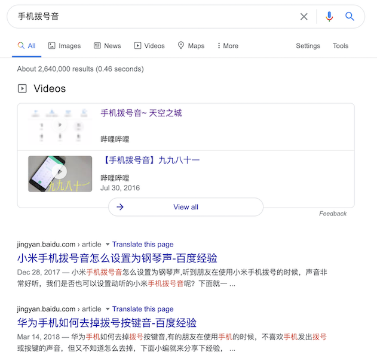

---

### 防御拨号音泄漏隐私

* 避免在语音或视频通话过程中使用拨号功能
* 关闭手机拨号按键的击键音

---

## 网络改号诈骗

> 杨女士收到一个自称某银行的电话告知自己的信用卡欠款逾期未还，需要在当天下午4点前还清。杨女士称自己的信用卡没有欠款，对方称杨女士可能涉嫌信用卡诈骗。并轮番冒充警方、检查院的电话对杨女士进行恐吓。为了洗脱罪名，诈骗分子让杨女士去开通了网银，并将密码器上的支付密码告诉诈骗分子，结果银行卡中的资金被瞬间转走44万元。由于目前资金已经被转到境外，所以仍然无法追回。

---

### 网络改号的技术原理

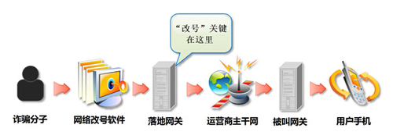

---

### 防御网络改号诈骗 {id="defend-against-callerid-spoof-1"}

* 即使接收到「官方号码」发来的短信、电话，也不能掉以轻心
    * 避免点击短信中的链接，不要在电话交谈中泄漏自己的隐私信息和帐号口令等
    * 使用搜索引擎检索验证「官方号码」的真实性
    * 在必要的时候，可以通过更换一个不同运营商的号码 **回拨** 「官方号码」的方式来验证来电内容
* 官方账号一旦被盗用，发布虚假内容可以认为是「社交媒体时代」的「网络改号」诈骗

---

### 防御网络改号诈骗 {id="defend-against-callerid-spoof-2"}

在社交网络时代对于「身份」的真实性鉴别并不是仅仅根据号码、昵称、头像、加V认证等就能断定的，要「听其言、观其行、多源交叉验证」其言行。

---

## 伪基站诈骗

* 针对手机用户的「改号诈骗」
    * 「官方号码」短信或来电不再可信
* 可以对手机用户造成「拒绝服务」的效果

---

### 防范伪基站诈骗

* 使用最新的、被安全验证的移动通信技术

---

### 仅开启最新通信技术支持，防御「降级攻击」

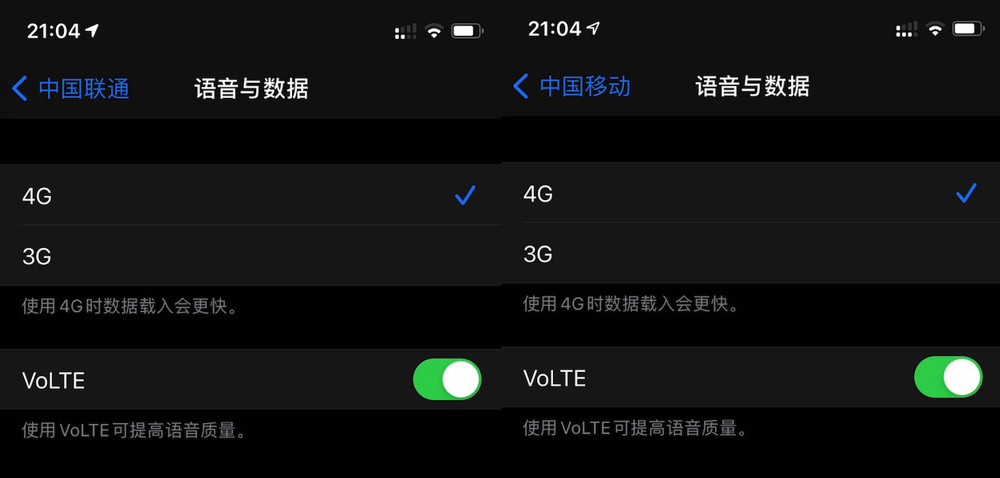

---

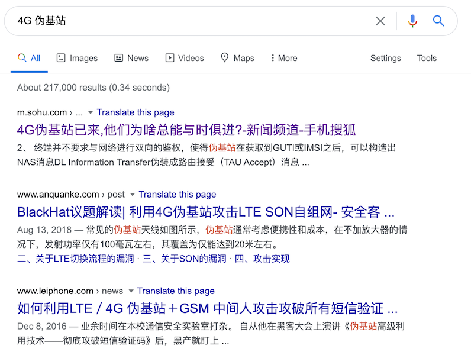

---

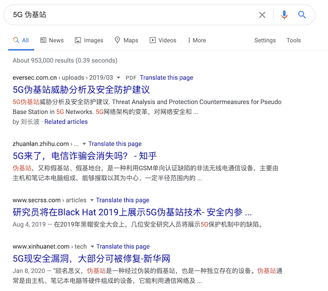

---

## 木马远控

* 技术手段上类似 PC 时代的木马远控
* 危害
    * 短信监听与劫持
    * 二次攻击跳板
    * 监听与劫持应用间通信与跳转

---

### 防范木马远控

* 做好终端系统安全防护
    * 及时安装手机系统的安全更新补丁
    * 从官方应用商店安装软件
* 提高个人使用终端的安全意识 
    * 避免连入公共无线网络
    * 防范前述社工攻击

---

## 换号诈骗

> 我换号了，敬请惠存 138-xxxx-yyyy

> 先是以朋友名义通知换号，再要你“帮忙”。

---

### 微信等即时通信软件或社交网络应用上的换号诈骗

* 诈骗者往往会通过一些信息收集手段，在确认「原版」帐号暂时不可用状态之后
    * 例如可以通过盗号改密码、恶意投诉等方式让目标帐号暂时无法使用
* 用「山寨版」帐号去添加「原版」帐号社交关系网络中的好友，加好友的理由就是冠冕堂皇的「换号」
    * 对于一些警惕性高的人，可能会试图联系「原版」帐号并发现确实无法联系了，则会相信骗子的「换号」加好友请求的真实性
* 一旦「换号」加好友成功，后续的骗局展开就和电话换号诈骗如出一辙了

---

### 防范换号诈骗

* 线下二次验证
* 视频二次验证
* 语音二次验证

# 电子商务网络安全

---

## 消费端 {id="con-of-consumer-1"}

* [心愿购物单](https://www.zhihu.com/question/28173417/answer/122551812) 功能被滥用：钓鱼通知伪装成系统通知
* 匿名晒单评价功能：避免爬虫过度收集用户数据、建立用户画像进而进行 **精准** 广告/推荐/骚扰/钓鱼/诈骗
* 第三方收货平台和电商收货专用小号：面向商家保护消费者隐私联系方式信息

---

## 消费端 {id="con-of-consumer-2"}

* 延时发货骗局
    * 搜索黑优化手段：低价引流、冲高销量、自然搜索排序提升、提价正常发货、低价到期自动退款
    * 免费收集买家真实联系方式信息：低价付款抽奖，不中奖退款
* 快递面单的隐私化处理
    * 防御「垃圾搜索」
* 货到付款骗局

---

## 企业端

* 评价管理：恶意差评管理
* 库存管理：恶意秒杀不付款
* 价格管理：错标低价商品被羊毛党扫荡

---

## 平台端

* 刷单
* 反向刷单

# 网络勒索

---

* 勒索病毒
* iCloud 反向劫持

---

## 利用远程管理手机功能锁定受害人手机

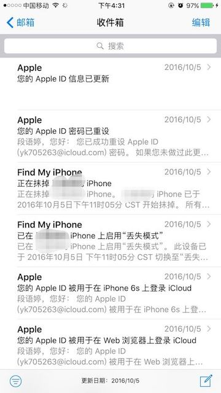

# 大数据应用与隐私保护

---

* 数据窃取风险
* 数据滥用风险
* 数据误用风险

---

## 数据窃取风险

* 2013 年曝光的斯诺登事件
* 内部威胁大于外部威胁

---

## 数据滥用风险

* 内部员工的非授权数据访问
* 数据共享风险

---

## 数据误用风险

* 用户画像与精准营销
* 大数据杀熟

---

### 同商品不同用户不同价一定是大数据杀熟？

* 不同地区的差异化定价
    * 生产厂商对不同地区实施的区域价格保护机制和促销策略
* 不同地区就近库存差异
* 新用户叠加新人促销优惠折扣

---

## 以系统为中心的安全 vs. 以数据为中心的安全

* 类比于医院里的「心血管科」和「血液科」
    * 前者解决（血液循环 vs. 软硬件系统与通信系统）系统本身的安全
    * 后者保障血液自身安全（存储在系统中和通过系统处理、传输的数据）
* 以系统为中心的数据安全生命周期：输入、处理和输出
* 以数据为中心的数据安全生命周期：数据共享、交换、交易、流通

---

## 传统数据安全 vs. 数据能力成熟度模型

* 传统数据安全：`CIA`
* 数据能力成熟度模型（`Data Security Maturity Model, DSMM`）
    * 数据的权属并不总是属于数据处理者
    * 用户根据对自身所拥有数据的安全等级期望选择与之相匹配安全能力的组织机构来处理其所拥有的数据
    * 数据共享、交换、交易和流通环节中的数据流通双方需要具备与所处理数据安全等级相匹配的安全能力成熟度

---

## 展望数据安全

* 法律能解决数据来源的合法性，但不能解决这些合法获得的数据是否会被安全保存或安全使用
* 过去把安全行业当作特种行业进行管理的思路是行不通的：数据无处无时不在，数据安全治理无处无时不在
* 很多数据安全前沿技术还有待突破：安全多方计算、同态加密、密文搜索等

# 本课程已完结

---

🎉🎉🎉

