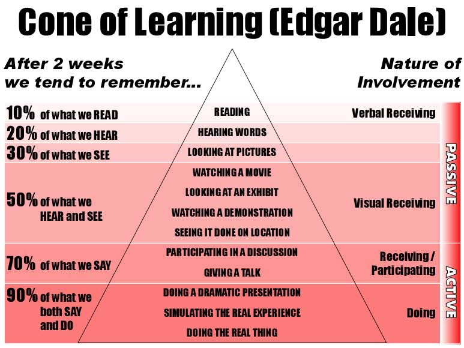
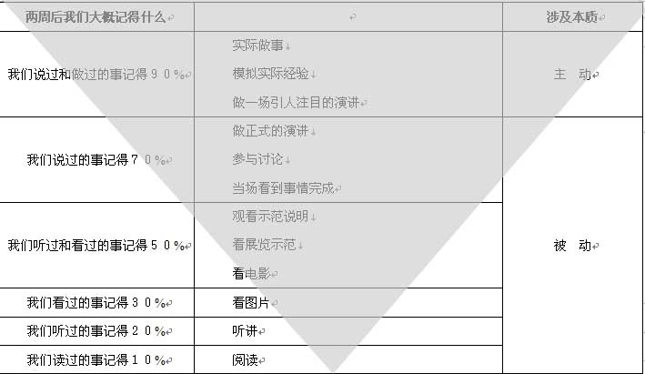

# 课程概况

---

## 先修课程

* 计算机安全与维护
* 计算机⽹络A
* [Linux 系统与网络管理](https://c4pr1c3.github.io/cuc-wiki/linux.html)
* [密码学应用实践（推荐）](https://c4pr1c3.github.io/cuc-wiki/ac.html)

---

## 本课程使用教材

[自编教材 - 在线](https://c4pr1c3.github.io/cuc-ns/)

---

## 硬件和软件环境

* PC / macOS
* Linux (Kali)
* 虚拟化（`Virtualbox` 或 `Docker`）

# 关于课程的教、学方法和原则

---

## 教

* 授⼈以渔
* 重思路、⽅向讲解，轻傻瓜式重复

---

## 学

* 兴趣第⼀
* 尽信师，不如⽆师：质疑、思考、实践
* 会用、用好互联⽹，特别是“搜索”
* ⼀定要亲自动⼿实践 

---

## 学习金字塔

---

## 遗忘金字塔

---

## 重要的事情说三遍

* 主动 **学** 主动 **做** 主动 **讲**
* 主动 **学** 主动 **做** 主动 **讲**
* 主动 **学** 主动 **做** 主动 **讲**

# 课程目标

---

通过本课程的讲授和实验操作

* 你能了解到
    * ⽹络攻防基本原理
    * ⽹络攻防基本⼿段
* 你不能了解到
    * 如何编写恶意代码

# 课程体系

---

| 内容主题           | 讲授学时 | 实验学时 | 难度评级   |
| :-:                | :-:      | :-:      | :-:        |
| 计算机网络安全基础 | 6        | 2        | ⭐️⭐️       |
| 网络监听与扫描     | 6        | 6        | ⭐️⭐️⭐️     |
| 网络与系统渗透     | 8        | 10       | ⭐️⭐️⭐️⭐️   |
| 网络与系统防御     | 12       | 14       | ⭐️⭐️⭐️⭐️⭐️ |

# 考核方式

---

* 详见 `当年教学 Wiki` 。

# Q&A

---

欢迎提问😁

